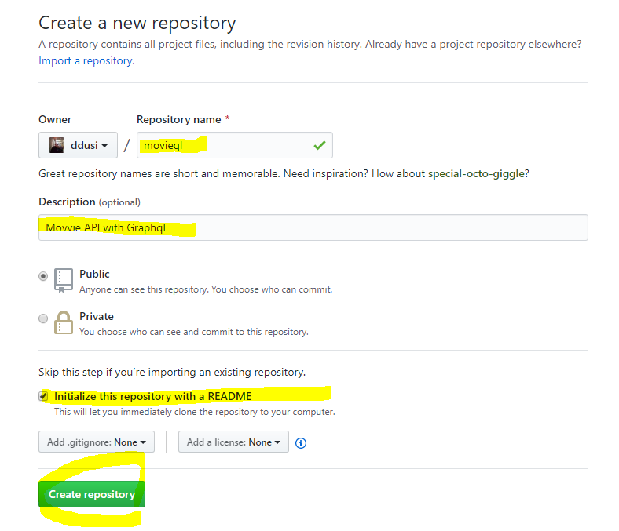

# GraphQL

영화 API를 만들자! 

GraphQL의 기본 원리를 배우고 GraphQL-Yoga를 사용하여 NodeJS + GraphQL서버를 만든다.


## GraphQL 설치

1. GraphQL라이브러리 설치하기 

   git bash에서 이 라이브러리를 설치하자.

   ```shell
   $ pip install Graphql
   ```

2. 깃허브에서 새 레포지토리를 만든다. 

   



이 깃허브와 remote 한다. 


3. graph-ql yoga를 설치한다.

   ```shell
   // 설치하는 명령문 (git)
   yarn add graphql-yoga
   ```

   ### <a href=https://yarnpkg.com/en/docs/install#mac-stable>yarn을 사용하려면 설치해야한다. </a>

   ### <a href=https://nodejs.org/ko/download>node.js도 설치해야한다. </a>

   ```
   // 이것도 설치
   yarn global add nodemon
   ```

   

   


## GraphQL을 배우기 위한 선행학습

1. node.js
2. javaScript
3. Backend
4. yarn


## GraphQl을 쓰는 이유 

#### Over-fetching, under-fetching을 없애기 위해서

오버-패싱은 기존에 데이터베이스에 접근하여 값을 받아올 때, 필요하지 않은 정보까지 묶여서 받아야 했다. 이 때, 서버로부터 유저 네임만 필요했지만 서버는 성별 나이까지 같이 저장하고 있어서 원치 않는 정보를 같이 받는 현상을 오버-패싱이라고 한다.

​	하지만 graphq은 사용자가 원하는 정보만 서버로부터 불러올 수 있다.


## GraphQL이란?

1. 그래프큐엘은 URL이 존재하지 않는다. 

   URL이 존재하지도 않고, 체계도 없다. 사용x

   
   
2. 기본문법

```graphql
/feed/
/notifications/
/user/1/

query {
    feed{
        comments
        likeNumber
    }
    notifications{
        isRead
    }
    user{
        username
        profilepic
    }
}

{
    feed: [
        {
            comments:1,
            likeNumber: 20
        }
    ],
    notifications: [
        {
            isRead: true
        },
        { 
            isRead: false
        }
    ],
    user: {
        username: "nico"
        profile: "http:"
    }
}
```

