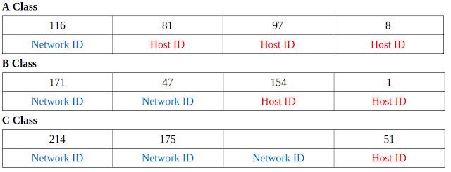

# Web Programing


### 1. 웹의 구성 요소

	> 웹을 이용하려면 웹 브라우저 사용방법, 웹 프로토콜, 하이퍼링크, 웹 서버 주소, 인터넷 정보자원들에 대한 기본 지식이 필요하다.
	>
	> 서버 구축에는 웹 서버 구축관리, 웹 문서 작성 개발, DB서버의 운영관리, 웹 프로그래밍 지식이 필요하다.


#### 인터넷 연결 프로토콜 (TCP/IP)

##### Transmission Control Protocol / Internet Protocol

> 인터넷을 사용하기 위해서는 TCP/IP를 설치하고 IP주소를 할당 받아야 한다.


- IP주소 Class



> 원래는 4바이트 단위의 IP주소체계인 IPv4를 사용 했지만, 인터넷 사용이 폭발적으로 증가함에 따라 DHCP, DDNS 서버 등으로 늘렸지만 8바이트 단위로 확장한 IPv6가 개발되었다. 


#### 웹 문서 작성 언어

- HTML (HyperText Markup Language)은 인터넷 웹 서비스를 이용할 때 쓰는 표준언어로 하이퍼링크 기능과 마크업 기능을 제공한다.

```HTml
<body>
	<h2>HTML5 웹 프로그래밍</h2><hr>
	<p>
		웹 프로그래밍은 
		<a href="http://www.w3.org/html/"> HTML표준</a>
	</p>
</body>
```


#### 웹 서버 구축

​	아파치 웹 서버는 가장 많이 사용하는 무료 웹서버로,  http://www.apache.org/에서 직접 다운받을 수 있다. 웹 서버 구축을 위해서는 아파치와 함께, PHP 서버, MySQL 데이터베이스 서버를 결합해서 한꺼번에 설치해주는 패키지들을 다운 받아 설치해도 된다.


## HTML

> 정보를 표현한다 

## CSS

> 정보를 꾸며준다

## JavaScript

> HTML을 프로그래밍 적으로 제어한다.

