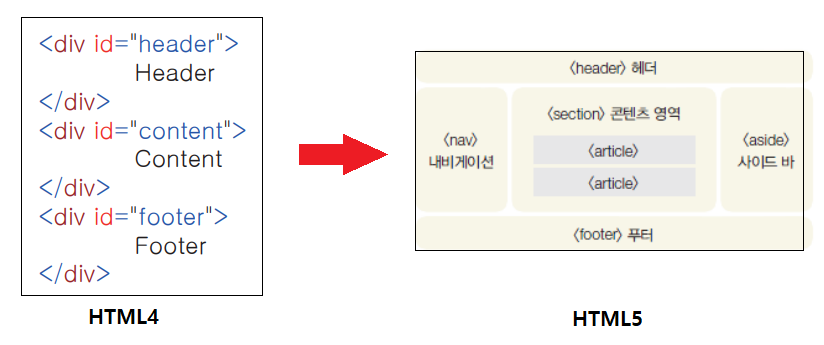

# HTML

### 1. HTML의 기본 구조

```html
<!doctype html>
<html lang="ko">
 	<head>
 ...
 	</head>
     <body>
 ...
 	</body>
</html>
```



> HTML4 구조는 가독성이 떨어지기 때문에 HTML5로 바뀌고 나서는 구조별로 나눴다.


### 2. 자주 쓰이는 태그들

#### `<Head>`태그

- 웹 브라우저 화면에는 보이지 않지만, 웹 브라우저가 알아두어야 할 정보들 입력 

- 문서에서 사용할 외부 파일들 링크

`<title>`태그 : 브라우저의 제목 표시줄에 표시되는 내용

`<meta>`태그 : 문자 인코딩 방법 및 문서의 키워드와 요약 정보를 지정

​			`<meta charset="utf-8">`

```html
<title> 제목제목제목 </title>
<meta charset="utf=8">
```


#### `<body>`태그

- 실제로 브라우저에 표시될 내용들 입력 

```html
<body> 입력할 내용 </body>
```


#### `<hn>` 태그

- 일반 텍스트 보다 크기가 크고 진하게 표시. h1~h6까지 사용.

```html
<h1> 텍스트 </h1>    
<h2> 텍스트 </h2>
<h3> 텍스트 </h3>
<h4> 텍스트 </h4>
<h5> 텍스트 </h5>
<h6> 텍스트 </h6>
```


#### `<p>` 태그

- 입력한 내용 앞뒤로 빈 줄이 생기면서 텍스트 단락이 만들어진다.

```html
<p> hello HTML </p>
```


#### `br`태그

- 태그가 삽입한 위치에서 줄이 바뀜.


#### `<b>`, `<i>`글씨 태그 

- `<b>` : 이 태그로 감싼 텍스트를 진하게 표시.

- `<i>` : 이 태그로 감싼 텍스트를 이탤릭체로 표시.


#### `` 태그

- 웹 문서에 이미지를 넣는 태그. 태그 하나당 하나의 이미지.

```html
 
```


#### `<a>` 태그

-다른 문서나 외부 사이트로 연결하는 하이퍼링크 만드는 태그

```html
<a href="링크할 주소"> 텍스트 또는 이미지 </a>
```


#### 주석

- 코드에 방해없이 개발자만 볼 수있게 하는 것

```html
<!-- 이것은 주석 처리이다. -->
```


