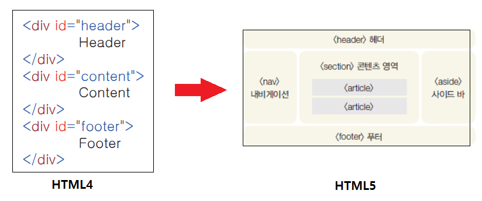
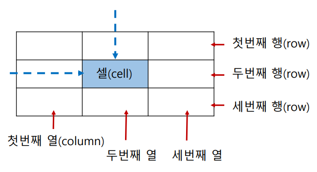
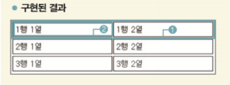

# HTML

### 1. HTML의 기본 구조

```html
<!doctype html>
<html lang="ko">
 	<head>
 ...
 	</head>
     <body>
 ...
 	</body>
</html>
```



> HTML4 구조는 가독성이 떨어지기 때문에 HTML5로 바뀌고 나서는 구조별로 나눴다.


### 2. 자주 쓰이는 태그들

#### `<Head>`태그

- 웹 브라우저 화면에는 보이지 않지만, 웹 브라우저가 알아두어야 할 정보들 입력 

- 문서에서 사용할 외부 파일들 링크

`<title>`태그 : 브라우저의 제목 표시줄에 표시되는 내용

`<meta>`태그 : 문자 인코딩 방법 및 문서의 키워드와 요약 정보를 지정

​			`<meta charset="utf-8">`

```html
<title> 제목제목제목 </title>
<meta charset="utf=8">
```


#### `<body>`태그

- 실제로 브라우저에 표시될 내용들 입력 

```html
<body> 입력할 내용 </body>
```


#### `<hn>` 태그

- 일반 텍스트 보다 크기가 크고 진하게 표시. h1~h6까지 사용.

```html
<h1> 텍스트 </h1>    
<h2> 텍스트 </h2>
<h3> 텍스트 </h3>
<h4> 텍스트 </h4>
<h5> 텍스트 </h5>
<h6> 텍스트 </h6>
```


#### `<p>` 태그

- 입력한 내용 앞뒤로 빈 줄이 생기면서 텍스트 단락이 만들어진다.

```html
<p> hello HTML </p>
```


#### `br`태그

- 태그가 삽입한 위치에서 줄이 바뀜.


#### `<b>`, `<i>`글씨 태그 

- `<b>` : 이 태그로 감싼 텍스트를 진하게 표시.

- `<i>` : 이 태그로 감싼 텍스트를 이탤릭체로 표시.


#### `` 태그

- 웹 문서에 이미지를 넣는 태그. 태그 하나당 하나의 이미지.

```html
 
```

①src 속성 : 이미지 파일의 경로. 웹 문서 파일의 위치를 기준으로 정해진다.

②width, height 속성 : 이미지 크기 지정.

​	``

③ alt 속성 : 대체 텍스트

- 이미지를 표시하지 않았을 경우에 이미지 대싞 표시할 텍스트. 

- 시각 장애인을 위한 화면 리더기에서 대체 텍스트를 읽는다.

  ``

④ title 속성 : 툴팁 표시

- 마우스 포인터 자리에 표시하는 설명 상자

  ``


#### `<embed>` 태그

- 미디어 파일을 표현해줌

  `<embed src=“미디어 파일 경로” [width=“너비” height=“높이”]>`

  ①src : 미디어 파일의 경로. 

  ②width, height : 화면의 너비와 높이. 

  ③type : 삽입할 미디어 파일의 mime 타입. 

  - wmv video/x-ms-wmv 
  - avi video/avi 
  - mov video/mov; 
  - swf appliation/x-shockwave-flash;


### `<video>` 태그

> mp4 라는 비디오 파일 형식은 크롬이나 사파리 브라우저에서맊 재생할 수 있다. 파이어폭스에서 열어보면 비디오가 나타나지 않는다. 아직까지 HTML5 태그에서 사용할 파일 형식의 표준이 정해지지 않았다.
>
> 현재로서는 브라우저마다 재생할 수 있는 파일들을 따로 지정해 주는 방법으로 이 문제를 해결.

#### `<video src = "경로" width="450" height="300" controls>`


- ##### 비디오와 코덱 

  ① H.264/AVC - 고화질의 영상. 

   - mp4 파일이나 mov 파일 등 맋은 곳에서 사용된다. - 로열티를 지불해야 한다  웹 표준으로 지정하기에는 맋은 논란이 있다. - 사파리와 크롬에서 지원 

     

  ② 오그 테오라(Ogg Theora) 

  - H.264와 달리 로열티를 지불하지 않아도 되는 공개 코덱 
  
  - ogg 파일 형식에서 사용하는 코덱
  
  - 파이어폭스와 오페라, 크롬에서 지원. 
  
    
  
  ③ WebM - 가장 최근에 구글에서 오픈 소스로 공개한 코덱.
  
  - 화질이 좋고 무료로 제공 
  - webm 파일에서 사용 
  - 파이어폭스와 오페라, 크롬 등에서 지원.


```html
<video>
 <source src="gate.ogg" type=“video/ogg”>
 <source src="gate.mp4" type=“video/mp4”>
 <source src="gate.webm" type=“video/webm”>
</video>
```


- controls : 미디어 파일에 컨트롤 막대 표시.

  >  표시되는 컨트롤 막대는 웹 브라우저마다 다르며, 사용할 수 있는 명령도 조금씩 다르다. 

- preload : 재생하기 전에 비디오 파일을 모두 다운로드할 것인지 또는 일부 정보만 다운로드 할 것인지 여부를 지정한다. (none, metadata, auto)

- autoplay : 비디오 파일을 다운로드하자마 자동으로 재생한다. 

  > 모바일 기기에서는 자동 재생되 지 않는다.

- loop : 미디어 파일 반복 재생. 속성 값 없이 loop 라고 하면 된다.


#### `<audio>` 태그

- HTML5에서 배경 음악이나 효과음 등 오디오 삽입.

  `<audio src="오디오파일경로" [속성][속성="속성값]>`


#### `<a>` 태그

-다른 문서나 외부 사이트로 연결하는 하이퍼링크 만드는 태그

```html
<a href="링크할 주소"> 텍스트 또는 이미지 </a>
```


#### 주석

- 코드에 방해없이 개발자만 볼 수있게 하는 것

```html
<!-- 이것은 주석 처리이다. -->
```


### 3. 텍스트 관련 태그들 

- `<strong>` : 중요한 부분을 굵게 표시 
- `<em>` : 중요한 부분을 이탤릭체로 표시
- `<b>` : 굵게 표시
- `<i>` : 이텔릭체로 표시 
- `<span>` : 줄바꿈 없이 영역 묶기

  > 텍스트 단락 안에서 줄바꿈 없이 일부 텍스트만 묶어서 스타일을 적용하려고 할 때 주로 사용


### 4. 목록을 만드는 태그들

- `<ul>` ,`<li>` 태그 : 순서없는 목록 

  ```html
  <ul>
      <li> 내용 </li>
      <li> 내용 </li>
  </ul>
  ```


- `<ol>`,`<li>` 태그 : 순서 목록

  ```html
  <ol>
      <li> 내용 </li>
  	<li> 내용 </li>
  </ol>
  ```

  


### 5. 표를 만드는 태그

- `<tabel>` : 표 전체 만듬

- `<tr>` : 열을 만듦
- `<td>` : 셀을 만듬  
- `<caption>` : 테이블의 제목 만듦



```html
<table>
 	<tr> <!-- 첫번째 행에 td로 내용을 넣는다. -->
		<td>1행 1열</td>
 		<td>1행 2열</td>
 	<tr>
 	<tr>
 		<td>2행 1열</td>
 		<td>2행 2열</td>
 	<tr>
 	<tr>
 		<td>3행 1열</td>
 		<td>3행 2열</td>
 	<tr>
</table>
```




### 하이퍼링크 만들기 

#### `<a href="연결할 문서나 사이트 경로"> 텍스트 </a>`

- 링크를 만드는 태그는 ` <a> `태그
-  반드시 href속성을 함께 사용해서 어떤 대상으로 연결하는지 알려주어야 한다.


 #### 새창에서 링크 열기 

`<a href="링크할 경로 target="_blank` : 현재페이지는 유지하고 새탭에서 열기

#### 링크를 미리 알려주는 툴팁

`<a href="링크할 경로" title="링크내용에 대한 요약 설명">`

#### 앵커 (anchor)

`<a id="앵커이름"> 텍스트 또는 이미지 </a>`

- 웹문서가 너무 길 경우 문서 안에 팻말을 달아놓고 그 위치로 한번에 이동하는 기능 
- 네이버에서 리모콘 기능이랑 같음

```html
<body id="top">
 <a href="#bottom">최하단으로 이동</a>
 <br><br><br><br><br><br><br><br><br><br><br><br><br><br><br><br><br>
 <br><br><br><br><br><br><br><br><br><br><br><br><br><br><br><br><br>
 <a id="bottom" href="#top">최상단으로 이동</a>
</body>
```

