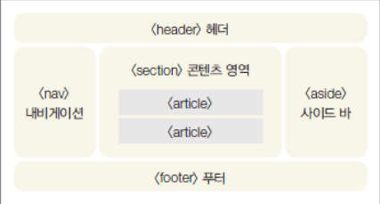
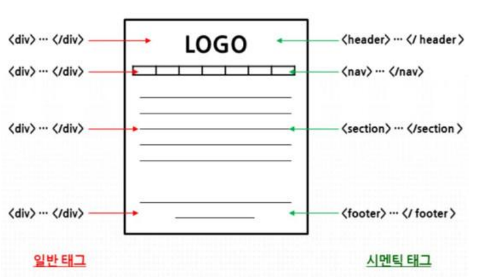

# 시멘틱 태그

> HTML4는 화면을 구성하는 역할은 대부분 태그에게 맡겨 놓았고, 수많은 태그들을 구분하는 것은 id 속성을 이용했다. 이 불편함을 해소하고자 HTML5가 생겼다.


#### 시멘틱 태그가 사용된 HTML5의 문서 구조 







#### 1. `<header>` : 머릿말(제목)

#### 2. `<nav>` : 문서를 연결하는 내비게이션 링크

#### 3. `<section>` : 콘텐츠영역 나타내기

#### 4. `<article>` : 실제 콘텐츠 내용 넣기

#### 5. `<footer>` : 제작 정보와 저작권 정보 표시 

#### 6.`<address>` : 제작자의 정보, 연락처 정보


```html
<!DOCTYPE html>
<html>
<head>
	 <meta charset="utf-8">
	 <title>HTML5 연습</title>
	 <link href="style.css" rel="stylesheet">
</head>
	<body>
 		<header>
 			<h1>Tennis</h1>
 			<h2>관악구 테스트장 예약 사이트</h2>
 		</header>
    
		 <nav class="navi">
	 		<ul>
 				<li><a href="#">이용 앆내</a></li>
           		<li><a href="#">코트 소개</a></li>
 				<li><a href="#">예약 방법</a></li>
 				<li><a href="#">예약 하기</a></li>
 			</ul>
 		</nav>
    
	 <section class="content">
 		<h2>테니스장 소개</h2>
 		<article>
 			<h3>1번 코트</h3>
 			
		 </article>
 	</section>
    
 	<aside class="sidebar1">
 		<h3>예약 방법</h3>
 		<p>전화 070-###-####</p>
 	</aside>
    
 	 <footer>
 		<p>서울특별시 관악구</p>
 		<address>###@naver.com</address>
     </footer>
	</body>
</html>
```

