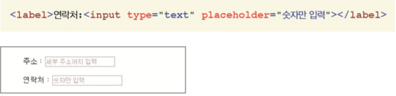

# Form Tag


### 1. `<form>` 태그

- 폼을 만드는 기본 태그. 

  `<form [속성="속성값"]> 폼요소 </form>`

- 사용 가능한 속성

  - method : 폼을 전송할 방식 선택
  - action : 폼을 전송할 서버 쪽의 스크립트 파일

#### `<form action="register.php" method="post">`


### 2. `<fieldset>`태그

- 폼 요소를 그룹으로 묶는 태그

 `<fieldset [속성="속성 값"]> ... </fieldset>`

​	① disabled:  태그의 자식 요소들을 사용핛 수 없게 맊든다. 

​	② form: 현재  태그가 속해 있는 form의 이름 표시 

​	③ name: 서버로 넘겨줄 이름 지정.

``` html
<fieldset>
	 <legend>로그ㅇ니 정보</legend>
	 <ul>
 		<li>아이디 : <input type="text" id="user_id"></li>
 		<li>비밀번호 : <input type="password" id="pw"></li>
	 </ul>
 </fieldset>
```


### 3. `<legend>` 태그

- 그룹으로 묶은 구역에 제목을 붙이는 태그

```html
<legend> 가입자 정보 </legend>
 <ul>
 	<li>이름 : <input type="text" id="user_name"></li>
	 <li>메일 주소 : <input type="text" id="user_mail"></li>
	 <li>생년월일 : <input type="text" id="birth"></li>
 </ul>
```


### 4. `<label>` 태그

- 폼 요소에 캡션(텍스트)을 붙이는 태그 
- 라디오 버튼이나 체크 박스에서 캡션 부분을 클릭해도 라디오 버튼과 체크 박스 버튼 이 선택된다.


### 5. `<input>`

- 사용자가 입력하는 부분은 거의  태그를 이용해 처리 

- 입력하는 내용의 종류는  태그의 type 속성을 통해 지정 

- type 속성 값에 따라 함께 사용핛 수 있는 속성들도 달라진다

  #### `<input type="유형"  [속성="속성 값"]>`


#### input의 type들 

<table>
    <tr>
    	<td>키워드</td>
        <td>설명</td>
    </tr>
    <tr>
    	<td>text</td>
        <td>한 줄짜리 텍스트를 입력할 수 있는 텍스트 상자</td>
    </tr>
     <tr>
    	<td>password</td>
        <td>비밀번호를 입력할 수 있는 필드</td>
    </tr>
    <tr>
    	<td>checkbox</td>
        <td>주어진 항목에서 2개이상 선택 가능한 체크박스</td>
    </tr>
    <tr>
    	<td>radio</td>
        <td>주어진 항모게서 1개만 선택할 수 있는 라디오버튼</td>
    <tr>
    	<td>button</td>
        <td>버튼을 넣습니다.</td>
    </tr>
        <tr>
    	<td>file</td>
        <td>파일을 첨부할 수 있는 버튼을 넣습니다.</td>
    </tr>
        <tr>
    	<td>submit</td>
        <td>서버 전송 버튼을 넣습니다.</td>
    </tr>
    <tr>
    	<td></td>
        <td></td>
    </tr>
    <tr>
    	<td></td>
        <td></td>
    </tr>
    </tr>
        <tr>
    	<td>hidden</td>
        <td>사용자에게는 보이지 않지만 서버로 넘겨지는 값을 가지는 필드</td>
    </tr>
        <tr>
    	<td>search</td>
        <td>검색 상자를 넣습니다.</td>
    </tr>
        <tr>
    	<td>tel</td>
        <td>전화번호 입력 필드</td>
    </tr>
        <tr>
    	<td>url</td>
        <td>url 주소를 입력할 수 있는 필드</td>
    </tr>
        <tr>
    	<td>email</td>
        <td>메일 주소를 입력 할 수 있는 필드</td>
    </tr>
        <tr>
    	<td>number</td>
        <td>숫자를 조절 할 수 있는 화살표</td>
    </tr>
        <tr>
    	<td>range</td>
        <td>숫자를 조절 할 수있는 슬라이드 막대</td>
    </tr>
        <tr>
    	<td>color</td>
        <td>색상표를 넣습니다.</td>

​    

#### 그밖에 다른 type들 

#### type=“reset” – 리셋 버튼 

- 요소에 입력된 정보들을 모두 리셋시킴 

- 사용자가 입력핚 내용을 모두 지움. 

- value 속성을 사용하여 버튼에 표시할 내용 지정. 


#### type=“image” – 전송 버튼 

- submit 버튼 대신 이미지 사용


#### readonly 속성 

- readonly 속성은 해당 필드를 읽기 전용으로 바꾼다. 

- 필드 안에 내용이 있으면서 사용자에게 내용을 보여주기만 하고 사용자가 입력은 할 수 없게 한다. 

- 인기 전용으로 하려면 readonly=“true” 또는 readonly

​    

#### placeholder 속성 

- 요소의 필드 안에 적당한 힌트 내용을 표시하고 있다가 그 필드를 클릭하면 내용이 사라지도 록 하는 것 

- 텍스트 필드 앞에 레이블을 사용하지 않고도 어떤 내용을 입력해야 할지 알려줄 수 있어 편리하다.




#### required 속성 

• [submit] 단추를 클릭해서 서버로 폼을 전송할 때 **필수 필드에 필요한 내용이 모두 채워졌는지 검사**한다. 

> HTML4에서는 자바스크립트로 처리했지만 HTML5에서는 required 속성 사용


### 6. `<select>`, `<optgroup>`, `<option>` 태그

- 최대한 공간을 적게 사용하면서 여러 가지 옵션을 표시하는 드롭다운 목록 만들기


#### `<option>`태그의 속성

- value : 옵션을 선택했을 때 서버로 넘겨질 값 

- selected : 화면에 표시될 때 기본으로 선택될 옵션 지정


<select >
    <option value="computer">컴퓨터공학</option>
    <option value="mechanic">기계공학</option>
    <option value="indust">산업공학</option>
    <option value="elec">전자공학</option>
</select>

```html
<select >
    <option value="computer">컴퓨터공학</option>
    <option value="mechanic">기계공학</option>
    <option value="indust">산업공학</option>
    <option value="elec">전자공학</option>
</select>
```

#### 속성

- size : 드롭다운 옵션의 개수
- multiple : 컨트롤 키 누른 상태로 여러 옵션 선택 가능


### 7. `<textarea>` 태그

- 한 줄 이상의 문장을 입력할 때 사용하는 폼

  `<textarea [속성="속성 값"]> 내용 </textarea>`

 태그의 속성

1. name : 텍스트 영역의 이름을 지정합니다.

2.  cols: 텍스트 영역의 가로 너비를 문자단위로 지정

3.  rows : 텍스트 영역의 세로 길이를 줄 단위로 지정.

   


