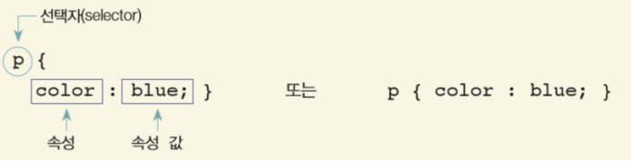
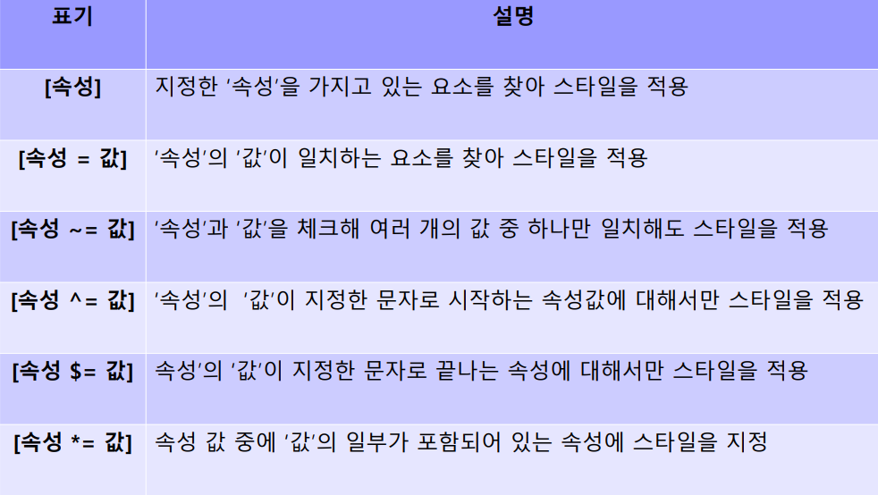
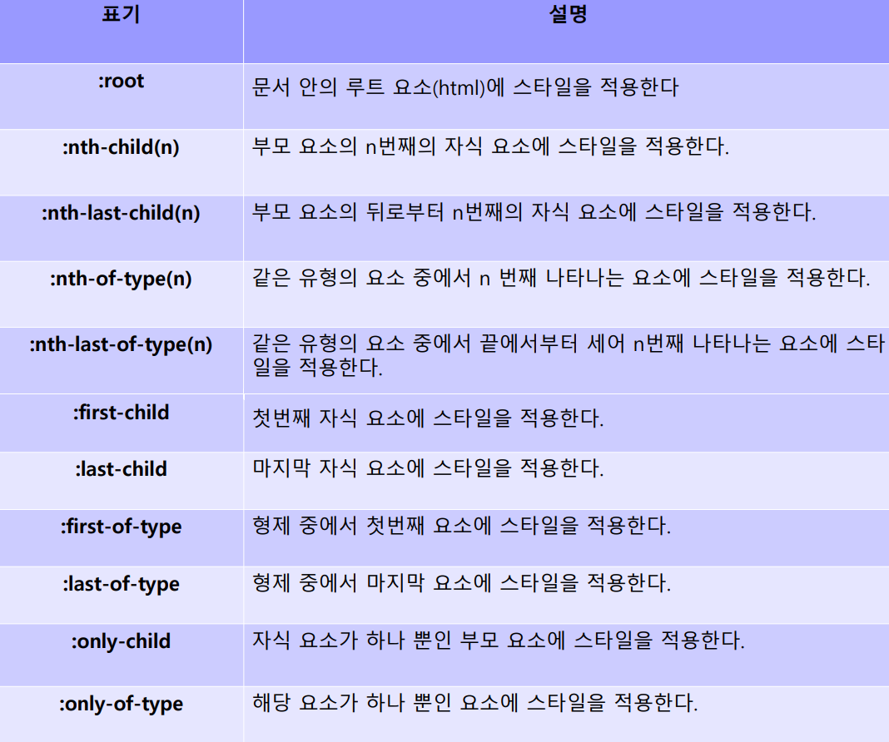

# CSS


###  스타일이란?

>  HTML 문서에서 자주 사용하는 글꼴이나 색상, 정렬, 각 요소들의 배치 방법 등 문서의 겉모습을 결정짓는 내용들


- #### 스타일의 형식

  선택자(seletor) : CSS가 적용 될 곳은 선택자이다. 

  속성 : `속성 : 속성 값`과 같은 형식으로 함께 표시하며 여러 값이 쌍으로 존재할 경우 세미콜론으로 구분한다. 

  ``` html
p { color:blue;}
  h2 { font-size:20px; color:purple; }
  ```




- #### 스타일 적용 방법 

  1. 태그에 직접 적용

     `<div style="background : #ff0000;">`

  2. 문서 내부에 적용

     ```html
     <style>
         div { background : #ff00000 }
     </style>
     ```

  3. 외부 문서를 삽입 

     `<link href="외부 CSS 파일 경로" rel="stylesheet" type="text / css">`

     

- #### 부모요소의 스타일은 자식 요소에게 상속된다.

```html
<style>
    ul{
        color:blue /* 글자색 블루 */
        list-style:square;  /* 목록 항목은 square 모양으로 */
    }
</style>
```

```html
<ul>
    <li> 공부 </li>
    <li> 운동 </li>
</ul>	<!-- 모두 부모 스타일 적용 -->
```


- #### 스타일은 가장 나중에 쓰인 스타일을 적용한다. 

  #### (절차적으로 작용하여 덮어씌움)

  ```html
  <style>
  p{ color:red; }
  p{ color:blue; }
  </style> <!-- blue가 적용됨 -->
  ```

  

- #### 전체 선택자 vs 태그 선택자

  ```html
  <!DOCTYPE html>
  <html>
  <head>
  	<meta charset="utf-8">
  	<title>HTML5 연습</title>
  	<style>
  	/* 전체 선택자 */
  	* {
  		font-size : 60px;
  	}
  	/* 태그 선택자 */
  	p {
  		background-color : yellow;
  	}
  	a {
  		color : red;
  	}
  	</style>
  </head>
  	<body>
  		<p>P 문단 태그 내용</p>
  		<a>A 앵커 태그 내용</a>
  	</body>
  </html>
  ```


- #### class 선택자, id 선택자

  ##### 공통점 : 요소의 특정 부분에만 스타일 적용 

  ##### 차이점 

  - 클래스 선택자 : 문서 안에서 여러 번 반복할 스타일이라면 클래스

    선택자로 정의. 마침표(.) 다음에 클래스 이름 지정

     `.redtext { color:red; }`

    

  - id 선택자 : 문서 안에서 한번만 사용한다면 id 선택자로 정의.

    파운드(#) 다음에 id 이름 지정

    `#pic2 { clear:both; float:left; }`

``` html
<!DOCTYPE html>
<html>
	<head>
	<meta charset="utf-8">
	<title>HTML5 연습</title>
	<style>
	/* 아이디 선택자 */
		#first { background : red; }
		#second { background : blue; }
	/* 클래스 선택자 */
	span.title {
	background : yellow;
	font-size : 50px;
	}
	span.desc {
		background : gray;
		font-size : 150px;
	}
	</style>
</head>
<body>
	<div id="first">
		첫번째 DIV
	</div>
		<div id="second">
		두번째 DIV
	</div>
		<span class="title">
			SPAN1
		</span>
			<span class="desc">
			SPAN2
		</span>
	</body>
</html>
```


- #### 속성 선택자

  >  input `[type=text]` 와 같이 [ ]안에 들어가는 것을 속성이라고 한다. 




```html
<style>
	h5[title] { background-color : red; }
	h5[class~=header] { background-color : yellow; }
	h5[class^=con] { background-color : blue; }
	h5[class$=esc] { background-color : orange; }
	h5[class*=tiv] { background-color : purple; }
	input[type=text] { width : 50px; }
	input[type=password] { background-color : red; }
	input[type=tel] { font-size : 30px; }
	input[type=search] { font-style : italic; }
</style>
```


- #### 하위 선택자

  부모 요소에 포함된 모든 하위 요소에 스타일 적용

  ```html
  상위요소 하위요소 {속성: 속성 값;}
  body p { color:blue; }
  ```

  

- #### 자식 선택자

  자식 요소에만 스타일이 적용

  ```html
  부모요소 > 자식요소 {속성:속성값;}
  body > p { color:blue; }
  ```


- #### 인접 형제 선택자

  같은 부모를 가진 형제 요소중 첫번 째 동생 요소에만 스타일 적용.

  ```html
  요소1 + 요소2 {속성:속성 값;}
  <style>
      h1 + ul {
          color:blue;
          font-weight:bold;
      }
  </style>
  
  <body>
      <h1> 요금 </h1>
      <ul>
          <li> 전화 </li>
      </ul>
      <ul>
          <li> 데이터 </li>
      </ul>
  </body>
  ```

  > h1의 인접 형제 요소인 첫번째 ul 전화만 적용.


- #### 형제 선택자

  형재 요소들에만 스타일 적용 

  ```html
  요소1 ~ 요소2 {속성:속성 값;}
  h1 ~ p { text-decoration : underline;}
  ```

  > h1 > p에 모두 적용


- #### 가상 클래스

<table>
    <tr>
        <td>표기</td>
        <td>설명</td>
    </tr>
    <tr>
        <td>:link</td>
        <td>링크</td>
    </tr>
    <tr>
        <td>:visited</td>
        <td>사용자가 방문했던 링크</td>
    </tr>
    <tr>
        <td>:active</td>
        <td>대상 요소가 활성화 되었을 때. 클릭했을 때 등</td>
    </tr>
    <tr>
        <td>:hover</td>
        <td>사용자가 대상 요소를 가리키고 있을 때</td>
    </tr>
    <tr>
        <td>:focus</td>
        <td>대상 요소가 포커스 되었을 때</td>
    </tr>
    <tr>
        <td>:checked</td>
        <td>대상 요소가 체크 되었을 때</td>
    </tr>
    <tr>
        <td>:selected</td>
        <td>대상 요소가 선택 되었을 때</td>
    </tr>
</table>





- #### 가상요소

  <table>
      <tr>
      	<td>표기</td>
          <td>설명</td>
      </tr>
          <tr>
      	<td>::before</td>
          <td>특정 요소의 내용 앞에 지정한 내용을 만든다.</td>
      </tr>
          <tr>
      	<td>::after</td>
          <td>특정 요소의 내용 뒤에 지정한 내용을 만든다.</td>
      </tr>
          <tr>
      	<td>::selection</td>
          <td>사용자가 드래그해서 선택하는 영역의 스타일을 지정한다.</td>
      </tr>
          <tr>
      	<td>:not()</td>
          <td>괄호 안에 있는 요소를 제외한 요소에 스타일을 적용한다.</td>
      </tr>
  </table>

  