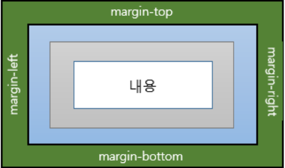
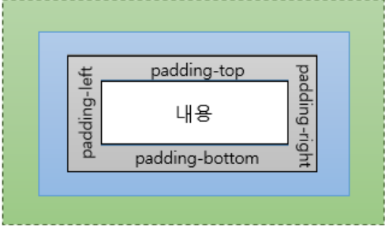
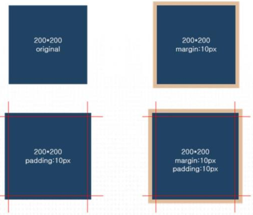
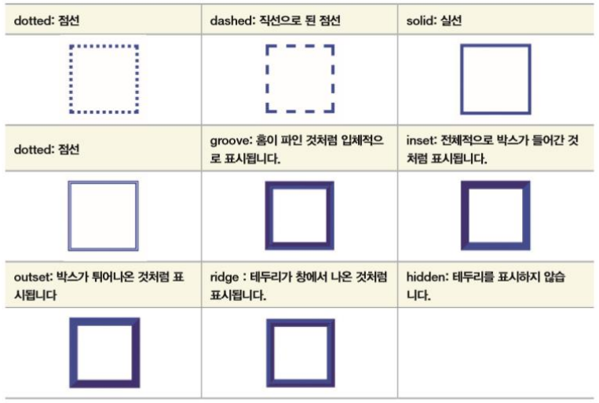
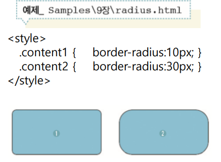
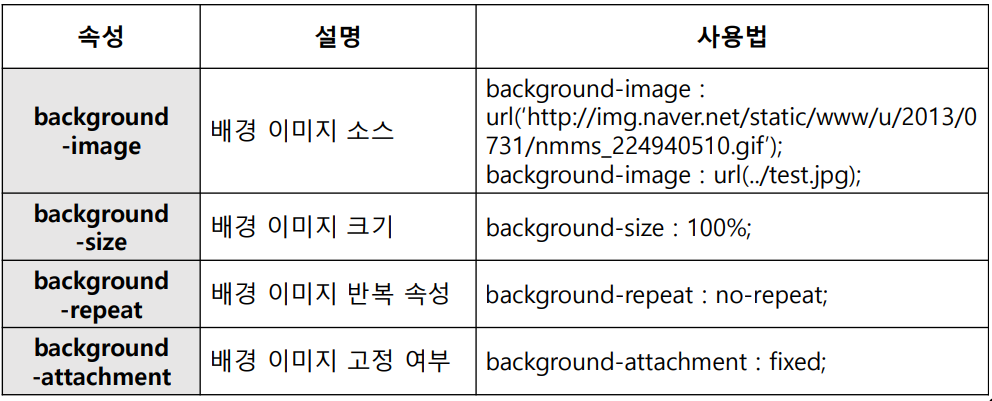

# CSS 속성


### 1. 단위

​	CSS에서 주로 사용하는 단위

- `px` : 절대적 속성 크기, 모니터 해상도 기준 화소

  font-size : 20px;

  

- `pt` : 절대적 속성 크기, 1pt - 1/72in

  font-size : 20pt;

  

- `em` : 상대적 속성 크기, 부모 요소 글자 크기의 배수

  font-size : 20em;


### 2. display

> HTML 요소를 화면에 출려 또는 숨기는 스타일 속성

<table>
    <tr>
        <td>속성</td>
        <td>설명</td>
        <td>사용법</td>
    </tr>
    <tr>
        <td>none</td>
        <td>숨김</td>
        <td>display:none;</td>
    </tr>
    <tr>
        <td>block</td>
        <td>한줄 공간 출력</td>
        <td>display:block;</td>
    </tr>
    <tr>
        <td>inline</td>
        <td>내용만큼만 공간 출력</td>
        <td>display:inline;</td>
    </tr>
    <tr>
        <td>inline-block</td>
        <td>내용만큼만 공간 출력 & 여러가지 속성</td>
        <td>display:inline-block</td>
    </tr>
</table>


### 3. visibility

> HTML 요소를 화면에 출력 또는 숨기는 스타일 속성

- ##### `visibility : visible;`  - 출력

- ##### `visibility : hidden;` - 숨김


###### display와 차이점

​	display:none; - HTML 요소를 화면에서 숨기며, 공간을 차지하지 않음

​	visibility:hidden - HTML 요소를 화면에서 숨기며, 공간은 유지


#### 4. Opacity

> HTML 요소의 투명도 조절
>
> 0.0~1.0까지 조절

##### `opacity:1.0;`


### 5. width와 height 

- width : HTML 요소의 가로 크기 지정

  width: 300px;

- height : HTML 요소의 세로 크기 지정

  height : 100px;

```html
<style>
    #content {  //content라는 아이디 선택자
        background-color : red
    	width : 300px
        height : 300px
    }
</style>
```


### 6. margin & padding



- ##### margin : 외곽 여백 지정  

  > 네 방향의 마진을 지정할 수 있음. 그냥 margin은  네방향 한꺼번에 지정.

  margin : 5px;

  margin-top : 5px;

  

  

  

- ##### padding : 내부 여백 지정

  padding : 5px;

  padding-top : 5px;


##### margin과 padding의 차이점




#### 7. 테두리 

> HTML 요소의 전체 크기 및 테두리 속성 지원

- ##### box-sizing : 테두리 위치를 지정 (내부/외부)

  box-sizing : border-box;


- ##### border : 테두리 모양 및 두께, 색상 지정

  border : 3px solid red

  border-width : 2px;

  

- ##### border-style 




- ##### radius : 테두리 모서리 둥굴게 처리




- ##### border 배경




### 8. font 폰트

<table>
    <tr>
        <td>속성</td>
        <td>설명</td>
        <td>사용법</td>
    </tr>
    <tr>
        <td>font-size</td>
        <td>글자크기</td>
        <td>font-size : 2px;</td>
    </tr>
    <tr>
        <td>font-family</td>
        <td>글꼴</td>
        <td>font-family:'돋움';</td>
    </tr>
    <tr>
        <td>font-style</td>
        <td>글자 형태 변경</td>
        <td>font-style:itaic</td>
    </tr>
    <tr>
        <td>font-weight</td>
        <td>글자 두께</td>
        <td>font-weight:100;</td>
    </tr>
    <tr>
        <td>line-height</td>
        <td>행간격</td>
        <td>line-height:20px</td>
    </tr>
    <tr>
        <td>text-align</td>
        <td>글자정렬</td>
        <td>text-align:center;<br>
        	text-align:left; <br>
            text-align:right; <br>
        </td>
    </tr>
    <tr>
        <td>text-decoration</td>
        <td>글꼴표시 설정<br>주로 `< a >`태그의 밑줄 제거</td>
        <td>text-decoration:none;기본값<br>
        	text-decoration:underline: 밑줄표시<br>
            text-decoration:overline : 글자 위로 선표시<br>
            text-decoration:line-through 글자를 가로지르는 선<br>
        </td>
    </tr>
    <tr>
        <td>text-shadow</td>
        <td>그림자 생성</td>
        <td>text-shadow:5px black;</td>
    </tr>
</table>