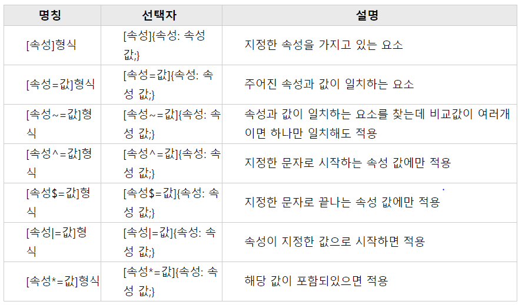

# 속성 선택자




# 가상 선택자 

> 가상 클래스는 별도의 클래스를 지정하지 않아도 지정한 것 처럼 요소를 선택할 수 있다. 
>
> 가상요소는 가상클래스처럼 선택자에 추가되며, 존재하지 않은 요소를 존재하는 것처럼 부여하여 문서의 특정 부분 선택이 가능합니다. 


### - n번째 선택자

`태그:nth-child(n)` : n번째 자식 요소에 스타일을 적용.

`태그:nth-last-child(n)` : 뒤에서 n번째 자식요소에 스타일 적용

`태그:nth-of-type(n)` :  같은 태그가 여러개 나열 되어있을때, n번째 항목을 지정하여 적용.

`태그:nth-last-of-type(n)` : 뒤에서부터 같은 태그가 여러개 나열 되어있을때, n번째 항목을 지정하여 적용.

`태그:first-child` : 첫번째 자식 요소에 적용할 스타일이다.

`태그:last-child`: 마지막 자식요소에 적용할 스타일이다.

`태그:first-of-type` : 형제 관계에 있는 요소중 첫번째 요소에 적용한다. 

`태그:last-of-type`: 형제 관계에 있는 요소중 마지막 요소에 적용한다.

`태그:only-child` : 부모 요소 안의 자식요소가 유일하게 하나일 때 스타일 적용.

`태그:only-of-child` : 해당 요소가 유일한 요소일 때 스타일 적용. 


### - 특정 상태를 선택하는 가상선택자

`a:link` : 문서 안의 하이퍼링크 중 아직 방문하지 않은 링크에 적용

`a:visited` :  한번 이상 방문한 사이트에 적용.

`a:active` : 해당 요소가 활성화되었을 때 적용. ex) 클릭한 상태

`a:hover` : 해당 요소 위에 마우스 포인터를 올려놓았을 때 적용( 롤 오버 )

`a:focus` : 해당 요소에 초점이 맞춰졌을 때 적용 ex) 텍스트 필드 안에 초점이 맞춰질때

`태그:checked` : 라디오 버튼이나 체크박스에 체크 되었을 때 적용할 스타일을 지정한다.

`::selection{속성: 속성 값;}` : 드래그되어 선택되는 영역의 스타일을 지정한다. 

`not(태그){속성:속성값;}` : not안에 포함된 태그를 제외한 모든 부분에 스타일 적용.

`태그::before{content: "";}` : 특정 요소의 내용 앞에서 지정한 내용을 만들 수 있다.  

`태그::after{content: "";}` : 특정 요소의 내용 뒤에서 지정한 내용을 만들 수 있다. 

- content의 속성들 
  1. normal : 아무것도 표시하지 않은 기본값
  2. string : 문자열 생성
  3. image : 이미지나 비디오를 불러올 수 있음.
  4. counter : 순서를 매길 수 있음. counter-increment, counter-reset 함께 사용.
  5. none : 아무것도 표시하지 않는다.
  6. atter : 해당 속성의 속성값 표기

- ::before, ::after의 활용법

  ```html
  <head>
      <style>
      .test li{float:left; margin-right:5px}
      .test li::after{padding-left:5px; content:"/";}
      .test li:last-child::after{content:"";}
      </style>
  </head>
  <body>
      <div>
          <ul class="test">
              <li><a href="">one</a></li>
              <li><a href="">two</a></li>
              <li><a href="">three</a></li>
          </ul>
      </div>
  </body>
  ```

  ::before, ::after같은 가상선택자는 css로 중복적인 html요소를 손쉽게 css와 함께 넣을 수 있다. 

  