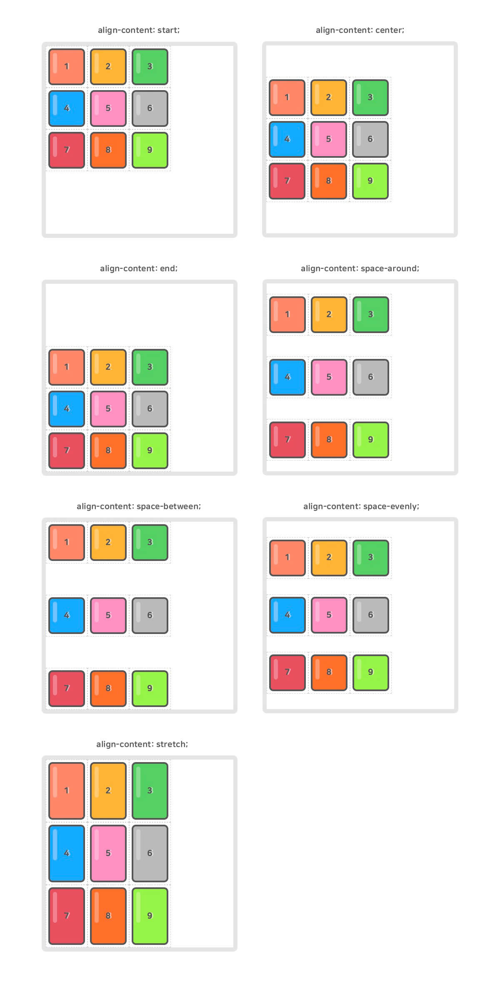

08_grid 

### Grid

<br>

그동안 사람들은 html에서 레이아웃을 보다 손쉽게 나눌수 있을 방법이 무엇인지에 대해 연구를 해왔다. 그래서 flex라는 속성이 생겼지만, 이 것보다 더 최근의 방법인 gird에 대해서 공부해 보자.

<br><br><br>

### 1. grid를 쓰는법

​	일단 그리드를 쓰기 위해선 css에서 속성을 주어야한다.

```css
#container{
	display:grid;
	grid-template-columns: 150px 1fr;
}
```

contatiner라는 id에 css속성을 주는데, display: grid로 속성을 주면 이제 grid를 사용할 수가 있다. 그다음 열방향인지 행방향인지에 대해 디테일한 속성을 주면된다.

<br>

그리드를 주는 두가지의 방법들

1. grid : block 특성의 그리드 정의

2. inline-grid : inline특성의 그리드 정의

<br>

> 이 그리드 속성을 쓰기위해선, 모든 요소를 감싸주는 부모 태그를 만들고, 그 부모에게 grid속성을 주어야 한다.

<br>

<br>

<br>

### 2. grid의 속성

이 그리드는 Container(컨테이너)와 Item(아이템)이라는 두가지 개념으로 구분되어있다. 컨테이너가 아이템들을 감싸는 부모이다.

<br>

#### - grid Container의 속성들

| 속성                  | 의미                                       |
| --------------------- | ------------------------------------------ |
| display               | 그리드 컨테이너를 정의                     |
| grid-template-rows    | 명시적 행의 크기 정의                      |
| grid-template-columns | 명시적 열의 크기 정의                      |
| grid-template-areas   | 영역 이름을 참조해 템플릿 생성             |
| grid-tmplate          | grid-template-xxx의 단축 속성              |
| row-gap               | 행과 행 사이의 간격을 정의                 |
| column-gap            | 열과 열 사이의 간격 정의                   |
| grid-auto-rows        | 암시적인 행의 크기를 정의                  |
| grid-auto-columns     | 암시적인 열의 크기를 정의                  |
| grid-auto-flow        | 자동 배치 알고리즘 방식을 정의             |
| align-content         | 그리드 콘텐츠를 수직(열 축) 정렬           |
| justify-content       | 그리드 콘텐츠를 수평(행 축) 정렬           |
| place-content         | align-content, justify-content의 단축 속성 |
| align-items           | 그리드 아이템들을 수직 정렬                |
| justify-items         | 그리드 아이템들을 수평 정렬                |
| place-tems            | 그리드 아이템들의 단축 속성                |

<br><br><br><br>

#### - grid Item 속성들

| 속성              | 의미                                                |
| ----------------- | --------------------------------------------------- |
| grid-row-start    | 그리드 아이템의 행 시작 위치 지정                   |
| grid-row-end      | 그리드 아이템의 행 끝 위치 지정                     |
| grid-row          | 아이템 위치 단축 속성(행시작/ 끝 위치)              |
| grid-column-start | 그리드 아이템의 열 시작 위치 지정                   |
| grid-column-end   | 그리드 아이템의 열 끝 위치 지정                     |
| grid-column       | 아이템 열의 단축속성(열 시작/ 끝 위치)              |
| grid-area         | 영역 이름을 설정하거나, grid-row, column이 단축속성 |
| align-self        | 단일 그리드 아이템을 수직  정렬                     |
| justify-self      | 단일 그리드 아이템을 수평 정렬                      |
| order             | 그리드 아이템의 배치 순서을 지정                    |
| z-index           | 그리드 아이템의 쌓이는 순서를 지정                  |

<br>

<br><br>

### 3. 자주쓰이는 속성들 

#### - grid-template-rows, columns

명시적 행의 크기를 정의하며, 동시에 라인의 이름도 정의할 수 있다. 

`fr`(fraction, 공간비율) 단위를 사용할 수있다. 

`repeat()` 함수도 사용 가능!

<br>

```css
.container {
  display: grid;
  grid-template-rows: 1행크기 2행크기 ...;
  grid-template-rows: [선이름] 1행크기 [선이름] 2행크기 [선이름] ...;
}
```

```css
.container {
  width: 400px;
  display: grid;
  grid-template-rows: repeat(3, 100px);
  grid-template-columns: repeat(3, 1fr);
}
```

<br>

#### - align-content

그리드 콘텐츠를 수직정렬 합니다. 

그리드 콘텐츠의 세로 너비가 그리드 컨테이너보다 작아야 합니다. 



### <br>- justify-content

그리드 콘텐츠를 수평 정렬합니다.

그리드 콘텐츠의 가로 너비가 그리드 컨테이너보다 작아야 합니다. 


#### <br>- order

그리드 아이템이 자동 배치되는 순서를 변경할 수 있다. 

숫자가 작을수록 앞에 배치 된다.

```css
.container {
  display: grid;
  grid-template-rows: repeat(2, 1fr);
  grid-template-columns: repeat(3, 1fr);
}
.item:nth-child(1) { order: 1; }
.item:nth-child(3) { order: 5; }
.item:nth-child(5) { order: -1; }
```


<br>

<br>


참고: https://heropy.blog/2019/08/17/css-grid/

