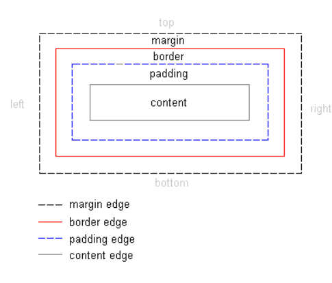

# HTML 웹 개발 Front


### 1. div 태그 좌우 반으로 나누기


태그

`float` : 말그대로 띄우다라는  뜻. 보통 정렬하기 위해서 쓴다.

- none: 띄우지 않음(기본값)

- left: 왼쪽에 띄움

- right: 오른쪽에 띄움

- initial: 기본값으로 설정함

- inherit: 부모요소로 부터 상속함.

  **절대 위치 요소는 float 속성을 무시한다.**


`div`: 하나 이상의 태그를 묶는 태그, 묶여진 태그들은 하나의 객체로 취급되어 속성을 주기 편하다.


```html
    <style>
        div {
            width: 100%;
            height: 300px;
            border: 1px solid #000;
        }
        div.left {
            width: 50%;
            float: left;
            box-sizing: border-box;
            background: #ff0;
        }
        div.right {
            width: 50%;
            float: right;
            box-sizing: border-box;
            background: #0ff;
        }
        </style>
    <body>
        <div>
            <div class="left"></div>
            <div class="right"></div>
        </div>
    </body>
```


`position` :  레이아웃을 배치하거나, 객체를 위치시킬 때 사용하는 속성

- static : 기본값 (위치 설정ㄴㄴ) 아래로 정렬된다.

  > top, bottom 등 설정이 안먹음

- relative : static의 원래 위치부터 계산한다.

  > top, bottom,left,rigrh의 위치를 같이 설정할 수도 있다.

- absolute: 바깥쪽에 공간(margin, padding 영향 x) 상위 요소 기준으로 위치가 결정됨.

- fixed: 브라우저 화면의 상대적 위치. (상위 요소에 영향을 받지 않음)




레이아웃 설정

`padding` : 본문 내용과 border 사이의 여백

> 마진은 음수값이 가능하지만, 패딩은 음수값 지정이 안된다.

`border` : 선 

`margin` : border와 바깥과의 여백


`div` vs `span` 

- div는 블럭개념으로 그릇에 담는 것이라면

- span은 inline 개념으로 안에 요소의 개별적 수정이다. 

  

`overflow` : 내용이 요소의 크기를 벗어났을 때 어떻게 처리할지 정하는 속성

- visible : 박스를 넘어가도 보여줍니다.
- hidden : 박스를 넘어간 부분은 보이지 않습니다.
- scroll : 박스를 넘어가든 넘어가지 않든 스크롤바가 나옵니다.
- auto : 박스를 넘어가지 않으면 스크롤바가 나오지 않고, 박스를 넘어갈 때에는 스크롤바가 나옵니다.
- initial : 기본값으로 설정합니다.
- inherit : 부모 요소의 속성값을 상속받습니다.


### flexbox

뷰포트나 요소의 크기가 불명확하거나 동적으로 변할 때에도 효율적으로 요소를 배치, 정렬, 분산할 수 있는 방법을 제공하는 css3의 새로운 레이아웃 방식. 최대 장점은 복잡한 계산 없이 요소의 크기와 순서를 유연하게 배치할 수 있다. 


#### - flexbox의 구성요소

> 부모요소 flex container 자식요소 flex item


### - flexbox를 만드는 방법

```
.flex1 {
	display: flex;
}
```

flex 속성이 적용된 요소는 flex container가 되고, 자식요소는 flex item이 된다. 

flex item은 주축에 따라 정렬된다. 주축의 방향은 flex-direction 속성으로 결정한다.

- row는 주축의 방향을 왼쪽에서 오른쪽으로
- column은 주축 방향을 위에서 아래로

- 부모의 속성과 자식의 속성은 다르다!

  

|    부모속성     |  자식속성   |
| :-------------: | :---------: |
| flex-direction  |    flex     |
|    flex-wrap    |  flex-grow  |
| justify-content | flex-shrink |
|   align-item    | flex-basis  |
|  align-content  |    order    |


### - flexbox만이 활용할 수 있는 10가지 레이아웃

- [레이아웃 1 - 스크롤 없는 100% 레이아웃](https://d2.naver.com/helloworld/8540176#ch2)

  ```
  .flex_container {
    display: flex;
    flex-direction: column;
    height: 100%;
  }
  
  .flex_item {
    flex: 1; /* flex: 1 1 0 */
    overflow: auto;
  }
  ```

  

- [레이아웃 2 - 내비게이션 영역](https://d2.naver.com/helloworld/8540176#ch3)

- [레이아웃 3 - 브라우저 화면 아래에 붙는 푸터](https://d2.naver.com/helloworld/8540176#ch4)

- [레이아웃 4 - 정렬이 다른 메뉴](https://d2.naver.com/helloworld/8540176#ch5)

- [레이아웃 5 - 폼 레이블 수직 중앙 정렬](https://d2.naver.com/helloworld/8540176#ch6)

- [레이아웃 6 - 중앙 정렬 아이콘](https://d2.naver.com/helloworld/8540176#ch7)

- [레이아웃 7 - 유동 너비 박스](https://d2.naver.com/helloworld/8540176#ch8)

- [레이아웃 8 - 말줄임과 아이콘](https://d2.naver.com/helloworld/8540176#ch9)

- [레이아웃 9 - 위아래로 흐르는 목록](https://d2.naver.com/helloworld/8540176#ch10)

- [레이아웃 10 - 가로세로 비율을 유지하는 반응형 박스](https://d2.naver.com/helloworld/8540176#ch11)


### - flex의 속성

1. flex-direction : 아이템의 방향 결정!

   - column : 위에서 아래로
   - row : 왼쪽에서 오른쪽으로

   

   

2. flex : 1 속성으로 자식 요소의 크기 확장

   flex item에 적용한 `flex` 속성은 flex item의 크기와 관련된 속성이며, 다음과 같이 `flex-grow` 속성과 `flex-shrink` 속성, `flex-basis` 속성을 축약한 표현이다.


```css
.flex-item {
  flex-grow: 1;
  flex-shrink: 1;
  flex-basis: 0;
}


/* flex: 1 1 0 */
.flex-item {
  flex: 1;
}
```


3. flex-grow 속성 (커질 때,)

   flex item의 확장에 관련된 속성이다. 0과 양의 정수를 속성값에 사용함.

   속성값이 `0`이면 flex container의 크기가 커져도 flex item의 크기가 커지지 않고 원래 크기로 유지된다. flex container의 크기가 커질 때 flex item의 크기도 커지게 하려면 `1` 이상의 값을 속성값으로 설정한다. 속성값이 `1` 이상이면 flex item의 원래 크기에 상관없이 flex container를 채우도록 flex item의 크기가 커진다.

   

   

4. flex-shrink 속성 (작아질 때,)

   flex item의 축소에 관련된 속성이다. 0과 양의 정수를 속성값에 사용한다. 기본값은 1 이다.

   속성값이 `0`이면 flex container의 크기가 flex item의 크기보다 작아져도 flex item의 크기가 줄어들지 않고 원래 크기로 유지된다. 속성값이 `1` 이상이면 flex container의 크기가 flex item의 크기보다 작아질 때 flex item의 크기가 flex container의 크기에 맞추어 줄어든다.

   


5. flex-basis 속성

   `flex-basis` 속성은 flex item의 기본 크기를 결정하는 속성이다. 기본값은 `auto`다.

   `width` 속성에서 사용하는 모든 단위(px, %, em, rem 등)를 속성값에 사용할 수 있다. `flex-basis` 속성의 값을 `30px`이나 `30%`와 같이 설정하면 flex item의 크기가 고정된다.

   

   `flex-basis` 속성에서 `auto`와 함께 자주 사용하는 속성값이 `0`이다. `flex-basis` 속성의 값을 `0`으로 설정하면 flex item은 절대적 flex item(absolute flex item)이 되어 flex container를 기준으로 크기가 결정된다.

   > **주의**
   > `flex-basis` 속성의 값을 `0`으로 선언할 때에는 `flex-basis: 0px`, `flex-basis: 0%`와 같이 단위도 함께 설정해야 한다.


