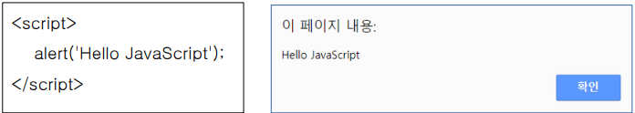
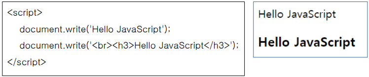
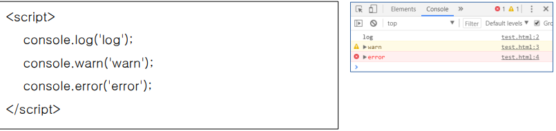
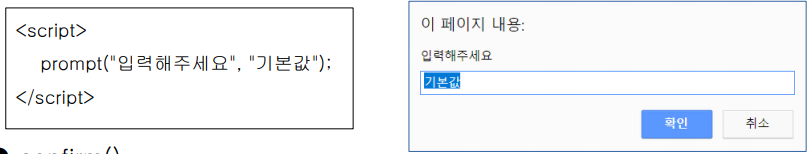
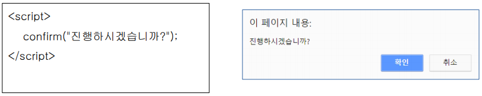

# Java_Script


### 1. 자바스크립트 코드 작성

```html
<head>
 <script>
 alert("Hello World..!");
 </script>
</head>
```

```html
<head>
 <!-- 링크형 -->
 <script src="http://code.jquery.com/jquery-3.1.1.min.js"></script>

 <script>
 /* 내장형 */
 var num = 100;
 num += 10;
 /* 함수형 */
 function sum() {
 }
 </script>
</head>
```


​	자바스크립트는 표현하는 방법이 매우 간소하다. 하지만 세미콜론이나 각각의 규칙만 잘 지켜준다면 비교적 c언어보다 말랑말랑한 언어이다.

- ##### 표현식

  10 + 20 + 30


- 문장
  - 하나 이상의 표현식이 모인것
  - 문장이 모여 프로그램 구성
  - 문장의 끝에는 세미콜론을 찍어 문장의 종결을 알려줌


### 2. 식별자

자바스크립트에서 이름을 붙일 때 사용하는 것이 바로 식별자이다.  변수나 함수의 이름이 될 수있는 것을 선언한다. 

> 식별자를 선언 할때 기존의 의미가 있는 키워드들은 쓰면 안됀다.

	1. 키워드 사용 불가
 	2. 숫자로 시작 불가
 	3. 특수문자는 _이랑 $만 가능
 	4. 공백문자 포함 불가 


### 3.주석

- 한 줄 : // 를 사용

- 여러 줄 : /* */ 를 사용


### 4. 출력

1. ##### alert()



>  화면에 알림창으로 출력

##### 	2. write




> 화면에 출력 


##### 	3. console.log()



> 개발자 도구에서 확인 할 수 있는 console창에 출력 


### 5. 입력

	1. ##### prompt() 




2. ##### confirm()




### 6. 여러가지 기능

1. ##### 팝업창 window.open

```html
<script>
 function openPopup() {
 	var popup = window.open("", "", "width=400 height=300");
 	popup.document.write(
 	"<input type='button' value='닫기' onclick='window.close()'>");
 }
 </script>
```


2. ##### 화면 및 브라우저 크기 window.screen.width

```html
   <script>
    	var w = window.screen.width;
    	var h = window.screen.height;
    	var w2 = window.innerWidth;
    	var h2 = window.innerHeight;
    	alert("화면크기 : " + w + ", " + h);
    	alert("브라우저크기 : " + w2 + ", " + h2);
   
    	document.write("화면크기 : " + w + ", " + h);
    	document.write("<br>");
    	document.write("브라우저크기 : " + w2 + ", " + h2);
    </script>
```

   

3. ##### input 태그의 value

```html
    <body>
    <form>
    	<input type="text" name="id" value="아이디1">
    	<input type="text" name="id" value="아이디2">
    </form>
    <form>
    	<input type="text" name="pw" value="비밀번호1">
    	<input type="text" name="pw" value="비밀번호2">
    </form>
   
    	<script>
    	alert(document.forms[0].id[0].value);
    	alert(document.forms[1].pw[1].value);
    	</script>
    </body>
   
```

   

4. ##### event - click 

```
<head>
<script>
	function fnClick(obj) {
 	if(obj.value == '') {
 		alert("입력된 값 : " + obj.value);
	 }
 }
 </script>
 </head>
 
 <body>
 	<form>
 	<input type="text" name="id" value="아이디1" onclick="fnClick(this)">
 	<input type="text" name="id" value="아이디2">
 	</form>
 </body>
```


5. ##### event - down / out / over

```html
<html>
 <head>
 <script>
 function fnMouseDown() {
	 alert("아이디2 마우스 클릭");
 }
 function fnMouseOut(obj) {
 	obj.style.backgroundColor = "#ffffff";
 }
 function fnMouseOver(obj) {
 	obj.style.backgroundColor = "#ff0000";
 }
 </script>
 </head>
    
 <body>
 	<form>
 		<input type="text" name="id" value="아이디1">
 		<input type="text" name="id" value="아이디2"
		 onmousedown="fnMouseDown()"
 		onmouseout="fnMouseOut(this)" onmouseover="fnMouseOver(this)">
	 </form>
 </body>
</html>
```


6. ##### event - onload

```html
<html>
 	<head>
 	<script>
 	function fnOnLoad() {
 	document.forms[0].title.addEventListener("click", function() {
 	var value = this.value;
	 alert(value + " 클릭");
 	});
 }
 </script>
 
 </head>
 	<body onload="fnOnLoad()">
 	<form>
 		<input type="text" name="title" value="제목">
 	</form>
 	</body>
</html>
```


