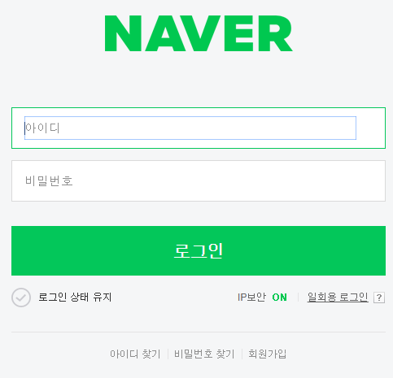
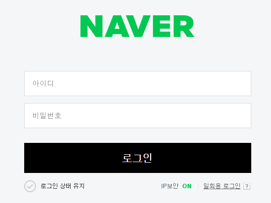

# java Script 


### 1. 자바스크립트는 작성하는 방법이 2가지 이다

첫번째, lnline방식 

이 방식은 이미 쓰여진 HTML에 속성값으로 자바구문을 넣는 것이다.

```html
<input type="button" onclick="alert('hello')" value="hello"/>
```

input이라는 HTML 태그 안에 onclick이라는 메소드를 넣고, 그 메소드 안에 자바스크립트 구문을 넣어서 실행시킨다.


두번째, Script 방식

이 방식은 `<script> `태그를 만들어서 이 태그 안에 자바스크립트를 쓰는 방식이다. 이렇게 사용하	는 이유는 자바 스크립트와 HTML의 분리를 할 수 있기 때문이다. 좀 더 쉽게 유지보수할 수 있다.

   ```html
<body>
    <input type="button" id="hw" value="Hello world" />
    <script type="text/javascript">
        var hw = document.getElementById('hw');
        hw.addEventListener('click', function(){
            alert('Hello world');
        })
    </script>
</body>
   ```


### 2. 자바스크립트 파일 확장자명 .js 

자바스크립트파일은 관습적으로 확장자명으로 js를 사용한다.


### 3. 스크립트 파일 외부 참조 

```html
<script src="./script.js"></script>
```

`.`은 현재 폴더를 가리킨다.


### 4. Object Model

웹브라우저의 구성요소들은 하나한나가 객체화되어있고, 이 객체화 된 HTML의 요소들은 자바스크립트로 제어할 수 있다.  예시로 한번 확인해 보자.




이 문서는 네이버 로그인 화면이다. 여기서 로그인 버튼의 색상을 동적으로 바꾸기 위해선 자바스크립트를 이용해야한다.  외부 css파일을 참조하는 것은 자바스크립트로 해야한다는 것이다 .


```shell
> var change = document.getElementsByClassName('btn_global');
undefined
> change[0].style.backgroundColor='blue';
"blue"
> change[0].style.backgroundColor='white';
"white"
> change[0].style.backgroundColor='black';
"black"
```

일단, 저 버튼을 가르키는 클래스 네임을 찾고, 그 클래스를 통해서 자바스크립트로 변경을 하면 가능하다. 

change라는 변수에 클래스를 저장하고 그 클래스를 통해서 스타일이 속성값을 접근해 색상을 바꾸면 된다. 이때, 저장된 변수값은 리스트의 형태로 저장되었기 때문에 change[0]와 같은 형태로 불러와야 한다.


#### result



​	블랙으로 색을 바꾼 버튼


### 각 오브젝트의 구조


#### DOM (Document Objest Model)

​	`<head>`, `<body>` 등을 제어하는 객체

#### BOM(Browser Object Model)

​	웹 페이지의 내용을 제외한 브라우저의 각종 요소들을 객체화 시킨 것.

#### JavaScript Core

​	자바스크립트 언어 자체에 저장되어 있는 객체들.


### 5. 사용자와 커뮤니케이션 하기


#### alert 

---

경고창이라고 부른다. 사용자에게 정보를 제공하거나 디버깅등의 용도로 많이 사용한다.

```html
<!DOCTYPE html>
<html>
    <body>
        <input type="button" value="alert" 						onclick="alert('hello world');" />
    </body>
</html>
```


#### confirm

---

사용자에게 확인/ 취소 값을 받는 창을 띄운다

```html
    <body>
        <input type="button" value="confirm" onclick="func_confirm()" />
        <script>
            function func_confirm(){
                if(confirm('ok?')){
                    alert('ok');
                } else {
                    alert('cancel');
                }
            }
        </script>
    </body>
```


#### prompt

---

사용자에게 데이터 값을 받는 명령어

```html
    <body>
        <input type="button" value="prompt" onclick="func_prompt()" />
        <script>
            function func_prompt(){
                if(prompt('id?') === 'egoing'){
                    alert('welcome');
                } else {
                    alert('fail');
                }
            }
        </script>
    </body>
```

> 만약 사용자에게 받는 값이 egoing이라면 welcome 이라는 창이, 그 밖에 다른 값들이라면 fail 이 뜬다. 


