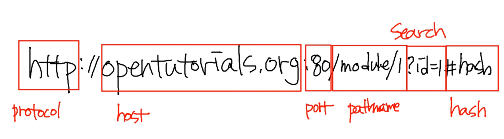

## 1. Location 객체

현재 웹 페이지의 주소 알아내기

현재 웹 페이지의 URL을 변경

현재 웹 페이지를 리로드 하는 방법


 #### 1. 현재 윈도우의 URL알아내기

아래는 현재 윈도우의 문서가 위치하는 URL을 알아내는 방법은 두가지이다.

```shell
console.log(location.toString(), location.href);
```

- location.toString()

- location.href

  둘 다 동일한 결과값을 만든다.


console.log(location)는 객체를 분석하여 보여준다. 

하지만, alert(location)는 문자열만을 출력한다.


#### 2. URL Parsing (파싱)



```javascript
console.log(location.protocol);
console.log(location.host);
console.log(location.port);
console.log(location.pathname);
console.log(location.search);
console.log(location.hash);
```

문서의 위치와 관련해서 다양한 정보를 얻을 수 있다.


#### 3. URL 변경하기

```java
//해당 URL로 이동한다.
location.href = 'http://egoing.net';
location = 'http://egoing.net';

// 웹페이지를 리로드 하는 방법
location.href = location.href
location.reload();
```


## 2. Navigatior 객체

크로스브라우징 이슈 : 브라우저마다 코드가 각각 다르게 실행되는 문제

네이게이터 객체를 이용하여 사용자가 사용하는 브라우저가 뭔지 알아냈다.


#### 1.네비게이터를 이용하여 주요한 프로퍼티를 알수있다.

```
console.dir(navigatior);
```


#### 2. appName

```
console.dir(navigatior.appName);
```

웹브라우저의 이름을 나타낸다.

| 결과    | 브라우저                         |
| ------- | -------------------------------- |
| IE      | 마이크로소프트 인터넷 익스플로러 |
| Nescape | 파이어폭스, 크롬 등              |


#### 3. appVersion

```
console.dir(navigatior.appVersion);
```

브라우저의 버전을 의미한다. 


##### 	result

```
"5.0 (Windows NT 6.3; WOW64) AppleWebKit/537.36 (KHTML, like Gecko) Chrome/34.0.1847.116 Safari/537.36"
```


#### 4. userAgent

```
console.dir(navigatior.auserAgent);
```

브라우저가 서버측을 전송하는 헤더의 내용이다. 

appVersion이랑 비슷하다.


#### 5. platform

```
console.dir(navigatior.platform);
```

브라우저가 동작하고 있는 운영체제에 대한 정보를 출력한다.

##### 	result

```
"win32"
```


#### 6. 기능 테스트

우리가 작성하는 코드가 브라우저에서 기능이 있는지 없는지 테스트 하는 것.


Navigator 객체는 브라우저 호환성을 위해서 주로 사용하지만 모든 브라우저에 대응하는 것은 쉬운 일이 아니므로 아래와 같이 기능 테스트를 사용하는 것이 더 선호되는 방법이다. 

예를 들어 Object.keys라는 메소드는 객체의 key 값을 배열로 리턴하는 Object의 메소드다. 이 메소드는 ECMAScript5에 추가되었기 때문에 오래된 자바스크립트와는 호환되지 않는다. 아래의 코드를 통해서 호환성을 맞출 수 있다. 

```javascript
// From https://developer.mozilla.org/en-US/docs/Web/JavaScript/Reference/Global_Objects/Object/keys
if (!Object.keys) { //!Objext.keys가 false일 때
  Object.keys = (function () {
    'use strict';
    var hasOwnProperty = Object.prototype.hasOwnProperty,
        hasDontEnumBug = !({toString: null}).propertyIsEnumerable('toString'),
        dontEnums = [
          'toString',
          'toLocaleString',
          'valueOf',
          'hasOwnProperty',
          'isPrototypeOf',
          'propertyIsEnumerable',
          'constructor'
        ],
        dontEnumsLength = dontEnums.length;
 
    return function (obj) {
      if (typeof obj !== 'object' && (typeof obj !== 'function' || obj === null)) {
        throw new TypeError('Object.keys called on non-object');
      }
 
      var result = [], prop, i;
 
      for (prop in obj) {
        if (hasOwnProperty.call(obj, prop)) {
          result.push(prop);
        }
      }
 
      if (hasDontEnumBug) {
        for (i = 0; i < dontEnumsLength; i++) {
          if (hasOwnProperty.call(obj, dontEnums[i])) {
            result.push(dontEnums[i]);
          }
        }
      }
      return result;
    };
  }());
}
```


