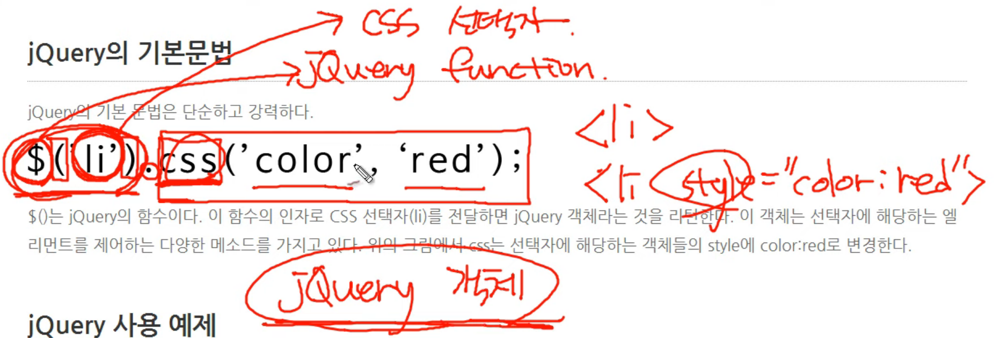

# DOM


### 1. 제어 대상을 찾기 

---

```html
<body>
<ul>
    <li>HTML</li>
    <li>CSS</li>
    <li>JavaScript</li>
</ul>
<script>
    var lis = document.getElementsByTagName('li');
    for(var i=0; i < lis.length; i++){
        lis[i].style.color='red';   
    }
</script>
</body>

```

​	문서 내에서 객체를 찾아내는 방법은 여러가지가 있다. 그 중에서 하나는 getElementsBy`TagName`, `ClassName` 등을 이용하는 방법을 사용했다. 

일단 document라는 엘리먼트는 문서전체를 뜻하고, 그 문서 전체에서 li이라는 태그 네임을 갖는 모든 요소를 탐색하고, 그 li를 for문으로 돌려서 그 길이만큼(lis.length) 스타일 요소를 붙여 출력한다. 


​	만약 조회의 대상이 겹칠 때, 그 범위를 좁히고 특정 객체를 지정하려면 다른 방법이 있다. 

```html
<body>
<ul>
    <li>HTML</li>
    <li>CSS</li>
    <li>JavaScript</li>
</ul>
<ol>
    <li>HTML</li>
    <li>CSS</li>
    <li>JavaScript</li>
</ol>
<script>
    var ul = document.getElementsByTagName('ul')[0];
    var lis = ul.getElementsByTagName('li');
    for(var i=0; lis.length; i++){
        lis[i].style.color='red';   
    }
</script>
</body>
```

여기서 우리는 ul > li만을 특정하고 싶다. 그래서 겟엘리먼트태그네임을 ul로 지정하였고, 그 ul중 첫번째 배열 [0]을 통해 범위를 지정해주었다. 그 지정된 li들 중에서 아까와 똑같이 for반복문으로 스타일 요소를 붙여 실행한다. 


### getElementsByClassName을 이용하여 인자 찾기

 ```html
<body>
<ul>
    <li>HTML</li>
    <li class='active'>CSS</li>
    <li class='active'>JavaScript</li>
</ul>
<script>
    var ul = document.getElementsByClassName('active');
    var lis = ul.getElementsByTagName('li');
    for(var i=0; lis.length; i++){
        lis[i].style.color='red';   
    }
</script>
</body>
 ```


### getElementById을 이용하여 인자 찾기

```html
body>
<ul>
    <li>HTML</li>
    <li id="active">CSS</li>
    <li>JavaScript</li>
</ul>
<script>
    var li = document.getElementById('active');
    li.style.color='red';
</script>
</body>
```


### document.querySelector을 이용하여 인자 찾기

```html
<!DOCTYPE html>
<html>
<body>
<ul>
    <li>HTML</li>
    <li>CSS</li>
    <li>JavaScript</li>
</ul>
<ol>
    <li>HTML</li>
    <li class="active">CSS</li>
    <li>JavaScript</li>
</ol>
 
<script>
    var li = document.querySelector('li');
    li.style.color='red';
    var li = document.querySelector('.active');
    li.style.color='blue';
</script>
</body>
</html>
```


### document.querySelectorAll

```html
<body>
<ul>
    <li>HTML</li>
    <li>CSS</li>
    <li>JavaScript</li>
</ul>
<ol>
    <li>HTML</li>
    <li class="active">CSS</li>
    <li>JavaScript</li>
</ol>
 
<script>
    var lis = document.querySelectorAll('li');
    for(var name in lis){
        lis[name].style.color = 'blue';
    }
</script>
</body>
```


### 2. 라이브러리

자주 사용하는 로직을 편리하게 재사용 할 수 있도록 고안된 소프트웨어를 라이브러리라고 한다. 


### 3. jQuery

 제이커리는  DOM을 내부에 감추고 보다 쉽게 웹페이지를 조작 할 수 있도록 돕는 도구이다.  

##### - jQuery의 기본 구조

```html
<body>
<script src="//code.jquery.com/jquery-1.11.0.min.js"></script>
    <script>
    jQuery( document ).ready(function( $ ) {
      $('body').prepend('<h1>Hello world</h1>');
    });
    </script>
</body>
```

​	이중에서 

```javascript
$('body').prepend('<h1>Hello world</h1>');
```

​	이 부분이 제일 중요하다. 바디라는 태그안에 prepend라는 메소드를 이용하여 다음 내용을 끼워넣어라. 라는 뜻.




```javascript
$('li').css('color','red');
$는 제이쿼리 함수
그다음 오는 li는 CSS선택자
이렇게 불러오면 .을 통해서 jQuery 객체값으로 변환하여 리턴하고 
jQuery 객체의 프로퍼티에 있는 CSS메소드를 불러 다음과 같이 쓴다. 

원래의 자바문법은 
<li style="color:red">
```

$()는 jQuery의 함수이다. 이 함수의 인자로 CSS 선택자(li)를 전달하면 jQuery 객체라는 것을 리턴한다. 이 객체는 선택자에 해당하는 엘리먼트를 제어하는 다양한 메소드를 가지고 있다. 위의 그림에서 css는 선택자에 해당하는 객체들의 style에 color:red로 변경한다.


제이쿼리도 똑같이 클래스는 선택자는 `.`, id선택자는 `#`

HTML요소가 가지는 속성을 선택하는 문법은 `요소[속성]`이다.

예를들어서 $("p[title]").css("color", "red");

​					$('input[type=text]').css('background-color', 'red')


자식 선택자로 불러오는 방법도 기존 자바스크립트랑 똑같다

$(document).ready(function(){

​	$('body > h1, body > h2').css('background-color', 'cyan');

});


후손선택자

$(document).ready(function(){

​	$('body h1').css('color', 'red');

});

형태로도 사용 가능


