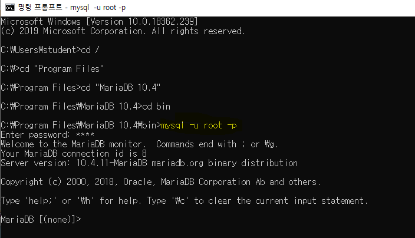
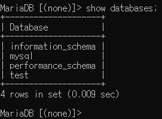
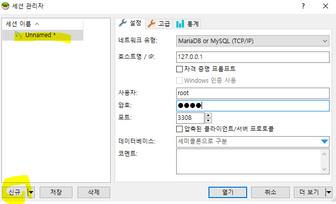
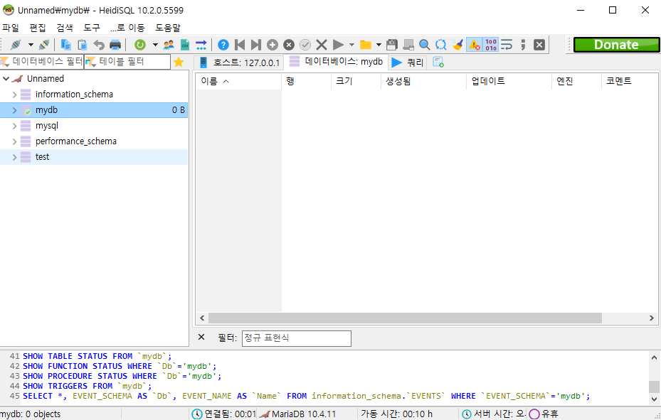
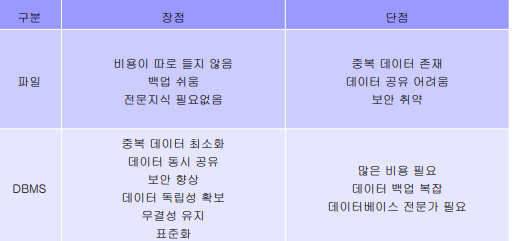
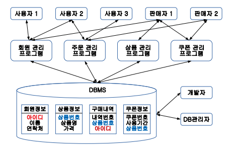

# maria DB 

MariaDB (= MySQL)

Oracle

Ms-SQL

===> SQL (Structured Query Language)

​			ANSI SQL = 표준 SQL

| Server            | Client         |
| ----------------- | -------------- |
| Websever(Spring)  | Browser        |
| DBServer(MariaDB) | Tool(HeidiSQL) |

Create

Read

Update

Delete

windows + r => services.msc

## 01. 설치하기

https://mariadb.com/downloads/ 에서 맞는 os에 설치

- 저장경로

- 패스워드 설정

- 포트 설정

  

- cmd 창에서 접속하기 

  

- show databases;

  

- 만들기

  

- 설치 끝

  

## 02. 데이터베이스란?

- 여러 사람들이 공유하고 사용할 목적으로 통합 관리되는 정보의 집합
- 파일 시스템의 문제를 해결하기 위해 제시된 소프트웨어
- 파일과 데이터베이스의 차이점

- 데이터베이스 데이터 관리

- 데이터베이스

  주요기능 

  - 정의 (DDL): 데이터베이스 구조르 정의하거나 수정

  - 조작(DML): 데이터 삽입, 조회, 수정, 삭제 작업

  - 제어(DCL): 데이터를 항상 정확하게 안전하게 유지

    -  내부적으로 필요한 규칙이나 기법을 정의하기 위해 사용 
    - 무결성 : 정확하고 유효한 데이터만 유지 
    - 보안 : 허가된 사용자에게만 데이터 조작 권한 부여 
    - 회복 : 장애 여부와 관계없이 데이터 일관성 유지 
    - 동시성 제어 : 동시 공유 지원

    

- 관계형 데이터베이스
  - 테이블 형태로 구성
  - 스키마 : 데이터베이스에 저장되는 데이터 구조와 제약조건을 정의한 것

- 개체 (Entity)

  - 현실 세계에서 사람이나 사물과 같이 구별되는 모든 것 

  - 다른 개체와 구별되는 이름을 가지고 있고, 각 개체만의 고유한 특성이나 상태, 즉 속성을 하나 이상 가지고 있음

- 속성 (attribute)
  - 개체나 관계가 가지고 있는 고유의 특성 
  - 의미있는 데이터의 가장 작은 논리적 단위

- 슈퍼키 : 두가지 이상 키를 묶어서 사용. 최소성 성립 x 
- 기본키 : 키로 쓰고 있는 것
- 대체키 : 기본키를 제외한 키로 사용 가능한 것
- 후보키 : 기본키를 포함한 키로 사용 가능한 것
- 외래키: 다른 테이블에서 가져온 것을 키로 사용 할 때

