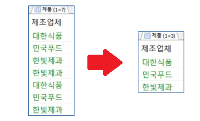
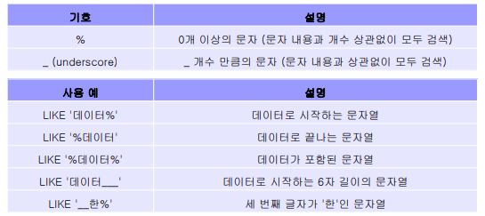

## DML

> 데이터 조작어


## INSERT : 데이터 삽입

- 기본 구조

```SQL
INSERT INTO 테이블명
 [(속성 리스트)]  --> 생략 가능
 VALUES
 (속성의 값 리스트);
```


- '부서' 테이블에 데이터 삽입

```
INSERT INTO 부서 (부서번호, 부서이름) VALUES (1, '인사부');
INSERT INTO 부서 (부서번호, 부서이름) VALUES (2, '연구부');
INSERT INTO 부서 (부서번호, 부서이름) VALUES (3, '홍보부');
```


## SELECT : 데이터 검색

```SQL
SELECT 고객아이디, 고객이름, 나이, 등급, 직업, 적립금
FROM 고객;
```

> 고객 테이블로부터 속성들을 선택해 값을 검색한다. (보여준다.)


```sql
SELECT *
FROM 고객;
```

> 모든 속성을 검색할 때 쓰는 명령어이지만, 왠만해선 명시해서 쓰는게 좋다. 나중에 프로그래밍을 할 때, 선택하기 어렵기 때문.


```sql
DESC 고객;
```

> 테이블의 속성을 잘 모를때 검색하기 위한 명령어.


중복된 속성 값을 제외하고 조회.

```sql
SECLECT DISTINCT 제조업체 --> 여러개도 가능
FORM 제품;
```




- 속성명 변경 출력 : AS

  ```
  SELECT 속성명 [AS] 변경속성 --> AS 생략 가능 
  FROM 테이블
  ```

  ```SQL
  SELECT 제품명, 단가 AS '가격'
  -- SELECT 제품명, 단가 '가격'
  FROM 제품;
  ```

- 산술식 이용하여 검색

  ```SQL
  SELECT 속성명 + 숫자, 속성명 * 숫자, …
  FROM 테이블;
  ```

  > 사용할 수 있는 연산식은 +, -, *, / 등 가능. 
  >
  > 실제 속성의 값은 변하지 않고 결과 테이블에서만 계산

  

- WHERE : 조건에 해당하는 데이터 검색

  ```sql
  SELECT [DISTINCT] 속성 리스트
  FROM 테이블 리스트
  [WHERE 조건];
  ```
  
  - 비교 / 논리 연산자 등을 이용하여 검색 조건 작성
  
  - 숫자, 문자, 날짜 모두 조건으로 사용 가능
  
  - 문자 또는 날짜 값 사용시 따옴표로 묶어서 표현
  
  - `==` 라는 연산자가 없다. `=`가 같다라는 의미
  
    
  
  


ex) 1

```sql
SELECT 제품명, 재고량, 단가
FROM 제품
WHERE 제조업체 = '한빛제과';
```

2

```sql
SELECT 제품명, 재고량, 단가
FROM 제품
WHERE 제조업체 = '한빛제과';
```

3

```sql
SELECT 제품명, 단가, 제조업체
FROM 제품
WHERE 단가 BETWEEN 2000 AND 3000;
```


- LIKE : 부분적으로 일치하는 데이터 검색

  ```SQL
  SELECT 속성 리스트
  FROM 테이블
  WHERE 속성명 LIKE '검색 데이터';
  ```

> 문자열을 이용하는 조건에만 적용 가능.




고객 테이블에서 성이 김 인 고객의 고객이름, 나이 ,등급, 적립금 검색

```SQL
SELECT 고객이름, 나이, 등급, 적립금
FROM 고객
WHERE 고객이름 LIKE '김%';
```


```SQL
SELECT ENAME, DEPTNO FROM EMP
	WHERE ENAME LIKE '____' AND ENAME LIKE '__R%';

```

조건을 중복으로 써 주고 싶을때, `속성 LIKE '조건' AND 속성 LIKE '조건'`으로 써줘야 한다.


- NULL 데이터 검색 : IS NULL / IS NOT NULL

  ```SQL
  SELECT 속성 리스트
  FROM 테이블
  WHERE 속성명 IS NULL;
  ```

  > 특정 속성의 값이 NULL 값인지 비교. 
  >
  > IS 키워드를 사용하지 않고 비교연산자 이용 시 항상 거짓으로 출력
  >
  > 예를 들어 `WHERE 나이 = NULL;` 으로 사용하면 항상 `False` 


엑셀 함수 

=CONCATENATE를 이용하면 mySQL에 넣을 수가 있다. 