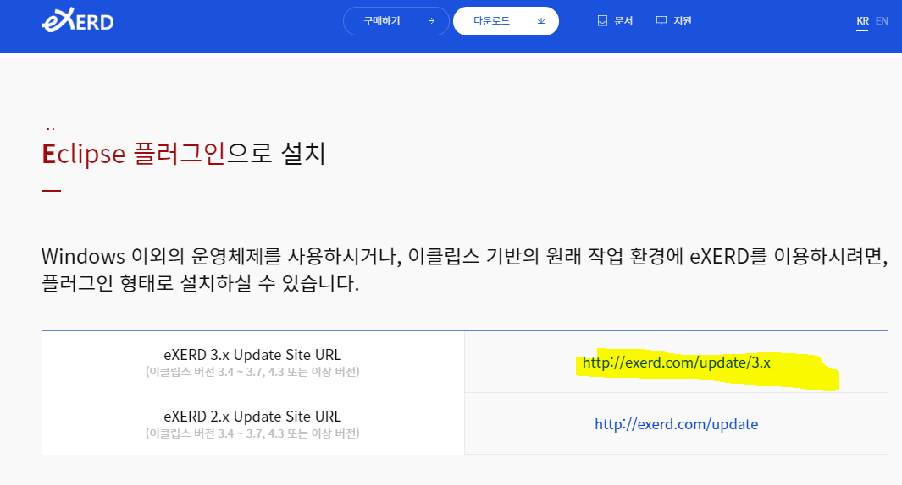
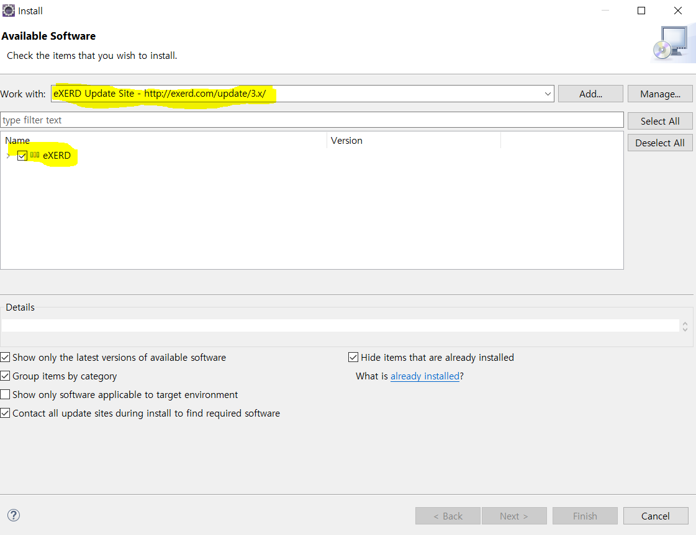
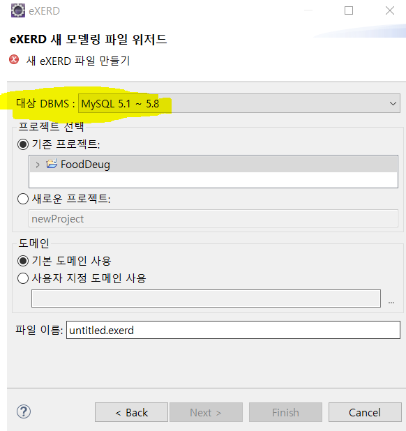
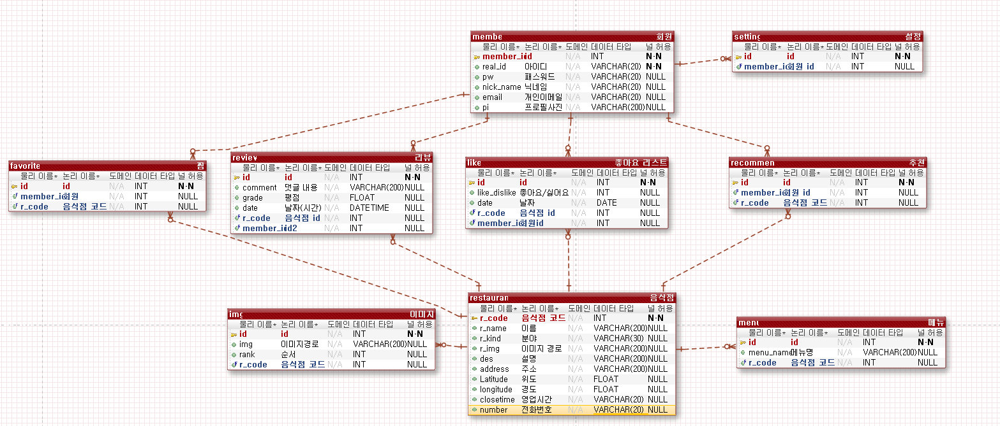
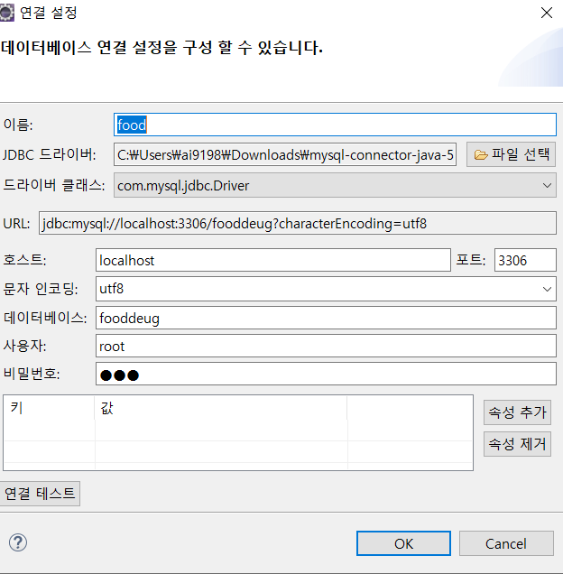
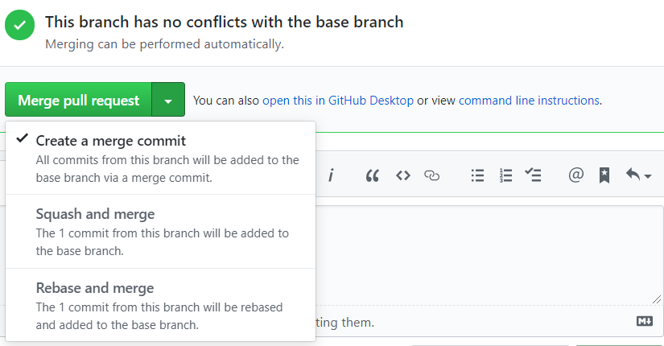

## 00. 설치 

#### - Eclipse IDE를 설치한 후, 모델링 플러그인을 설치. 

<a href='http://ko.exerd.com/down.jsp#a3'> Exerd</a> 여기서 다운로드 링크 복사후, 이클립스 소프트웨어 설치하기로 설치하기.

#### - Eclipse IDE에 설치하기 

help > install New Software > work with에 링크 삽입후 엔터! 

#### - Project 생성 후, eXERD File 생성 (대상 DB 설정!)

#### - 테이블 생성후 튜블, 속성 넣기

##### 명령어들

튜플생성 : `ctrl + enter`

기본키로 튜플 생성 : `ctrl + Shift + enter`

속성 들어가기 : `space bar`

##### 알아야 할 것들

1. 논리 속성과 물리 속성은 다른것. 

   > 논리 속성은 사용자가 보기 편하게 하는것이고, 실제로 이름 들어가는건 다 물리 속성!

2. 데이터 타입, 참조조건 다 넣어줘야함.

### Exerd 소프트웨어

> 추천하는 이유는 논리명과 물리명을 한번에 볼 수있는 유일한 툴이고, 직관적이라 좋다.

##### - 리버스 엔지니어링 : import

##### - 포워드 엔지니어링 : export

> export를 하기 위해선 자바로 만든 프로그램이기 때문에 자바 라이브러리가 필요하다.  그러므로 포워드 엔지니어링을 하기 위해선 다운!

1. mvnrepository.com에서 [MySQL Connector/J](https://mvnrepository.com/artifact/mysql/mysql-connector-java) » [5.1.48](https://mvnrepository.com/artifact/mysql/mysql-connector-java/5.1.48)설치!

2. window - preferences - eXERD > DBMS 연결설정 > 새연결 > MySQL > JDBC 드라이버 파일

## 01. 설계 과정

1단계: 요구사항 분석 > 2단계: 개념적 설계 > 3단계: 논리적 설계 > 4단계: 물리적설계 > 5단계: 구현

> 설계 과정 중 오류가 발견되어 변경이 필요하면 이전단계로 되돌아가 설계 내용을 변경

## 02. 설계 1단계: 요구 사항 분석

- 목적 
  - 사용자의 요구 사항을 수집 분석
  - 업무에 필요한 데이터가 무엇인지, 그 데이터에 어떤 처리가 필요한지 고려
- 결과물: 요구 사항 명세서
- 주요작업
  - 실제 사용하는 주요 사용자의 범위 결정
  - 사용자가 조직에서 수행하는 업무 분석
  - 면담, 설문조사, 업무관련 문서 분석 등의 방법을 이용해 요구 사항 수집
  - 수집된 요구 사항에 대한 분석결과를 요구사항 명세서로 작성

## 03. 설계 2단계: 개념적 설계

- 목적
  - 요구 사항 명세서의 내용을 데이터 모델을 이용해 개념적 구조로 표현
  - 일반적으로 E-R 모델 이용
- 결과물: 개념적 스키마 
- 주요작업
  - 요구사항 명세서를 기반으로 중요한 개체를 추출
  - 개체 간의 관계를 결정하여 E-R 다이어그램으로 표현
- 작업과정
  - 개체 추출, 각 개체의 주요 속성과 키 속성 선별
  - 개체 간의 관계 설정
  - E-R다이어그램으로 표현

1. 개체 추출, 각 개체의 주요 속성과 키 속성 선별

   - 개체: 저장할만한 가치가 있는 중요 데이터를 가진 사람, 사물 등

   - 요구사항 중 업무와 관련이 깊은 의미있는 명사

     

   - 회원아이디, 비밀번호, 이름, 나이, 직업, 등급, 적립금 = 회원속성

   - 속성 중 고유한 데이터 = 회원아이디

   - 추출결과

     - 개체 : 회원
     - 속성 : 회원아이디, 비밀번호, 이름, 나이, 직업, 등급
     - 키 속성: 회원아이디

     

2. 개체 추출, 각 개체의 주요 속성과 키 속성 선별

   

- 추출 결과
  - 개체: 상품
  - 속성: 상품번호, 상품명, 재고량, 단가
  - 키 속성: 상품번호

3. 개체 추출, 각 개체의 주요 속성과 키 속성 선별

   

## 데이터베이스 단계

- 일반적인 사용절차

  - 데이터베이스에 맞는 모듈 import

  - 데이터베이스 접속

  - Cursor 객체 생성

  - Cursor 객체의 SQL 실행 메소드를 사용하여 CRUD 실행

    - 조회의 경우 실행 결과를 추출

  - 데이터베이스 작업 완료 후 commit(저장)

  - Cursor 객체 close 

    > 항상 close를 해줘야 한다. 만약 안한다면 다른사람이 접속을 못할 수도 있다. 
    >
    > 예를들어 한 DB같은 경우에는 1000명 정도만 동시접속 가능하기 때문이다.

