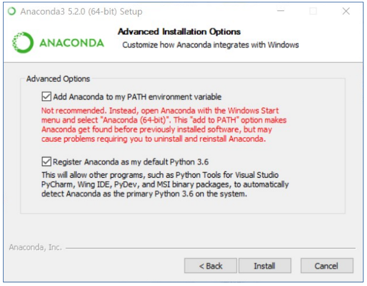
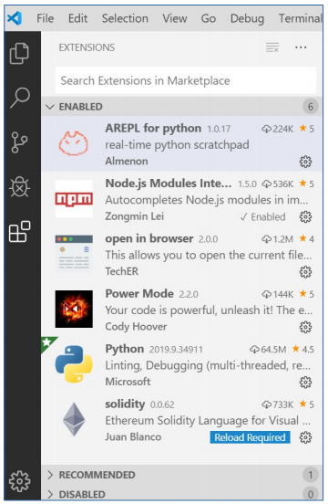
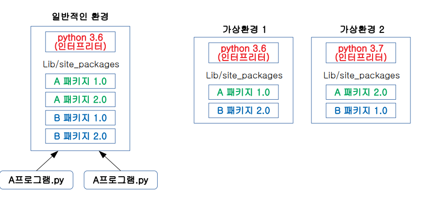
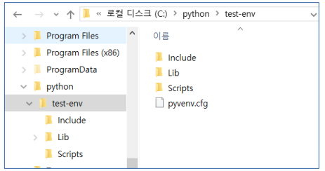
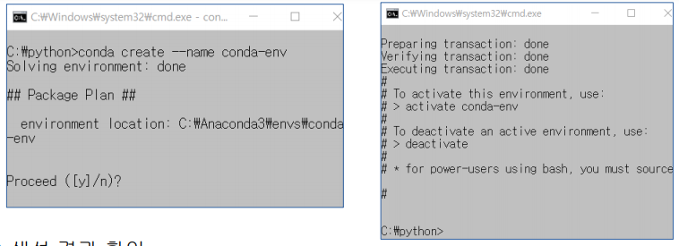
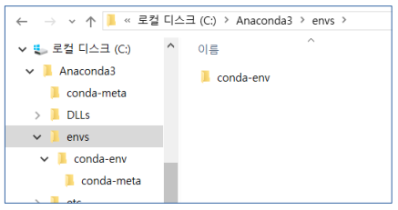
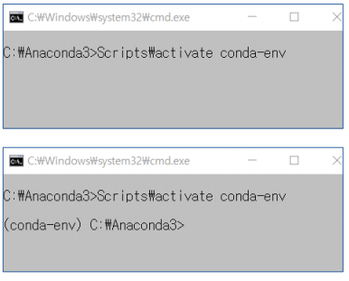

# 일정

#### 파이썬 & 크롤링

​	- 1.10(금) ~ 1.16(목) / 5일

#### RDB 

> (관계형 데이터베이스): Oracle, MySQL

​	- 1.17(금) ~ 1.28(화) / 5일

#### MongoDB

​	- 1.31(금) ~ 2.3(월) / 3일

#### 모듈 프로젝트 - 2

	- 5일


# 정보

1. 파이썬 -> 주피터 노트북 라이브러리

> - python 3.8버전은 주피터가 잘 작동이 안된다.
>
>   최대 단점: 버전이 바뀌면 기존의 라이브러리가 안되는 경우들이 많다.
>
>   그래서 관련된 책에 같은 버전으로 실행해야한다. 
>
> - 아나콘다 개발자툴을 설치하면 
>
>   최대 장점: 파이썬 버전별로, 라이브러리 버전별로 가상환경을 설정가능.
>
>   최대 단점: 용량이 너무 큼.
>
>   아나콘다 경량화 -> 미니콘다


2. 자바 -> 이클립스

3. HTML > VS Code
4. 라즈베리 파이는 파이썬을 이용한다.
5. 요기요 파이썬의 장고 (파이썬으로 웹사이트 만듦)
   - 웹 애플리케이션은 자바가 장악하고 있다.


## 01. 프로그래밍 언어 

-  #### 컴파일러 (Compiler) : C / C++ / C# / Java / Go 

  - 모든 명령을 일괄 번역하여 실행
  - 속도가 빠른 반면 구조가 복잡함 


- #### 인터프리터 (Interpreter) : Ruby / Perl / PHP / JavaScript

  - 명령어를 만날 때마다 즉시 번역하여 실행
  -  속도는 느리지만 단순하고 쉬움


## 02. 아나콘다, 파이썬 설치


- #### 설치

  1. 파이썬 다운로드 - https://www.python.org/downloads/ 

  2. 아나콘다 다운로드 - https://www.anaconda.com/download/

     

     PATH add는 꼭 해주자!

  

  3.  VS Code - https://code.visualstudio.com/




- #### 아나콘다가 장점 

  가상환경을 만들어 각 라이브러리, 파이썬의 버전별로 설정 가능. 

  > 기존에 파이썬은 설치한 버전과 다른 버전을 원할 때는 지우고 다시 설치해줘야 했다. 

  

- #### 아나콘다의 단점

  조금만 설치해도 용량이 너무 크다.


## 03. 가상환경 만들기


#### 1. 파이썬에서 기본적으로 제공하는 `venv` 모듈 사용

```shell
$ python -m venv test-env
```


 - 가상환경 생성 경로

   #### \python\test-env



- 가상환경 실행 명령어

  #### activate

  


#### 2. 아나콘다에서 가상환경 만들기

- #### conda create --name confa-env

####  


- 가상환경 생성 경로

  ##### \Anaconda3\envs

  


- 가상환경 실행

  #### Scripts\activate conda-env

  


## 04. 파이썬에서 기본적으로 제공하는 pip 명령어


##### 1. pip search 모듈

​	모듈을 검색해준다. 검색사이트 (https://pypi.org)


##### 2. pip install 모듈 : 모듈을 설치한다.

	##### pip uninstall 모듈 : 모듈을 삭제한다. 


##### 3. pip install 모듈 ==version : 버전 체크


##### 4. pip install --upgrade 모듈 : 버전 업그레이드


##### 5. pip show 모듈 : 설치된 패키지 정보 확인


##### 6. pip list : 설치된 패키지 목록 확인


##### 7. pip freeze > requirements.txt : 설치된 패키지 리스트를 text 파일로 만들어 간편하게 관리

#####  


## 05. 아나콘다 명령어


- #### 패키지 관련 명령어 

  1. 현재 환경 정보 : `conda info` 
  
  2. 검색 : `conda search [패키지명] `
  
  3.  설치
     
     - `conda install [패키지명]`
     
     - `conda install [패키지명]=[버전]`
     
     - `conda install [패키지명]=[버전]=[파이썬버전]`
     
  4. 업그레이드 : `conda update [패키지명]`
  
  5. 삭제 : `conda remove [패키지명] `
  
  6. 설치된 목록 확인 : `conda list --export > [text 파일명]`
  
  7. 목록으로 설치 : `conda install --file [text 파일명]`
  
  
  
- #### 가상환경 관련 명령어
  
  1. 가상환경 만들기 : `conda create --name confa-env`
  
  2. 가상환경 실행 : `activate [가상환경이름]`
  
  3. 가상환경 종료 : `conda deactivate`
  
  4. 가상환경에서 모듈설치 : `conda install [모듈이름]`
  
  5. 설치된 라이브러리 확인 : `conda list`
  
     > 가상환경 별로 객체로 인식.
  
  6. 가상환경 제거 : 해당 폴더만 삭제하면 됌.
  


## 06. 주피터 노트북 설치 

> '주피터 노트북' 라이브러리가 python 3.8에서 잘 동작하지 않음
>
> 파이썬은 버전에 따라 라이브러리가 동작하지 않는 경우가 많음.
>
> 파이썬 3.8 에서 '주피터 노트북' 사용법
>
> ```
> ㅇ visual c++ 2005 설치
> 
> 
> ㅇ Lib/asyncio/__init__.py
> import asyncio
> if sys.platform == 'win32':  # pragma: no cover
>     from .windows_events import *
>     asyncio.set_event_loop_policy(asyncio.WindowsSelectorEventLoopPolicy())
>     __all__ += windows_events.__all__
> else:
>     from .unix_events import *  # pragma: no cover
>     __all__ += unix_events.__all__
> ```


주피터 노트북은 코드별로 관리하기가 쉽고 코드별로 실행을 할 수가 있기 때문에 쉽게 관리 가능.


#### 설치

1. cmd 창에서 `conda install jupyter` 실행

2. 설치 완료 후 cmd 창에서 `jupyter notebook` 실행

3. 만약 주피터 노트북 웹이 안열리면 cmd창에 뜬 url을 복사해서 연다.

   [](https://github.com/naxvinci/TIL/blob/master/python/python00.assets/image-20200110102106764.png)

4. 주피터노트북은 패스 설정된 곳에서 기본으로 열린다

5. 주피터노트북 끌 때는 그냥 웹창 다 끄고 cmd 창에서 `ctrl + c`를 통해 종료


## 07. 주피터 노트북 명령어

- #### 명령어

  `dd` : 삭제

  `a`: 위에 추가 

  `b`: 아래 추가

  `ctrl + enter` :  현재 셀 실행

  `shift + enter`: 현재 셀 실행하고 다음줄

  `alt + enter`: 현재 셀 실행하고 다음줄에 추가

