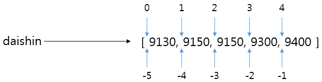

# Python


### 'Life is short, you need Python.'

- 파이썬의 장점

1. 파이썬은 쉽다
2. 많은 사람들이 사용한다.
3. 많은 것을 할 수 있다.


- 프로그래밍 언어 : 3형식

1. 저장
2. 조건 (if)
3. 반복 (while)


- 꼭 실수하지 말아야 할 것

1. 대/소문자
2. 띄어쓰기
3. 스펠링


# Python 문법

- 저장
  - = : 할당한다
  - == : 같다
  
  
  
- 무엇을 저장하는가 
  - 숫자 : 모든 숫자 저장 가능 (자료형 설정 없음)
  - 글자
  - 참/거짓 : True, False
  
  
  
- 파이썬 챗봇 https://py.hphk.io/

  

- 신텍스 에러는 거의 대부분 오타


- https://wikidocs.net/ 온라인 프로그래밍 책


- 터미널 창에서 파이썬 실행 

  - python [파일 이름]

  

## (1) type() 

  > 변수의 자료형을 알 수 있다. 
  >
  > `print(type(변수))`

  ```python
  a = 'ABC'
  b = '123'
  c = 123
  print(a, b, c, 123)
  print(type(b), type(c), type(123))
  
  d = True
  e = False
  print(d, e, type(d), type(e))
  ```

  **result**

  ```python
  $ python python_basic_01.py 
  ABC 123 123 123
  <class 'str'> <class 'int'> <class 'int'>
  True False <class 'bool'> <class 'bool'>
  ```


## (2) list 

> 변수를 list형식으로 저장.
>
> `변수 = [1, 2, 3]`

 

1. list를 불러오는 다양한 방법
   - 변수[0:3] : 0번부터 2번까지
   - 변수[1] : 1번 value 
   - 변수[4:] : 4번부터 끝까지
   - 변수[-1] : 맨 뒤에서 첫번째

```python
array = [1,2,3,"four","five","six", True]
print (array)
print (array[0:3])
print (array[1])
print (array[4:])
# 맨 마지막거 불러옴
print (array[-1]) 
```

**result**

```python
$ python array.py 
[1, 2, 3, 'four', 'five', 'six', True]
[1, 2, 3]
2
['five', 'six', True]
True
```


2. range()를 이용한 방법
   - range(5,10) : 5번에서 부터 9번까지
   - range(10) : 9번까지

```python
numbers = list(range(5,10))
num = list(range(10))
print(numbers)
print(type(numbers))
print(num)    
```

**result**

```python
[5, 6, 7, 8, 9]
<class 'list'>
[0, 1, 2, 3, 4, 5, 6, 7, 8, 9]
```


 3. list에 데이터 넣기 append, insert

    - 변수.append('value') : 제일 마지막에 내용추가
    - 변수.insert(원하는 위치, 'value') : 원하는 위치에 내용 추가

    ```python
    hobby = ['수영', '컴퓨터', '게임']
    print(hobby)
    hobby.append('음악감상')
    print(hobby)
    hobby.insert(1, '영화보기')
    print(hobby)
    ```

    **result**

    ```python
    ['수영', '컴퓨터', '게임']
    ['수영', '컴퓨터', '게임', '음악감상']
    ['수영', '영화보기', '컴퓨터', '게임', '음악감상']
    ```

	4. list에 데이터 지우기 del

    - del 변수[ ] : 해당 데이터를 지운다
    - len () : 리스트의 갯수를 알려주는 것

    ```python
    hobby = ['수영', '컴퓨터', '게임', '음악감상']
    print(hobby)
    print (len(hobby))
    
    del hobby[0:2]
    print(hobby)
    print (len(hobby))
    ```

    **result**

    ```python
    ['수영', '컴퓨터', '게임', '음악감상']
    4
    ['게임', '음악감상']
    2
    ```


## (3) 튜플

> 1) 리스트는 '[' ']'를 사용하는 반면 튜플은 '(' ')'를 사용한다. 
>
> 2) 리스트는 리스트 내의 원소를 변경할 수 있지만 튜플은 **변경할 수 없다. **
>
> 3) 자료접근시 무조건 [ ]을 이용한다.

```python
튜플 = ('1','2','3')
리스트 = ['1','2','3']
```


## (4) 딕셔너리 (dictionary) 

> 딕셔너리니는 제이슨(Json) 방식이랑 같다.
>
> * 제이슨이란? {'키' : value} 형식으로 묶어서 저장하는 것들. 
>
> `변수 = {'키' : value}`
>
> `변수 = dict(키=value)`

```python
# 딕셔너리 만드는 방식 1
dust = {'영등포구' : 50, '강남구' : 40}
print(dust)
# 딕셔너리도 불러올 때, 리스트와 같이 []를 쓴다.
print(dust['영등포구'])

# 딕셔너리 만드는 방식2
# dict(키=value) 형식으로도 불러 올 수 있다.
dust_two = dict(abc=50)
print(dust_two)
```

**result**

```python
$ python array.py 
{'영등포구': 50, '강남구': 40}
50
{'abc': 50}
```


## (5) random 함수

- 커피메뉴 추가  '리스트' 이용

  ```python
  import random #랜덤이라는 함수 불러옴
  
  coffee = ['아아', '뜨아', '라떼', '믹스', '핫초코']
  
  co = random.choice(coffee)
  print(co)
  ```

  **result**

  ```python
  핫초코 #랜덤값이 나옴
  ```


- 메뉴리스트 '딕셔너리' 이용

  ```python
  import random
  
  # menu 리스트를 만들어주세요.
  menu = ['20층', '양자강', '김밥카페', '순남시레기', '바나프레소']
  choice1 = random.choice(menu)
  phone_book = { '20층' : '010-1234-1234',
  '양자강' : '010-2345-2345',
  '김밥카페' : '011-3456-3456',
  '순남시레기' : '017-0130-0123',
  '바나프레소' : '011-3561-7624'
  }
  
  print(choice1)
  print(phone_book[choice1])
  ```

  **result**

  ```python
  바나프레소
  011-3561-7624	#랜덤값이 나옴.
  ```

  


## (6) dir

> dir을 찍어보면 쓸 수있는 함수들을 알 수 있다.
>
> `print(dir(변수))`

```python
num = [5]
print(dir(num))
```

**result**

```python
 ['__add__', '__class__', '__contains__', '__delattr__', '__delitem__', '__dir__', '__doc__', '__eq__', '__format__', '__ge__', '__getattribute__', '__getitem__', '__gt__', '__hash__', '__iadd__', '__imul__', '__init__', '__init_subclass__', '__iter__', '__le__', '__len__', '__lt__', '__mul__', '__ne__', '__new__', '__reduce__', '__reduce_ex__', '__repr__', '__reversed__', '__rmul__', '__setattr__', '__setitem__', '__sizeof__', '__str__', '__subclasshook__', 'append', 'clear', 'copy', 'count', 'extend', 'index', 'insert', 'pop', 'remove', 'reverse', 'sort']
```

​	list로 사용 할 수 있는 함수들.


## (7) 조건문 if 

### if ~ elif ~else문

> 1) 조건문에는 **if**라는 키워드를 사용한다.
>
> 2) **if** 다음에는 '조건'이 존재하는데 이 조건이 참(**True**)이면 들여쓰기한 문장이 실행된다. 
>
>  3) **if** 문의 끝에는 콜론(:)을 입력한다. 
>
> 4) **if** 문의 조건이 참(**True**)일 때 실행되는 문장은 들여쓰기해야 한다. 

```python
a = 0
if a == 0:
    print("0입니다.")

# a == true라는 뜻이다
if a :
    print("a 입니다.")
else:
    print("아닙니다.")


a = 30
if a > 30 :
    print("30 초과입니다.")
elif a < 20 :
    print("20 이하입니다.")
else :
    print("둘 다 아닙니다.")


a = 99
if a > 0 and a <= 20 :
    print('A')
elif a > 20 and a <= 40 :
    print('B')
elif a > 40 and a <= 60 :
    print('C')
elif a > 60 and a <= 80 :
    print('D')
elif a > 80 and a <= 100 :
    print('E')
```

**result**

```python
0입니다.	#a = 0 인 경우의 값
아닙니다.	#a = true 인 경우의 값
둘 다 아닙니다.	#a = 30 인 경우의 값
E	#a = 99 인 경우의 값
```

### if, elif, else 구문은...

	1. if ~ else 로 조건 2개
 	2. if ~ else ~elif 로 조건 3개
 	3. if ~ elif ~ elif 로 조건 여러개 쓴다.


- 미세먼지 수치 확인 챗봇

  ```python
  import requests
  from bs4 import BeautifulSoup
  url = 'http://openapi.airkorea.or.kr/openapi/services/rest/ArpltnInforInqireSvc/getCtprvnRltmMesureDnsty?serviceKey={}&numOfRows=10&pageNo=3&sidoName=서울&ver=1.6'.format(key)
  request = requests.get(url).text
  soup = BeautifulSoup(request,'xml')
  item = soup('item')[5]
  time = item.dataTime.text
  dust = int(item.pm10Value.text)
  
  
  # dust 변수에 들어 있는 내용을 출력해보세요.
  print('{} 기준 미세먼지 농도는 {}입니다.'.format(time, dust))
  print(f'{time} 기준 미세먼지 농도는 {dust}입니다.')
  
  if dust <= 30 :
      print('미세먼지 수준 = 좋음')
  elif dust <= 80 :
      print('미세먼지 수준 = 보통')
  elif dust <= 150 :
      print('미세먼지 수준 = 나쁨')
  elif dust > 150 :
      print('미세먼지 수준 = 매우나쁨')
  ```

  **result**

  ```python
  2019-12-18 18:00 기준 미세먼지 농도는 44입니다.	#.format()을 이용한 변수 출력
  2019-12-18 18:00 기준 미세먼지 농도는 44입니다.	#f'{}'를 이용한 변수 출력
  미세먼지 수준 = 보통	# 결과값을 불러와 조건에 맞는 것 출력.
  ```


## (8) 반복문 while 

> 횟수가 정해져 있지 않다.

```python
n = 0
while n < 3:
    print('출력')
    n = n+1

n=0
while n < 3:
    n = n+1
    print('출력')

n=0
while True:
    n = n+1
    print('출력')
    break
```

**result**

```python
출력
출력
출력	# while n<3 출력물
출력
출력
출력	# 순서 바꿔도 마지막 결과값을 변수에 대입하기 때문에 결과는 달라지지 않는다.
출력	# while과 break 쓰임 
```


## (9) 반복문 for 

> 횟수가 정해져 있다.

- for 변수 in 변수

  ```python
  numbers = list(range(10))
  print(numbers)
  for numbers in numbers:
      print(numbers)
  print(numbers)	#마지막 결과값만 출력
  ```

  **result**

  ```python
  [0, 1, 2, 3, 4, 5, 6, 7, 8, 9]
  0
  1
  2
  3
  4
  5
  6
  7
  8
  9
  9
  ```

  


