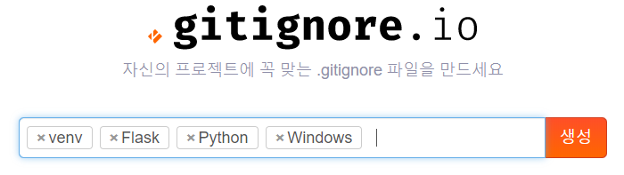

# 1) 터미널 명령어

- `python - m venv [가상환경 이름] `: 가상환경을 만든다 

- `source [가상환경 이름]/scripts/activate` : 가상환경을 실행한다.

  > source venv/bin/activate : 맥에서

- `deactivate` : 가상환경 끄기

- `pip freeze > requirements.txt` : 메모장에 모듈 정보들 저장.

- `pip install -r requirements.txt` : 메모장에 저장된 모듈들을 설치해라.

  > 모듈관리하기 쉬움

  

- `pip install requests` : requsts라는 라이브러리를 설치

  > **설치한 라이브러리들**
  >
  > - requsts 
  >
  > - BeautifulSoup4
  >
  > - flask
  >
  > - random
  >
  > - render_template

- `python -m pip install --upgrade pip` : pip 업그레이드

- `shift + alt + f` : 자동정렬

  

  

  

# 2) Pandas (python data analysis library)

> https://3months.tistory.com/292


# 3) 주피터 노트북 

> 파이썬 데이터 관리하기 쉬운 툴


# 4) API

공공데이터 주소 : https://www.data.go.kr/

더무비 데이터베이스 : https://www.themoviedb.org/


# 5) vim 모드

단축키 모드 : esc

- 방향키
  - h : ←
  - j : ↑
  - k : ↓
  - l : →


텍스트 모드  

- a : 커서 앞쪽에서 시작
- i : 커서 뒤쪽에서 시작
- shift + a : 줄 맨 끝에서 시작
- shift + i : 줄 맨 앞에서 시작
- - 


# 6) gitignore - git에 원하지 않은 정보 업로드 막기

- http://gitignore.io/

  - 

  > 원하지 않은 정보들을 업로드 제한을 주는 코드
  >
  > .gitignore 파일을 만들면 손쉽게 해준다.


# 7) 플랫폼

## 플랫폼이란?

- 간략 설명: 프로그램 실행 환경
- 비교 설명: 자동차 주행 환경(일반 고속도로용, 사막 전용, 경주용, 달 탐사용)


[](https://4.bp.blogspot.com/-SOWxJX5kW6Y/WD7mdH1-xCI/AAAAAAAAB6s/OpOaVnHm_Z4x_QHAQblJfB-DS4EZZKejQCLcB/s1600/what-is-platform.jpg)


> 프그램이 실행되는 환경이며 플랫폼은 플랫폼위에 다른 플랫폼이 존재할 수 있습니다. 가령, Windows에서 Java로 개발하고 있으며 앱스토어에서 어플을 내려받는 과정에서 이미 3개의 플랫폼을 사용하고 있는 것입니다.
> 플랫폼은 같은 영역에도 다양한 목적과 가치로 많이 만들어지고 있으며 모든 플랫폼에서 실행되도록 개발하기는 어렵습니다. 프로그램의 목적에 맞도록 플랫폼을 선택하는 것이 중요합니다.


#### 플랫폼 예시

- Windows, Linux, macOS등 O/S는 모두 플랫폼입니다.
- 어플을 다운받는 앱스토어, 구글플레이, 원스토어도 플랫폼입니다.
- [V8 JavaScript Engine](https://developers.google.com/v8)은 JavaScript에게 큰 힘이 되어주고 있는 플랫폼입니다.
- Java 프로그램은 OS제약이 없지만 실행하기 위해서는 해당 OS에 자바 가상 머신(Java Virtual Machine, JVM)위에서 실행되므로 Java 플랫폼이 필요합니다.


# 8) 아키텍쳐

## 아키텍처란?

- 간략 설명: 프로그램 주요 구조 설계
- 비교 설명: 자동차 도면


[](https://3.bp.blogspot.com/-AmJGBS4MQ1Y/WD7SK1mBgYI/AAAAAAAAB6A/KFkin9yR6J8IYdZfSyixw9F_j5ziXRzEQCEw/s1600/what-is-architecture.gif)


>   기획한 내용을 프로그램화했을 경우 필요한 주요 특징을 기술적으로 설계하고 명시하는 것입니다.
> 결과물에 필요한 모든 구성 요소를 명시하지만, 구체적인 구현 방법은 포함되어 있지 않습니다. 가령, 아래에서 설명할 플랫폼은 주요 특징이지만 프레임워크와 라이브러리는 주요 특징이 아니므로 명시되지 않을 가능성이 큽니다.

>  자동차 설계로 예를 들면 자동차 헤드라이트가 본넷 밑에 사각형 모양으로 존재한다고 설계하고 헤드라이트 고정 방식이 접착제인지, 볼트인지는 명시되지 않는다고 볼 수 있습니다. 하지만 상황에 따라 포함될 수도 있습니다.


#### 아키텍처 예시

- PC를 조립하기 위해 하드웨어 부분을 확인하고 선택한 리스트가 아키텍처라 할수 있습니다.
- [Azure 솔루션 아키텍처](https://azure.microsoft.com/ko-kr/solutions/architecture)
- [인기 있는 소셜 네트워크 서비스로 본 아키텍처](http://blog.gaerae.com/2015/07/sns-architecture.htm)


# 9) 프레임 워크

## 프레임워크란? 

- 간략 설명: 프로그램 기본 구조(뼈대)
- 비교 설명: 자동차 프레임

> 원하는 기능 구현에만 집중하여 빠르게 개발 할 수 있도록 기본적으로 필요한 기능을 갖추고 있는 것으로 위에서 설명한 라이브러리가 포함되어 있습니다.
> 프레임워크만으로는 실행되지 않으며 기능 추가를 해야 되고 프레임워크에 의존하여 개발해야 되며 프레임워크가 정의한 규칙을 준수해야 합니다.

#### 프레임워크 예시

- Java 개발자라면 [Spring](http://spring.io/)!
- Python 개발자라면 [Django](https://www.djangoproject.com/)!
- JavaScript 개발자라면 [Angularjs](https://angularjs.org/)!
- PHP 개발자라면 [Laravel](https://laravel.com/)!


# 10) 라이브러리

## 라이브러리란? 

- 간략 설명: 프로그램 제작 시 필요한 기능
- 비교 설명: 자동차 바퀴, 자동차 헤드라이트, 자동차 에어백


[](https://3.bp.blogspot.com/-Q7rxJuGwL40/WD7SK67gGTI/AAAAAAAAB58/kMDlk_UEl5UO1hKk_dOSP_LZVMfWRdQiwCLcB/s1600/what-is-library.jpg)


> 재사용이 필요한 기능으로 **반복적인 코드 작성을 없애기 위해** 언제든지 필요한 곳에서 호출하여 사용할 수 있도록 Class나 Function으로 만들어진 것입니다.
> 사용 여부는 코드 작성자 선택 사항이며 새로운 라이브러리 제작 시에도 엄격한 규칙이 존재하지 않습니다. 제작 의도에 맞게 작성하면 됩니다.


#### 라이브러리 예시

- 가장 유명한 자바스크립트 라이브러리는 jQuery입니다. (간혹 프레임워크라고 소개되는 곳이 있는데 공식 사이트에서도 라이브러리로 명시되어 있습니다.)
- 그래픽 사용자 인터페이스(Graphical user interface , GUI)에서 재사용하기 쉽게 버튼, 테이블 같은 구성 요소를 호출해서 쓸수 있도록 분리해두었다면 라이브러리입니다.
- 

- Windows에서 간혹 보았을 dll 확장자는 동적 링크 라이브러리(dynamic-link library, DLL)의 약자로 라이브러리라고 할수 있습니다.
- 객체지향 프로그래밍(object-oriented programming, OOP)은 기본적으로 각 기능마다 함수화하는 것으로 클래스 라이브러리라고 할수도 있습니다.


# 11) 크롤링

> Web상에 존재하는 컨텐츠를 수집하는 작업 

1. TML 페이지를 **가져와서**, HTML/CSS등을 **파싱**하고, 필요한 데이터만 추출하는 기법
2. **Open API(Rest API)**를 제공하는 서비스에 Open API를 호출해서, 받은 데이터 중 필요한 데이터만 추출하는 기법
3. **Selenium**등 브라우저를 프로그래밍으로 조작해서, 필요한 데이터만 추출하는 기법

4. 크롤링에 필요한 라이브러리는 **requests, BeautifulSoup**


### 1.미국 달러환율 정보 크롤링 연습

```python
import requests

url = "https://finance.naver.com/sise/"

request = requests.get(url)
print(request)
```

**result**

```shell
$ python kospi.py 
<Response [200]>
(venv) 
```

- 여기서 200은 HTTP의 응답코드이다. 

  - 200 : 성공적으로 처리 
- 404 Not found : 찾는 리소스가 없다.
  

  
- **기본구조**

```python
import requests		#requests 라이브러리를 불러온다.
from bs4 import BeautifulSoup		#bs4에 있는 BeautifulSoup 라이브러리를 불러온다.

url = "https://finance.naver.com/marketindex/"		#url변수안에 HTML주소를 불러온다.
req = requests.get(url).text	#req변수 안에 requests를 이용하여 get방식으로 url변수를 불러온다.

soup = BeautifulSoup(req, 'html.parser')	#json, xml 다 파싱가능
#파이썬은 HTML을 읽어올 수 없기 때문에 BeautifulSoup를 사용하여 파싱한다.

exchange = soup.select_one('#exchangeList > li.on > a.head.usd > div > span.value')
print(exchange.text)
```

**result**

```python
$ python exchange.py 
1,164.50
```


### 2. 네이버 실시간 검색어 크롤링 연습

```python
import requests
from bs4 import BeautifulSoup

url = 'https://www.naver.com'

req = requests.get(url).text
data = BeautifulSoup(req, 'html.parser')
sel = '#PM_ID_ct > div.header > div.section_navbar > div.area_hotkeyword.PM_CL_realtimeKeyword_base > div.ah_roll.PM_CL_realtimeKeyword_rolling_base > div > ul > li > a > span.ah_r, span.ah_k'

search = data.select(sel)
for item in search:
    print(item.text)
```

**result**

```python
1
트럼프 탄핵
2
가결
3
최윤희
4
선미
5
트럼프

~

20
최성해
```


# 12) flask (라이브러리)

> [Flask](https://palletsprojects.com/p/flask/) 는 [Werkzeug](https://palletsprojects.com/p/werkzeug/) WSGI 라이브러리 위에 구축 된 Python 웹 애플리케이션 마이크로 **프레임 워크**입니다.

### 1. flask를 써보자

- **기본 flask구조**

```python
from flask import Flask, escape, request, render_template

app = Flask(__name__)

@app.route('/')
def hello():
    name = request.args.get("name", "World")
    return f'Hello, {escape(name)}!'
```

- **실행명령어**

``` shell
env FLASK_APP=hello.py flask run
```

- **git result**

```shell
* Serving Flask app "hello" (lazy loading)
 * Environment: production
   WARNING: This is a development server. Do not use it in a production deployment.
   Use a production WSGI server instead.
 * Debug mode: on
 * Restarting with stat
 * Debugger is active!
 * Debugger PIN: 129-559-331
 * Running on http://127.0.0.1:5000/ (Press CTRL+C to quit)
```

​	**실행 명령어를 매번 쓰기 어렵기 때문에 파이썬 명령어로 구동되게 만들어주는 코드**

```python

if __name__ == "__main__":
    app.run(debug=True)

```


### 2. flask 기본응용 

- **flask 구조**

  ```python
  from flask import Flask, escape, request, render_template
  import random
  
  app = Flask(__name__)
  
  
  @app.route('/')		#/ 주소 받을 시 보여줄 페이지
  def hello():
      name = request.args.get("name", "World")
      return f'Hello, {escape(name)}!'
  
  @app.route('/hi')		#/hi 주소 받을 시 보여줄 페이지
  def hi():
      name = "조원상"
      return render_template('hi.html', html_name = name)
  
  @app.route('/greeting/<string:name>/')		#/greeting 주소 받을 시 보여줄 페이지
  def greetiong(name):
      def_name = name
      return render_template('greeting.html', html_name = def_name)
      
  @app.route('/cube/<int:num>')		#/cube/<int:num> 주소 받을 시 보여줄 페이지
  def cube(num):
      cube_num = num**3
      return render_template('cube.html', cube = cube_num, num = num)
  
  @app.route('/dinner')		#/dinner 주소 받을 시 보여줄 페이지
  def dinner():
      menu = ['삼각김밥', '컵라면', '스테이크', '마라탕', '훠궈']
      dinner = random.choice(menu)
      menu_img = {'삼각김밥' : 'https://pbs.twimg.com/profile_images/1112313550972678145/iT3wabux_400x400.png', 
                  '컵라면' : 'https://img1.daumcdn.net/thumb/R720x0.q80/?scode=mtistory2&fname=http%3A%2F%2Fcfile25.uf.tistory.com%2Fimage%2F99A7CB355A4B982A0381DD', 
                  '스테이크' : 'https://m.mannabox.co.kr/images/detail/mannaboxplus/newsalchisteak/m_head.jpg', 
                  '마라탕' : 'https://m.6recipe.co.kr/web/product/big/201812/14d85a8d77aadf64de92851bbf94259a.jpg', 
                  '훠궈' : 'https://post-phinf.pstatic.net/MjAxOTA2MDNfMjQ4/MDAxNTU5NTQyNDAwMjIx.i4Wk5-2Is9kHOQ3qsxLJdORFBbzvxeu1a43cGbCTm0og.ZyodKeTW2B28ej546aEKjbGkFJncwIhcdue3TEFjJJQg.JPEG/%ED%9B%A0%EA%B6%881.jpg?type=w1200'
                  }
      img_url = menu_img[dinner]
      return render_template('dinner.html', dinner = dinner, img_url = img_url)
  
  @app.route('/movies')		#/movies 주소 받을 시 보여줄 페이지
  def movies():
      movie = ['조커', '겨울왕국2', '터미네이터', '어벤져스']
      return render_template('movies.html', movies = movie)
  
  if __name__ == "__main__":
      app.run(debug=True)
  ```

  

  ### 서버 결과물

  **1. http://127.0.0.1:5000/**

  > 단순출력

  ```HTML
  Hello, World!
  ```

  

  **2. http://127.0.0.1:5000/hi**

  > 단순 출력

  ```HTML
  <body>
      <h1>{{ html_name }}</h1>
      <ul>
           <li>양자강</li>
           <li>20층</li>
           <li>스타벅스</li>
           <li>바나프레소</li>
           <li>이디야</li>
       </ul>
   </body>
  ```

  

  **3. http://127.0.0.1:5000/greeting/<string:name>**

  > 입력받은 값을 출력

  ```HTML
  <body>
      <h1>만나서 반갑습니다, {{ html_name }}님</h1> 
  </body>
  ```

  

  **5. http://127.0.0.1:5000/cube/<int:num>**

  > 입력받은 숫자의 3제곱 출력

  ```HTML
  <body>
      <h1>{{ num }}의 3제곱은 <br> {{cube}} 입니다.</h1>
  </body>
  ```

  

  **6. http://127.0.0.1:5000/dinner**

  > 랜덤으로 저녁메뉴 사진과 함께 선정 출력 

  ```HTML
  <body>
      <h1>오늘 저녁은 {{dinner}}입니다.</h1>
      
  </body>
  ```

  

  **7. http://127.0.0.1:5000/movies**

  > jinja 모듈을 이용한 HTML에서 파이썬 사용하기

  ```HTML
  <body>
      <ul>
          {# 진자 주석은 이런식으로 쓴다 #}
      
          
              <li>{{ movie }} || 이 영화 진짜 재밌어</li>
          
              <li>{{ movie }} || 올라프 커여워</li>
          
              <li>{{ movie }}</li>
          
       {# <!-- jinja라는 이름의 모듈 --> #}
      </ul>
  </body>
  ```

  


### 3. 두 사이트간 정보를 주고 받는 사이트 만들기

- flask 구조

  ```python
  from flask import Flask, render_template, request
  app = Flask(__name__)
  
  @app.route('/ping')
  def ping():
      return render_template('ping.html')
  
  @app.route('/pong')
  def pong():
      data = request.args.get('keyword')		#get 방식으로 정보 저장
      # request.from.post('keyword')	#post 방식으로 정보 저장
      return render_template('pong.html', data = data)
  
  @app.route('/naver')
  def naver():
      return render_template('naver.html')
  
  @app.route('/google')
  def google():
      return render_template('google.html')
  
  if __name__ == ("__main__"):
      app.run(debug=True)
  ```


### 서버 결과물들

- /ping 결과물

  ```html
  <body>
      <h1>Here is Ping!!</h1>
      <form action="/pong">
          <input type="text" name="keyword">
          <input type="submit">
      </form>
  </body>
  ```

- /pong 결과물

  ```html
  <body>
      <h1>여기는 Pong입니다!!</h1>
      {{ data }}
  </body>
  ```

- /naver 결과물

  ```html
  <body>
      <h1>NAVER 검색하기!!</h1>
      <form action="https://search.naver.com/search.naver?">
          <input type="text" name="query">
          <input type="submit">
      </form>
  </body>
  ```

- /google 결과물

  ```html
  <body>
      <h1>Google 검색하기!!</h1>
      <form action="https://www.google.com/search">
          <input type="text" name="q">
          <input type="submit">
      </form>
  </body>
  ```


### 4. op.gg 사이트에서 크롤링 

- **기본 구조**

  ```python
  import requests
  from bs4 import BeautifulSoup
  from flask import Flask, render_template, request
  app = Flask(__name__)
  
  @app.route('/search')	#flask서버에서 /search 로 입장하면 다음과 같은
  						#함수를 불러온다.
  def search():	#search라는 함수를 정의한다.
      return render_template('search.html')	#render_template 모듈을 이용하여 search.html을 불러온다.
  
  @app.route('/opgg')
  def opgg():
      userName = request.args.get('userName')		#입력한 값을 get방식으로 저장한다.
      url = f'https://www.op.gg/summoner/userName={userName}'
  
      req = requests.get(url).text	#url에서 text형식으로 정보를 불러온다.
      data = BeautifulSoup(req, 'html.parser')	#파이썬에서 읽어올 수있도록 Beautifulsoup 모듈을 이용한다.
  
      tier = data.select_one("#SummonerLayoutContent > div.tabItem.Content.SummonerLayoutContent.summonerLayout-summary > div.SideContent > div.TierBox.Box > div > div.TierRankInfo > div.TierRank").text	#data에서 select_one을 이용해 정보를 불러온 정보를 text로만 불러온다. -> .test가 없으면 <span> text </span>으로 나옴. 
      
      win = data.select_one("#SummonerLayoutContent > div.tabItem.Content.SummonerLayoutContent.summonerLayout-summary > div.SideContent > div.TierBox.Box > div > div.TierRankInfo > div.TierInfo > span.WinLose > span.wins").text
  
  
      return render_template('opgg.html', userName = userName, url = url, tier = tier, win = win[:-1])
  
  if __name__ == ("__main__"): 	#flask에서 파이썬으로 실행하면 바로 서버가 켜치도록 한다.
      app.run(debug=True)
  ```

  **search.html**

  ```html
  <body>
      <h1>OP.GG 검색</h1>
      <form action="/opgg">	<!-- form태그를 이용하여 액션이 발생시 /opgg로 이동한다.  -->
          <input type="text" name="userName">		<!-- input을 text로 받는다. 이때, 그 값을 userName을 붙여서 같이 정보를 보낸다.  -->
          <input type="submit" value="검색">	<!-- input하여 submit버튼을 만들어준다. value를 붙여주면 제출버튼 이름을 바꿀 수 있다.   -->
      </form>
  </body>
  ```

  **opgg.html**

  ```html
  <body>
      <h1>{{ userName }}님의 랭크는</h1> 	<!-- 진저 모듈을 이용하여 userName이라는 파이썬 변수를 불러올 수 있다.  -->
      <h2>{{ tier }} 입니다.</h2>	<!-- -->
      <h3>{{ win }} 승 하셨습니다.</h3>	<!-- -->
      </form>
  </body>
  ```

  


