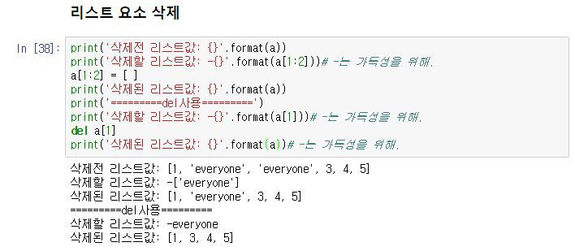

## Operator 

operatro 모듈은 파이썬의 내장 연산자에 해당하는 효율적인 함수 집합을 내보냅니다. 

operator을 사용하기 위해선 `@import Operator` 를 선언해야한다.

#### operator.abs(obj)

	> obj의 절댓값을 반환한다. 

#### operator.truth(obj)

> obj가 참이면 True를 반환한다. 그렇지 않으면 False를 반환한다. 

#### operator.add(a,b)

> `a + b`를 반환합니다.

#### operator.and_(a, b)

> a와 b의 비트별 논리곱(and)을 반환합니다. 

#### operator.or_(a, b)

> a와 b의 비트별 논리합(or)을 반환합니다. 

#### operator.index(a)

> 정수로 변환된 a를 반환합니다. 

#### operator.mod(a, b)

> `a % b`를 반환합니다.

#### operator.mul(a,b)

> `a @ b`를 반환합니다.

#### operator.sub

> `a - b`를 반환합니다.

# 1. List란?

파이썬의 자료구조 형태중 하나로 리스트는 값을 나열하는것 이라고 정의할 수 있겠습니다.

또한 List는 시퀀스데이터 이기도 합니다.

시퀀스는 데이터의 순서를 정하는것을 의미합니다.

순서를 가지고 있기 때문에 인덱스(index)를 사용하여 참조할 수 있습니다.

인덱스란 문자열이 있으면 번호를 뜻합니다.

Ex)문자열 인덱싱

a = 'hello' 문자열로 했을때, a[0]을 확인하면 첫번째 문자열인 h가 출력됩니다. 이것을 문자열 인덱싱이라 하며, 시퀀스자료형이기 때문에 가능한 것이죠.

파이썬에서의 시퀀스 자료형은?(순서를 정함)

string, list, tuple

시퀀스 자료형이 아닌것은?(순서를 정하지 않음)

set, dict

## 1.1 List 만들어보기

| 1    | list_name = [1,2,3,4,5,6] | [cs](http://colorscripter.com/info#e) |
| ---- | ------------------------- | ------------------------------------- |
|      |                           |                                       |

이런식으로 리스트이름 = [] 대괄호 안에 숫자나 문자등을 넣어서 만들 수 있습니다.

| 1    | list_name_num = [1,2,3,4,5,6] |
| ---- | ----------------------------- |
| 2    | list_name_string = ['h','i']  |
| 3    | list_name_word = ['hello']    |

이렇게 문자도 가능합니다.

## 1.2 List 인덱싱

### **1.2.1 인덱싱의 기초**

앞서 말했듯 List는 파이썬의 시퀀스 자료형 이기 때문에 인덱스(쉽게말해 자리 번호표)를 가지고 있습니다.

그것을 가지고 연산을 할수 있는데 예제를 통해 알아보겠습니다.

 

| 12   | a = [1,2,3]print(a[0]) |
| ---- | ---------------------- |
|      |                        |

결과는 어떻게 나올까요?

a라는 [리스트] 안에 0번째 인덱스를 프린트 했을때 무엇이 나올까요?

답은 1 입니다.

실험. 만약에 없는 인덱스를 프린트 했을경우 어떻게 될까?

a[3]은 없는 인덱스이기 때문에 당연히 index out of range라는 에러가 나오게 됩니다.

### 1.2.2 List 인덱싱의 연산

이요소들을 합치면 어떤 반응이 일어날까요?

| 12   | a = [1,2,3]print(a[0]+a[2]) | [cs](http://colorscripter.com/info#e) |
| ---- | --------------------------- | ------------------------------------- |
|      |                             |                                       |

의 답은 무엇일까요?

a[0]은 1

a[2]는 3

즉 1+3이 되어 **4**가 나오게 될것입니다.

**곱하기도 될까요?**

| 12   | a = [1,2,3]print(a[0]*a[2]) | [cs](http://colorscripter.com/info#e) |
| ---- | --------------------------- | ------------------------------------- |
|      |                             |                                       |

네 물론 됩니다.

a[0]은 1

a[2]는 3

즉 1*3이 되어 **3**가 나오게 될것입니다.

**그럼 빼기도 되겠죠?**

| 12   | a = [1,2,3]print(a[0]-a[2]) | [cs](http://colorscripter.com/info#e) |
| ---- | --------------------------- | ------------------------------------- |
|      |                             |                                       |

네 물론 됩니다.

a[0]은 1

a[2]는 3

즉 1-3이 되어 **-2**가 나오게 될것입니다.

문자는 더하거나 곱하거나 빼면 어떻게 될까요?

| 12   | a = ['h','e','ll','o']print(a[0]+a[2]) | [cs](http://colorscripter.com/info#e) |
| ---- | -------------------------------------- | ------------------------------------- |
|      |                                        |                                       |

답: hll

그외 곱하기와 빼기는 문자열 이기 때문에 안된다는 에러메시지가 나옵니다.

## 1.3 리스트 슬라이싱

리스트의 슬라이싱은 매우 간단합니다.

리스트의 요소들이 있다면 그중 원하는 부분만 잘라내서 가져오는 것으로 생각하시면 되는데 실습을 통해서 알아보겠습니다.

기본 문법은 출력시에 name[:] 이며

[num:] num 이상(포함하고 부터)

[:num] num 미만(포함하지 않고 까지)

[num1:num2] num1이상 ~ num2미만

[::-1] 거꾸로

[1:10:2] 1이상 10미만중 2개씩만

예제를 통해 알아보겠습니다.

| 1    | number = [1,2,3,4,5,6,7,8,9,10]                              |
| ---- | ------------------------------------------------------------ |
| 2    | print(number[1:3])#이상~미만                                 |
| 3    | print(number[3:])#이상                                       |
| 4    | print(number[:3])#미만                                       |
| 5    | print(number[1:3:2])#1이상 3미만 2개씩                       |
| 6    | print(number[0:9:2])#0이상 9미만 2개씩                       |
| 7    | print(number[::-1])#거꾸로 [Colored by Color Scripter](http://colorscripter.com/info#e) |

주의하실점은 num:num일때 이상~미만입니다.

1:3일때 1번째를 포함하는애 부터 3번째는 포함하지 않습니다

이 점만 주의하시면 슬라이싱하시는데 문제 없으실겁니다.

## 1.4 리스트 연산

### 1.4.1 리스트 더하기

너무나도 간단하기 때문에 예제만 봐도 충분이 이해가 가실겁니다.

그냥 리스트끼리 합쳐져서 순서대로 출력됩니다.

### 1.4.2 리스트 반복

### 

리스트의 기초는 너무 쉬워요~! 그냥 리스트*숫자를 사용하면 숫자만크 리스트를 반복시킵니다

### 1.4.3 리스트 수정

### 

### 

### 1.4.4 리스트 삭제

### 

### 1.4.5 리스트 요소 추가 

리스트의 요소를 추가하는 방법은 간단합니다.

리스트.append(요소) 를 사용하시면 되는데 주의하실점은 한번에 두개의 요소가 추가되지는 않지만

리스트안에 리스트를 추가할 수는 있다는 점입니다.

여러개의 리스트요소를 추가하고 싶을때 맨아래 extend를 참고하시면 됩니다.

### 1.4.6 리스트 정렬(sort)

문자와 숫자를 함께 정렬할수는 없는 것을 확인하실 수 있습니다.

### 1.4.7 리스트 뒤집기(reverse)

숫자와 문자가 함께있어도 잘 뒤집힙니다.

###  

### 1.4.7 리스트 위치 반환(index)

a안에 있는 3의 요소 index를 확인하고 싶을때

a안에 있는 1의 요소 index를 확인하고 싶을때

없는 요소를 확인하면 list에는 요소가 없다고 에러가 납니다.

### 1.4.8 리스트 요소 삽입(insert)

3번째 index에 4를 넣겠다는 뜻입니다.

a = [ 1,  2,  3 ]

[0]  [1] [2] index 이기 때문에 3번째에 4가 추가되어 [1,2,3,4]가 됩니다.

### 1.4.9 리스트 요소 제거(remove)

여러개의 요소가 있다면 맨앞에 한개의 요소만 제거합니다.

### 1.4.10 리스트 요소 꺼내기(pop)

가장 뒤에 있는 요소가 삭제됩니다.

### 1.4.11 리스트 요소 갯수 세기(count)

요소의 갯수를 카운트합니다.

### 1.4.12 리스트 확장(extend)

list안에 요소를 추가하는데 추가개념이 아닌 **확장** 개념이기 때문에 결과값이 다음과 같이 나오게 된것입니다. 

출처: https://rednooby.tistory.com/109 [개발자의 취미생활]

