# 사용자 입력 출력 


## 01. 사용자 입력 (input)

	#### - 사용자가 입력한 값을 문자열로 저장

```python
text = input()
print(text)
print(type(text))
```

> 문자열로 저장되는 것을 항상 유의


#### - 안내 문구 출력 후 사용자 입력

```python
text = input('내용을 입력해주세요.')
print(text)
print(type(text))
```


## 02. 출력 (print)

#### - 특정 값을 화면에 출력

```python
num = 123
print(num)

s = 'python'
print(s)

list = [1, 2, 'a', 'b']
print(list)

tuple = (1, 2, 'a', 'b')
print(tuple)
```


#### - Space, Comma, Plus 연산자 사용

```python
print('Life' 'is' 'too' 'short')
print('Life' + 'is' + 'too' + 'short')
print('Life ' 'is ' 'too ' 'short')
print('Life', 'is', 'too', 'short')
```

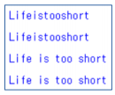


#### - 결과값을 한줄로 출력 (줄바꿈 X)

```python
print('Life', end=' ')
print('is', end=' ')
print('too', end=' ')
print('short', end=' ')
```

> `end=' '` 을 입력한다.


#### - 반복문 결과 한줄 출력

```python
for i in range(1, 11):
 print(str(i) + '번째', end = ' ')
```

> `end=' '` 을 입력한다.


## 03. 파일 

#### 1. 생성/열기 : open()

 - `파일객체 = open('파일명', '모드')`

   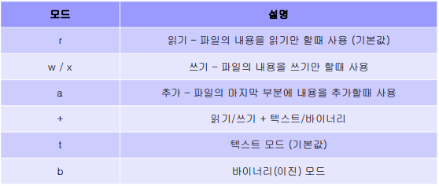


#### 2. 읽기모드 (r)

 - 대상 파일이 없는 경우 오류

   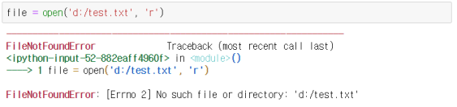

	- 작업 완료 후 파일 닫기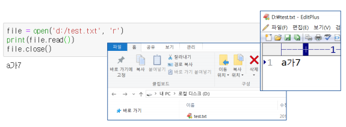


#### 3.  쓰기 모드 (w)

 - 대상 파일 내용 삭제하고 새로 작성

   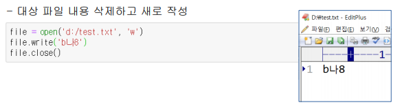

	- 대상 파일이 없는 경우 새 파일을 생성 후 내용 입력

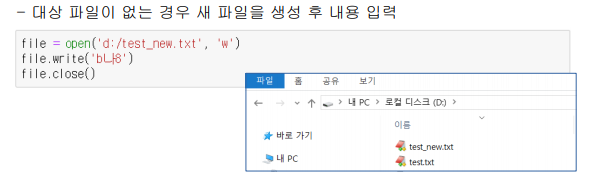


#### 4. 쓰기모드 (x)

 - 대상 파일이 있는 경우 오류

   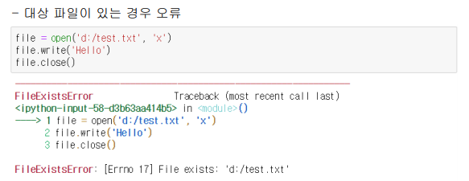

 - 대상 파일이 없는 경우 새파일을 생성 후 내용 입력

   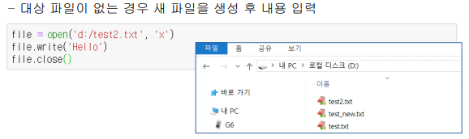


#### 5. 추가모드 (a)

- 대상 파일 내용의 끝 부분에 내용 추가

- 대상 파일이 없는 경우 새 파일을 생성 후 내용 입력

  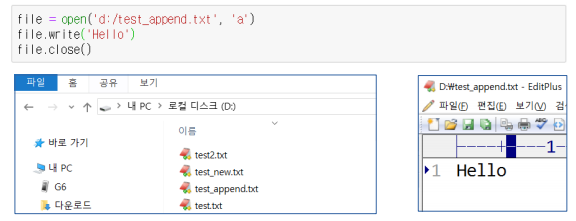


## 04. 바이너리 모드

 #### - 바이너리 모드 (wb/rb) - List, Tuple

```python
file = open('경로', 'wb')
```


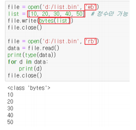


#### - 바이너리 모드 (wb/rb) - Dictionary

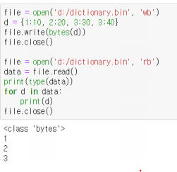

> 저장할 때, key 값만 불러온다. 그리하여 제대로 저장 하기위해선 pickle라이브러리가 필요함.

#### - 바이너리모드 (wb/rb) - Set

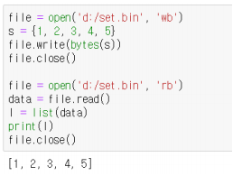


#### - pickle 모듈을 이용한 바이너리 저장

 pickle 모듈을 이용하면 원하는 데이터를 **자료형의 변경없이** 파일로 저장하여 그대로 로드할 수 있다.

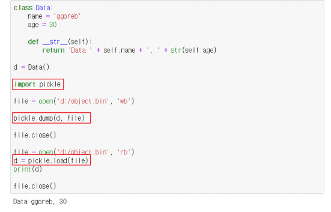

##### 1. 입력 : pickle.dump(data(자료형), file)

```python
>>> import pickle
>>> list = ['a', 'b', 'c']
>>> with open('list.txt', 'wb') as f:
...     pickle.dump(list, f)
```


##### 2. 불러오기 : 변수 = pickle.load(file)

한줄씩 파일을 읽어오고 더이상 로드할 데이터가 없으면 `EOFError` 발생

```
>>> with open('list.txt', 'rb') as f:
...     data = pickle.load(f) # 단 한줄씩 읽어옴

>>> data
['a', 'b', 'c']
```


## 05. with

- 파이썬의 프로그램은 `__enter__`와 `__exit__` 메소드를 가질 수 있는데 with 블럭의 시작과 끝 부분에서 자동으로 실행됨

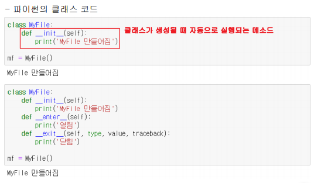

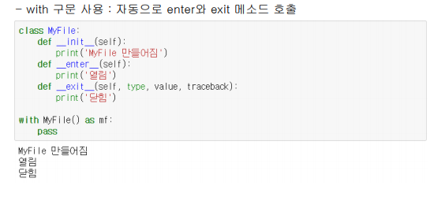

```python
>>> import pickle
>>> list = ['a', 'b', 'c']
>>> with open('list.txt', 'wb') as f:
...     pickle.dump(list, f)
```

