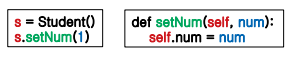
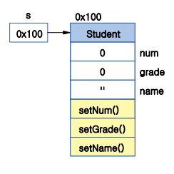

## 01. Class

- 객체지향의 가장 기본적인 개념

- 관련된 속성(모습)과 동작(기능)을 하나의 범주로 묶어 실세계의 사물을 표현

- 클래스를 만들면 메모리상에 차지하며 만들어진다. 

- 모델링 : 사물을 분석하여 필요한 속성과 추출

- 캡슐화 : 모델 결과를 클래스로 포장,표현

  > 데이터를 함부로 수정 못하게 보호함

- 멤버 : 클래스를 구성하는 변수와 함수 

  > 함수안에 만들어진 지역변수는 멤버가 아니다.

- 메서드 : 클래스에 소속된 함수

- 클래스의 변수를 활용하려면 반드시 self 선언

- 메서드 자체의 코드만으로 동작할 때는 self 인수의 정보가 없어도 상관없음

```python
class [클래스이름]:
	변수 = 10

	def 함수1():
		함수내변수 = 20
		print('함수1',함수내변수)
		
	def 함수2(self) #self는 변수
		print('함수2', self.변수)

#쓰는방법 1
객체 = 클래스()
print(객체.변수)

#쓰는방법 2
클래스.함수1()
객체.함수2()		#인수를 명시하지 않으면 자동으로 메소드로 전달.
```


#### 클래쓰를 쓰는 근본적인 이유는 협업시 라이브러리처럼 간편하게 가져다 쓰기 위함.


## 02. Class 사용방법 

#### 1. self 사용

```python
class 클래스
	def 함수(self):
		print('실행')
		
객체 = 클래스()
객체.함수()
```

> 제대로 관리하고 집합적으로 쓰일 때


#### 2. self 미사용

```python
class 클래스:
	def 함수():
		print('실행')
		
클래스.함수()
```

> 간단한 코드 한줄, 꺽쇠 하나 정도 쓰일 때.


#### 3. 혼합 사용시 사용불가


#### 4. 함수를 이용한 계산기능 (누적됨)

- 결과값 누적

```
result = 0 # 결과를 저장할 전역변수
def adder(num):
 global result # 전역변수 사용 설정
 result += num
 return result # 결과값 반환
print(adder(3))
print(adder(10))
```


- 2개의 결과값 누적

  ```
  result1 = 0 # 결과를 저장할 전역변수
  result2 = 0 # 결과를 저장할 전역변수
  def adder1(num):
   global result1 # 전역변수 사용 설정
   result1 += num
   return result1 # 결과값 반환
  def adder2(num):
   global result2 # 전역변수 사용 설정
   result2 += num
   return result2 # 결과값 반환
  print(adder1(3))
  print(adder1(10))
  print(adder2(13))
  print(adder2(100))
  ```

  

- 클래스를 이용한 계산 기능

  ```
  class Calculator:
   result = 0
   def adder(self, num):
   self.result += num
   return self.result
  cal1 = Calculator() # 객체 생성
  cal2 = Calculator() # 객체 생성
  result1 = cal1.adder(3) # 3
  result1 = cal1.adder(10) # 13
  result2 = cal2.adder(13) # 13
  result2 = cal2.adder(100) # 113
  print(result1)
  print(result2)
  
  ```

  

## 03. 클래스와 인스턴스

	- 클래스 : 설계도면
	- 객체(Object) : 클래스에 의해 만들어진 완성물 
 - 인스턴스(Instance) : 객체와 같은 의미
   - com은 객체
   - com은 Computer 클래스의 인스턴스 (관계를 나타내는 의미로 사용 할 때)

```python
class Computer:
   power = False
   def powerOn(self):
     self.power = True
     print('전원 ON')
        
   def powerOff(self):
     self.power = False
     print('전원 OFF')

com = Computer()
com.powerOn()
com.powerOff()
```


인스턴스 생성

```python
class Computer
:
 power = False
 def powerOn(self):
 self.power = True
 print('전원 ON')
 def powerOff(self):
 self.power = False
 print('전원 OFF')
com1 = Computer()
com2 = Computer()
```


학생 정보를 저장할 수 있는 클래스

```python
class Student:
 num = 0 # 번호, 생략가능
 grade = 0 # 학년, 생략가능
 name = '' #이름, 생략가능
 def setNum(self, num):
 self.num = num
 def setGrade(self, grade):
 self.grade = grade

 def setName(self, name):
 self.name = name
s = Student()
s.setNum(1)
s.setGrade(3)
s.setName('kim')
```






계산기 사칙연산 기능 추가

```python
class Calculator:
 def plus(self, first, second):
 return first + second
 def minus(self, first, second):
 return first - second
 def multiply(self, first, second):
 return first * second
 def divide(self, first, second):
 return first / second
cal = Calculator()
print(cal.plus(5, 3))
print(cal.minus(5, 3))
print(cal.multiply(5, 3))
print(cal.divide(5, 3))
```


계산할 값을 미리 저장할 수 있도록 수정

```python
class Calculator:
 def setData(self, first, second):
 self.first = first		##전역변수로 선언
 self.second = second	##전역변수로 선언
 def plus(self):
 return self.first + self.second
 def minus(self):
 return self.first - self.second
 def multiply(self):
 return self.first * self.second
 def divide(self):
 return self.first / self.second
cal = Calculator()
cal.setData(5, 3)
print(cal.plus())
print(cal.minus())
print(cal.multiply())
print(cal.divide())

```


계산할 값을 미리 저장할 수 있도록 수정

```python
class Calculator:
 def setData(self, first, second):
 self.first = first
 self.second = second
 def plus(self):
 return self.first + self.second
 def minus(self):
 return self.first - self.second
 def multiply(self):
 return self.first * self.second
 def divide(self):
 return self.first / self.second
cal = Calculator()
# cal.setData(5, 3) # 미호출 시 오류
print(cal.plus())
print(cal.minus())
print(cal.multiply())
print(cal.divide())
```


생성자를 이용한 값 초기화

```python
class Calculator:
 def __init__(self, first, second):
 self.first = first
 self.second = second
 def plus(self):
 return self.first + self.second
 def minus(self):
 return self.first - self.second
 def multiply(self):
 return self.first * self.second
 def divide(self):
 return self.first / self.second

cal = Calculator(5, 3)
print(cal.plus())
print(cal.minus())
print(cal.multiply())
print(cal.divide())
```


## 클래스 상속


