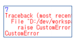
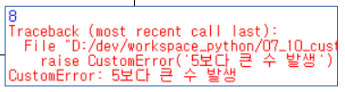

# 예외처리

## 01. 오류가 발생하는 상황

- ZeroDivisionError : division by zero 

  ##### 2 / 0 

- IndexError : list index out of range 

  #### list = [] 

  ##### list[0] 

- TypeError : unsupported operand type(s) for +: 'int' and 'str' 

  ##### 4 + '' 

- FileNotFoundError: [Errno 2] No such file or directory: 'python.txt' 

  ##### file = open('python.txt', 'r') 

- TypeError: unsupported operand type(s) for +: 'set' and 'set' 

  ##### {1, 2} + {3}


## 02. 오류 예외 처리 기법

1. 기본구조 

   ```python
   try:
    …
   except [발생 오류[as 오류 메시지 변수]]:
    …
   ```

   \- 오류가 발생하면 해당 라인에서 동작을 멈추고 except 블록으로 이동 

   \- 오류가 발생하지 않으면 except 블록은 실행되지 않음


2. try - except

   ```python
   try:
    …
   except:
    …
   ```

   \- 오류가 발생하면 종류에 상관없이 except 블록으로 이동


3. try - except 발생 오류

   ```python
   try:
    …
   except 발생 오류:
    …
   ```

   \- 오류가 발생하면 명시된 오류명과 같을때만 except 블록으로 이동


4. try - except 발생 오류 as 오류 메시지 변수

   ```python
   try:
    …
   except 발생 오류 as 오류 메시지 변수:
    …
   ```

   \- 오류가 발생하면 명시된 오류명과 같을때만 except 블록으로 이동 

   \- 오류 메시지의 내용까지 활용 가능


## 03. 예외처리 적용

#### 1. try - except

- ZeroDivisionError

  ```python
  try:
   2 / 0
  except:
   print('예외발생')
  ```

  

- IndexError

  ```python
  try:
   list = []
   list[0]
  except:
   print('예외발생')
  ```

  

- FileNotFoundError

  ```python
  try:
   file = open('python.txt', 'r')
  except:
   print('예외발생')
  ```

#### 2. try - except 발생 오류

- ZeroDivisionError

  ```python
  try:
   2 / 0
  except ZeroDivisionError:
   print('ZeroDivisionError 예외발생')
  ```

  

- IndexError

  ```python
  try:
   list = []
   list[0]
  except IndexError:
   print('IndexError 예외발생')
  
  ```

  

- FileNotFoundError

  ```python
  try:
   file = open('python.txt', 'r')
  except FileNotFoundError:
   print('FileNotFoundError 예외발생')
  ```


#### 3. try - except 발생 오류 as 오류 메세지 변수

> 이 방법을 제일 선호 함.

- ZeroDivisionError

  ```python
  try:
   2 / 0
  except ZeroDivisionError as e:
   print(e, '예외발생')
  ```

  

- IndexError

  ```python
  try:
   list = []
   list[0]
  except IndexError as e:
   print(e, '예외발생')
  ```

  

- FileNotFoundError

  ```python
  try:
   file = open('python.txt', 'r')
  except FileNotFoundError as e:
   print(e, '예외발생')
  ```


## 04. 예외처리 적용 다른방법

#### 1. try - except - else (오류가 없는 경우에만 실행)

- 기본구조

  ```python
  try:
   …
  except:
   …
  else:
   … 
  ```

  \- 오류가 발생하지 않으면 else 블록 실행 

  \- 반드시 except 절 다음에 위치

  

- 예외 처리 적용

  ```python
  try:
   file = open('python.txt', 'r')
  except:
   print('예외발생')
  else: # 파일이 정상적으로 열렸다면
   file.read()
   print(file)
   file.close()
  ```

#### 2. try - except - finally (항상 실행)

#### 3. try - except - except (여러개의 오류 처리)


## 05. 의도적인 오류 발생

#### - raise

```python
class Car:
   def move(self):
     raise NotImplementedError
     
class Taxi(Car):
   pass
   
taxi = Taxi()
taxi.move() # NotImplementedError 발생
```

\- 의도적으로 오류를 발생시키기 위해 사용 

\- 라이브러리를 설계하는 개발자가 활용하려는 개발자에게 반드시 메소드를 오버라이딩 후 사용하도록 하기 위해

> 라이브러리 개발자가 사용자가 이용할 때, 찝찝한 상황이 된다면 오류 발생 한다고 알려줄 때 쓰임.

```python
class Car:
   def move(self):
     raise NotImplementedError
 
class Taxi(Car):
   def move(self): # 오버라이딩
     print('fast move')
     
taxi = Taxi()
taxi.move() 
```


## 06. 오류 만들기

#### - 기본 구조

```python
class CustomError(Exception):
 pass

```

\- 파이썬에 미리 만들어놓은 많은 오류 모듈이 있긴 하지만 

​	현재 개발하려는 서비스 상황에 알맞은 오류를 찾을수 없을 때 

​	직접 오류를 만들어서 쓰는 것도 가능 

\- Exception 이라는 클래스를 상속받는 것만으로 가능

> 기능은 프로그램을 멈추는 기능밖에 없지만 클래스의 이름으로 에러를 짐작 가능하게끔 만드는 것. 

#### - CustomError 적용

```python
import random

class CustomError(Exception):
 pass

num = random.randint(1, 10) # 1 ~ 10 사이의 난수 발생
if num > 5:
 print(num)
 raise CustomError # 난수가 5보다 크면 CustomError 발생
else:
 print(num)
```



#### - 오류를 발생시키면서 메세지 출력

```python
class CustomError(Exception):
   def __init__(self, msg):
     self.msg = msg
   def __str__(self):
     return self.msg
```

#### - CustomError 메세지 출력

```python 
class CustomError(Exception):
   def __init__(self, msg):
     self.msg = msg
   def __str__(self):
     return self.msg

num = random.randint(1, 10)
if num > 5:
   print(num)
   raise CustomError('5보다 큰 수 발생')
else:
   print(num)
```




