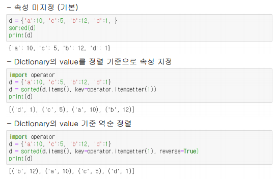

# 내장함수


## 01. 내장함수

#### - 특징

- 파이썬 내부에 미리 정의되어 있는 함수

- 외부모듈과는 달리 import과정없이 사용 가능

- `__builtins__` 속성을 통해서 내장 함수 목록 확인 가능

- 자주 사용되는 내장함수 목록

  | abs    | all       | any  | chr        | dir    |
  | ------ | --------- | ---- | ---------- | ------ |
  | divmod | enumerate | eval | filter     | hex    |
  | id     | input     | int  | isinstance | len    |
  | list   | map       | max  | min        | oct    |
  | open   | ord       | pow  | range      | sorted |
  | str    | tuple     | type | zip        |        |


## 02. 내장함수 종류

#### 1. abs()

​	숫자의 절댓값으로 돌려주는 함수

> 보통 수학에 관련된 메소드 사용시 많이 쓰임.

​	<연습문제>


```python
def distance(start, end):
    dx=abs(start[0] - end[0])
    dy=abs(start[1] - end[1])
    return dx, dy

start = (1, 1)
end = (5, 3)

dx, dy = distance(start, end)

print('dx:', dx, 'dy:', dy)
```


#### 2. all()

​	반복 가능한 자료를 입력받아서 요소가 모두 참이면 True, 거짓인 요소가 하나라도 있으면 False를 돌려주는 함수 (and 논리 연산자랑 같음.)

```python
>>> all([1, 2, 3, 4])
True
>>> all([1, 2, 0])
False
>>> all(['a', 'b', ''])
False
>>> all(('a', 'b', ''))
False
>>> all({1, 2, 0})
False
```

<연습문제>


```python
print('컴파일 언어가 아닌 것은?')
answer1 = input('1. C 2. C# 3. Python 4. swift => ')

print('컴퓨터 장치가 아닌 것은?')
answer2 = input('1. HDD 2. SDD 3. RAM 4. CPU => ')

print('파이썬의 자료형이 아닌 것은?')
answer3 = input('1. str 2. tuple 3. list 4. Map => ')

answer_list = list()
answer_list.append(answer1)
answer_list.append(answer2)
answer_list.append(answer3)
# 코드 작성
if all(answer_list):
    print('제출 완료')
else:
    print('재입력')
```


#### 3. any()

​	반복 가능한 자료를 입력받아서 참인 요소가 하나라도 있으면 True, 모두가 거짓이면 False를 돌려주는 함수 (all()의 반대)

```python
>>> any([1, 2, 3, 4])
True
>>> any([1, 2, 0])
True
>>> any(('a', 'b', ''))
True
>>> any([0, '', False, [], {}, ()])
False
```


#### 4. chr() 중요

​	아스키(ASCII)코드를 입력받아 해당하는 문자를 돌려주는 함수

```
>>> chr(48)
'0'
>>> chr(65)
'A'
>>> chr(97)
'a'
>>> chr(122)
'z'

```


#### 5. dir()

​	객체가 가지고 있는 변수와 함수, 속성들을 알려주는 함수

> 임의의 클래스, 변수를 생성하고 확인 가능.

```python
>>> dir([1, 2, 3])
['__add__', '__class__', '__contains__', '__delattr__',
'__delitem__', '__dir__', '__doc__', '__eq__', '__format__',
'__ge__', '__getattribute__', '__getitem__', '__gt__', '__hash__',
'__iadd__', '__imul__', '__init__', '__init_subclass__', '__iter__',
'__le__', '__len__', '__lt__', '__mul__', '__ne__', '__new__',
'__reduce__', '__reduce_ex__', '__repr__', '__reversed__',
'__rmul__', '__setattr__', '__setitem__', '__sizeof__', '__str__',
'__subclasshook__', 'append', 'clear', 'copy', 'count',
'extend', 'index', 'insert', 'pop', 'remove', 'reverse', 'sort']
```

> 예를들어 리스트에서 append를 사용하려는데 만약 안될때, dir을 사용하여 속성들 함수들을 살펴볼 수 있다.


#### 6. divmod()

​	2개의 숫자를 입력받은 후 나누기 결과 몫과 나머지를 튜플로 돌려주는 함수

```python
>>> divmod(5, 3)
(1, 2)
>>> divmod(-10, 2)
(-5, 0)
>>> divmod(5.4, 2)
(2.0, 1.4000000000000004) # 부동소수점의 한계
```

> 딱 나누어 떨어지지 않는 다면 부동소수점의 형태로 나타낸다. 
>
> 부동소수점 : 소수점의 위치를 고정하지 않고 그 위치를 나타내는 수

<연습문제>

```python
a = 123
b = 16
quotient, remainder = divmod(a, b)

print('몫', quotient)
print('나머지', remainder)
print(c)
```


#### 7. enumerate()

​	반복 가능한 자료를 입력받아서 인덱스와 요소를 돌려주는 함수

```python
for i, e in enumerate([1, 2, 3]):
 print(i, e)

for i, e in enumerate((1, 2, 3)):
 print(i, e)

for i, e in enumerate({1, 2, 3}):
 print(i, e)

for i, e in enumerate({1:1, 2:2, 3:3}):
 print(i, e)

for i, e in enumerate('문자열'):
 print(i, e)
```

​	result

```python
0 1 #[0]번에 요소 1
1 2 #[1]번에 요소 2
2 3 #[2]번에 요소 3
```


<연습문제>

```
char_list = ['a', 'b', 'c', 'd', 'e', 'f', 'g']
char_dict = {}
# 코드 작성
print(char_dict
```


#### 8. eval()

​	실행 가능한 문자열을 입력받은 후 실행한 결과값을 돌려주는 함수

```python
>>> eval('1 + 2')
3

>>> eval('print("Hello", "Python")')
Hello Python

>>> eval('any([1, 2, 3, 4])')
True
```


#### 9. filter() 중요

​	참, 거짓을 반환하는 함수와 반복 가능한 자료를 입력받은 후 참인 값만 찾은 후 돌려주는 함수

> 정말 자주 쓰이니까 제대로 익혀 두자. 

```python
def even(n):
   return n % 2 == 0
print( list( filter( even, (1, 2, 3, 4, 5, 6) ) ) )
print( tuple( filter( even, (1, 2, 3, 4, 5, 6) ) ) )
print( set( filter( even, (1, 2, 3, 4, 5, 6) ) ) )
print( list( filter( lambda n: n % 2 == 0, (1, 2, 3, 4, 5, 6) ) ) )


def even(n):
   return n % 2 == 0
list( filter( even, (1, 2, 3, 4, 5, 6) ) )
list( filter( lambda n : n % 2 == 0, (1, 2, 3, 4, 5, 6) ))
```


	##### - filter() 와 map()의 차이 (중요)

​	filter()는 주어진 조건에 따라 요소를 걸러주는 역할,

​	map()은 주어진 조건을 요소에 하나하나씩 적용시켜주는 역할


<연습문제>

1. filter, lambda, 함수 등을 이용하여 리스트 요소 중 음수를 제거한 리스트 만들기

   ```python
   num_list = [1, -2, 3, -5, 8, -3]
   list(filter( lambda n : n > 0, num_list))
   ```

   

2. filter, lambda, 함수 등을 이용하여 리스트 요소 중 3의 배수를 제거한 리스트 만들기

   ```python
   num_list = range(1, 21)
   list(filter( lambda x : x != 0, num_list))
   ```

   


#### 10. hex()

​	10진수인 정수를 입력받은 후 **16진수 정수**로 돌려주는 함수

```python
>>> hex(5)
'0x5'
>>> hex(10)
'0xa'
>>> hex(15)
'0xf'
>>> hex(16)
'0x10'

```


<연습문제>

```python
red = 190
green = 66
blue = 205

# 코드 작성
r = hex(red)
g = hex(green)
b = hex(blue)

print(r, g, b)
```


#### 11. id()

​	객체를 입력받은 후 객체의 **고유 주소값**을 돌려주는 함수


#### 12. input() 중요

​	사용자 입력을 받은 후 **문자열**로 돌려주는 함수

```python
>>> text1 = input()
abcd
>>> text1
'abcd'
>>> text2 = input('value : ')
value : abcd
>>> text2
'abcd'
```

> 무조건 문자열로만 돌려주기 때문에 필요에 따라 int와 같은 자료형으로 바꿔서 사용하여야 한다. 


#### 13. int() 중요

​	 문자열 형태의 **숫자**, 소수점이 있는 숫자를 **정수** 형태로 돌려주는 함수

```python
>>> int('2324') # 문자열 → 정수
2324
>>> int(2.324) # 실수 → 정수
2
>>> int('11', 2) # 2진수 → 10진수
3
>>> int('11', 8) # 8진수 → 10진수
9
>>> int('11', 16) # 16진수 → 10진수
17
>>> int('ff', 16) # 16진수 → 10진수
255
```


<연습문제>

주어진 16진수 문자를 이용하여 실행결과와 같이 출력될 수 있도록 show_hex_to_ch() 함수 작성 (split(), chr(), int() 등 이용)

```python
hexa_string1 = '48 45 4C 4C 4F'
hexa_string2 = '47 47 4F 52 45 42'
def show_hex_to_ch(hexa_string):
 # 코드 작성
    hexa_list = hexa_string.split(' ')
    for hexa in hexa_list:
        print(chr(int(hexa, 16)), end='') 
    print()
    
show_hex_to_ch(hexa_string1)
show_hex_to_ch(hexa_string2)
```


#### 14. isinstance()

​	입력받은 변수와 클래스가 같은 인스턴스인지 확인해주는 함수

```python
>>> class Car: pass
>>> a = Car()

>>> class Taxi(Car): pass
>>> b = Taxi()

>>> isinstance(a, Car)
True

>>> isinstance(b, Taxi)
True

>>> isinstance(b, Car)
True
>>> isinstance(10, int)
True
>>> isinstance(10.0, float)
True

#변수가 서로 다른 것이더라도 같은 클래스의 인스턴스이기만 하면 True로 나타낸다.
```


<연습문제>

```python
values = [10, 'a', True, {}, [], -4, 23.24, (1,), -1.2]
result = 0
# 코드 작성
for value in values:
    if not isinstance(value, bool) and isinstance(value, int) or isinstance(value, float):
        result += value
        
print(result) # 29.04
```


#### 15. len() 중요

​	입력된 값의 길이(전체 요소의 개수)를 돌려주는 함수

```python
>>> len('python')
6
>>> len([1, 2, 3, 4, 5])
5
>>> len({1, 2, 3, 4, 5})
5
```

> 튜플이든 리스트든 그 길이만 정수값으로 돌려준다. 


#### 16. list() 중요

​	반복 가능한 자료형을 입력받아 리스트로 만들어 주는 함수

```python
>>> list('python')
['p', 'y', 't', 'h', 'o', 'n']

>>> list({1, 2, 3, 4, 5})
[1, 2, 3, 4, 5]

>>> list({'a':1, 'b':2, 'c':3})
['a', 'b', 'c']

>>> list((1, 2, 3, 4, 5))
[1, 2, 3, 4, 5]
```


#### 17. map() 중요

​	 입력된 값에 연산결과를 반영하여 반환하는 함수와 반복 가능한(iterable) 자료를 입력받은 후 함수 결과값들을 묶어서 돌려주는 함수

> 뭔가를 적용한다라고 보자. 필터는 걸러주는 것.
>
> 데이터 분석에서 자주 쓰인다.

```
>>> def two_times(x): return x * 2
>>> list(map(two_times, [1, 2, 3, 4]))
[2, 4, 6, 8]
>>> list(map(lambda x: x * 2, [1, 2, 3, 4]))
[2, 4, 6, 8]
```


#### 18. max()

​	반복 가능한 자료형을 입력받아 요소 중 **최대값**을 돌려주는 함수

```python
>>> max((1, 3, 1000, 9999, -1))
9999
>>> max({'a':1, 'b':3, 'c':1})
'c' 								#키 값의 기준
>>> max('Python')
'y'
>>> max('pYthon')
't'
```


#### 19. min()

​	반복 가능한 자료형을 입력받아 요소 중 **최소값**으 돌려주는 함수

```python
>>> min((1, 3, 1000, 9999, -1))
-1
>>> min({'a':1, 'b':3, 'c':1})
'a'
>>> min('Python')
'P'
>>> min('pYthon')
'Y'
```


#### 20. oct()

​	10진수인 정수를 입력받은 후 **8진수 정수**로 돌려주는 함수

> 알고리즘에 자주 출제

```python
>>> oct(5)
'0o5'
>>> oct(8)
'0o10'
>>> oct(16)
'0o20'
>>> oct(18)
'0o22'

```


#### 21. open() 중요

 입력된  mode에 따라 파일객체를 돌려주는 함수

```python
>>> file = open('test.txt', 'r')  #입출력때 사용한 내장함수.
>>> print(file.read())
1234
가나다라
ACBD
```


#### 22. ord()

​	문자를 입력받아 해당하는 **아스키(ASCII)코드**를 돌려주는 함수 ( ⇔ chr() )

```python
>>> ord('0')
48
>>> ord('A')
65
>>> ord('a')
97
>>> ord('z')
122
```


#### 23. pow()

  2개의 x, y 숫자를 입력받은 후 x의 y제곱 결과를 돌려주는 함수

```python
# pow(숫자, 제곱횟수)
>>> pow(2, 2)
4
>>> pow(2, 10) # 1KB (≒ 1,000)
1024
>>> pow(2, 20) # 1MB (≒ 1,000,000)
1048576
>>> pow(2, 30) # 1GB (≒ 1,000,000,000)
1073741824
```


#### 24. range() 중요

​	주로 for문과 연계하여 사용되며, 입력받은 숫자에 해당하는 범위를 반복 가능한 객체로 만들어서 돌려주는 함수

```python
>>> list(range(5)) # 마지막 숫자 제외 0부터 시작하기 때문.
[0, 1, 2, 3, 4]
>>> list(range(1, 6)) # 두번째(마지막) 숫자 제외
[1, 2, 3, 4, 5]
>>> list(range(1, 11, 2)) # 숫자 사이의 거리
[1, 3, 5, 7, 9]
>>> list(range(0, -11, -2)) # 숫자 사이의 거리
[0, -2, -4, -6, -8, -10]

```


#### 25. sorted() 중요

​	반복 가능한 자료형을 입력받아 **오름차순** 정렬된 **리스트**를 돌려주는 함수

```python
>>> sorted(('z', 'y', 'r', 'a', 'b'))
['a', 'b', 'r', 'y', 'z']
>>> sorted((3, 5, 4, 9, -5))
[-5, 3, 4, 5, 9]
>>> sorted({'1', 'a', '2', 'A', '가'})
['1', '2', 'A', 'a', '가']
```

> 리스트를 돌려주는 함수이기 때문에 항상 리스트로 변환후 사용하여야 한다.




> 딕셔너리를 정렬하기 위해선, 리스트로 수정후, operator라는 외장함수를 이용하여 인자를 선택한다.  (튜플 기준)


#### 26. str() 중요

​	입력받은 값을 문자열 형태로 돌려주는 함수

```python
>>> str(1)
'1'
>>> str('123')
'123'
>>> str([1, 2, 3])
'[1, 2, 3]'
>>> str({1:1, 2:2, 3:3})
'{1: 1, 2: 2, 3: 3}'
```


#### 27. tuple() 중요

​	반복 가능한 자료형을 입력받아 튜플로 만들어주는 함수

```python
>>> tuple([1, 2, 3, 4, 5])
(1, 2, 3, 4, 5)

>>> tuple('12345')
('1', '2', '3', '4', '5')

>>> tuple({1, 2, 'a', 'b', 'c', '가', '나', '다'})
(1, 2, 'c', '가', 'b', 'a', '나', '다')
```


#### 28. type() 중요

​	입력받은 값의 자료형을 알려주는 함수

```python
>>> type('python')
<class 'str'>

>>> type(10.10)
<class 'float'>

>>> type({})
<class 'dict'>

>>> type(())
<class 'tuple'>

>>> type([])
<class 'list'>
```


#### 29. zip() 중요

​	반복 가능한 자료형 묶음별 요소들을 각 순번에 맞춰 튜플로 묶어진 리스트를 돌려주는 함수


<연습문제>

 3개의 리스트 각 요소를 이용하여 튜플 리스트로 변환하기

```python
list1 = [1, 2, 3, 4]
list2 = ['a', 'b', 'c', 'd']
list3 = ['가', '나', '다', '라']

tuple_list = list(zip(list1, list2, list3))
print(tuple_list)
```

result

```python
[(1, 'a', '가'), (2, 'b', '나'), (3, 'c', '다'), (4, 'd', '라')
```


