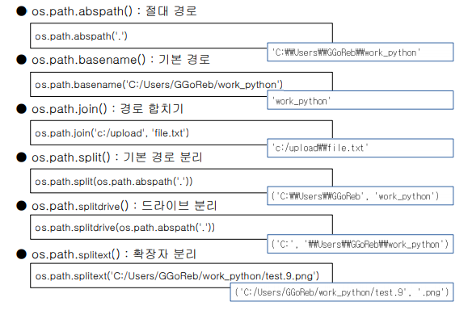
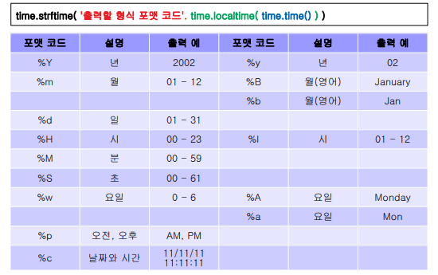

# Built-out function


## 01. 외장함수 

#### - 특징

- 파이썬에서 제공되는 기본 라이브러리

	- 내장함수와는 다르게 모듈을 불러들이는 import과정을 거쳐야됨

- 자주 쓰이는 라이브러리들

  | sys        | pickle      | os     | shutil     |
  | ---------- | ----------- | ------ | ---------- |
  | glob       | tempfile    | time   | datetime   |
  | dateutill  | calendar    | random | webbrowser |
  | namedtuple | defaultdict |        |            |

  


## 02. sys

​	파이썬이 제공하는 변수 및 함수를 직접 제어할 수 있게 해주는 모듈


##### - sys.argv

​	명령모드로 실행하면서 전달된 인자 확인

```python
# arg.py

import sys
print(sys.argv)
```


##### - sys.exit()

​	프로그램 강제 종료

```python
import sys

print('프로그램 시작')
sys.exit()
print('프로그램 종료')
```


##### - sys.path

​	파이썬의 모듈의 저장되어 있는 위치를 나타냄

​	외부 모듈을 사용하기 위해 특정 위치 지정 가능

```python
>>> import sys
>>> sys.path
['', 'C:\\Python36\\Lib\\idlelib', 'C:\\Python36\\python36.zip', 'C:\\
Python36\\DLLs', 'C:\\Python36\\lib', 'C:\\Python36', 'C:\\Python36\\
lib\\site-packages']

>>>
>>> sys.path.append('D:/dev/workspace_python')
>>> sys.path
['', 'C:\\Python36\\Lib\\idlelib', 'C:\\Python36\\python36.zip', 'C:\\
Python36\\DLLs', 'C:\\Python36\\lib', 'C:\\Python36', 'C:
\\Python36\\lib\\site-packages', 'D:/dev/workspace_python']
>>> 
```


## 02. pickle

​	객체의 형태를 그대로 유지하면서 파일에 저장하고 불러올 수 있게 하는 모듈

> 보통 바이너리 형태로 저장할 때 손쉽게 할 수있도록 해주는 라이브러리
>
> 리스트나 튜플같은 경우 바이너리로 저장해야지 리스트, 튜플 형태 유지한다.

 

##### - pickle.dump()

​	객체의 형태(딕셔너리, 리스트, 튜플)를 그대로 유지하면서 저장함.

```python
import pickle
file = open('obj.txt', 'wb')
data = {'a' : 'python', 'b' : 'easy'}
pickle.dump(data, file)
file.close()
```


##### - pickle.load()

​	객체의 형태를 그대로 유지하면서 불러오기

```python
import pickle
file = open('obj.txt', 'rb')
data = pickle.load(file)
print(data)
file.close()
```


## 03. os

​	환경변수, 디렉토리, 파일 등의 운영체제 자원을 제어할 수 있게 해주는 모듈

> 운영체제 안의 명령어들을 파이썬으로 제어 할 수 있기 때문에, 초장기 때 파이썬으로 해킹하는 사건이 빈번히 일어남. 현재는 대부분 막혀있음.


##### - os.environ

​	환경변수 확인

```python
>>> import os
>>> os.environ
environ({'ALLUSERSPROFILE': 'C:\\ProgramData', 'ANDROID_SDK_HOME': 'D:\\
dev\\Android\\avd', 'APPDATA': 'C:\\Users\\GGoReb\\AppData\\
Roaming', 'COMMONPROGRAMFILES': 'C:\\Program Files\\Common Files',
'COMMONPROGRAMFILES(X86)': 'C:\\Program Files (x86)\\Common Files',
'COMMONPROGRAMW6432': 'C:\\Program Files\\Common Files',
'COMPUTERNAME': 'DESKTOP-VMV850T', 'COMSPEC': 'C:\\Windows\\
system32\\cmd.exe', 'FPS_BROWSER_APP_PROFILE_STRING': 'Internet Explorer',
'FPS_BROWSER_USER_PROFILE_STRING': 'Default', 'GTK_BASEPATH': 'C:\\Program
Files (x86)\\GtkSharp\\2.12\\', 'HOME': 'C:\\Users\\GGoReb', … , 'WINDIR':
'C:\\Windows'})

```


##### - os.chdir()

​	현재 디렉토리의 위치 변경

```python
>>> import os
>>> os.chdir('C:/Windows')
```

##### - os.getcwd()

​	현재 지정된 디렉토리 확인

```python
>>> import os
>>> os.getcwd()
'C:\\Windows
```

##### - os.system()

​	시스템(운영체제 또는 외부 프로그램) 명령어 호출하기

```python
>>> import os
>>> os.system('dir')
#리눅스, 등등 불러오기 가능.
```

##### - os.popen()

​	시스템 명령어 호출 결과 받기

```python
import os

os.chdir('d:/dev/workspace_python')

content = os.popen('dir/w')

while True:
   line = content.readline()
   if not line:
       break
   print(line)

content.close()
```

##### - os.mkdir()

​	디렉토리를 만들어주는 함수

```python
os.mkdir('D:/python')
```

##### - os.rmdir()

​	디렉토리를 삭제해주는 함수 (디렉토리가 비어있어야 가능)

```python
os.rmdir('D:/python')
```

##### - os.unlink()

​	파일을 지워주는 함수

```python
os.unlink('D:/python/python.txt')
```

##### os.rename()

​	디렉토리 또는 **파일의 이름**을 변경해주는 함수

```python
os.rename('D:/python/sub', 'D:/python/main')
```

##### - os.path. 명령어들




## 04. shutil

파일을 복사해주는 모듈 


##### - shutil.copy()

```python
>>> import shutil
>>> shutil.copy('d:/python/source.txt', 'd:/python/target.txt')
```


## 05. glob

디렉토리에 있는 파일들을 리스트로 만들어주는 모듈


##### - glob.glob()

```python
import glob
fileList = glob.glob('C:/Windows/a*')
# *는 모든파일, *a 는 a로 시작하는 파일들

print(fileList)
```


## 06. tempfile

파일을 임시로 만들어서 사용하게 해주는 모듈 


##### - tempfile.mktemp()

​	중복되지 않는 임시파일의 이름을 무작위로 만들어서 돌려주는 함수

```
>>> import tempfile
>>> filename = tempfile.mktemp()
>>> filename
'C:\\Users\\GGoReb\\AppData\\Local\\Temp\\tmppvv7v8b8'
```


##### - tempfile.TemporartFile()

​	임시 저장공간으로 사용될 파일 객체를 돌려주는 함수

```
>>> import tempfile
>>> file = tempfile.TemporaryFile()
>>> file.close()
```


## 07. time

시간과 관련된 여러 기능을 제공하는 모듈


##### - time.time()

- \- UTC(Universal Time Coordinated 협정 세계 표준시)를 이용하여 현재 시각을 실수 형태로 돌려주는 함수
- 1970년 1월 1일 0시 0분 0초를 기준으로 지난 시간을 초 단위로 표시

```python
>>> import time
>>> time.time()
1525075157.2935598
```


##### - time.localtime()

- time.time() 으로 반환된 값을 이용하여 년, 월, 일, 시, 분, 초 등의 Tuple 형태로 변환해주는 함수

```python
>>> date = time.time()
>>> date2 = time.localtime(date)
>>> date2
time.struct_time(tm_year=2018, tm_mon=4, tm_mday=30, tm_hour=17, tm_min=3,
tm_sec=30, tm_wday=0, tm_yday=120, tm_isdst=0)

>>> nowDate = str(date2.tm_year) + '/' + str(date2.tm_mon) + '/' + str(date2.tm_mday)
>>> nowDate
'2018/4/30'
```


##### - time.asctime()

​	 time.localtime() 으로 반환된 값을 날짜와 시간을 알아보기 쉬운 형태로 돌려주는 함수

```python
>>> time.asctime( time.localtime( time.time() ) )
'Mon Apr 30 17:48:00 2018'
```


##### - time.ctime()

​	 time.asctime() 과 같은 내용을 출력해주는 함수 (현재 시각만 출력)

```python
>>> time.ctime()
'Mon Apr 30 17:48:00 2018'
```


##### - time.strftime()

​	 Tuple 형태의 time.localtime(time.time()) 과 함께 출력 형태를 지정하여 세밀하게 표현해주는 함수




##### - time.sleep()

​	일정시간 동안 멈추도록 해주는 함수, 주로 반복문 안에서 사용

```python
import time

for i in range(1, 11):
 print(i)
 time.sleep(1)
```


## 08. random

​	난수를 만들어주는 모듈


##### - random.random()

- 0.0 <= N < 1.0 범위의 난수값(실수)을 돌려주는 함수

```python
>>> import random
>>> random.random()
0.5031093544872511
```

##### - random.randint(A, B)

- A <= N <= B 범위의 난수값(정수)을 돌려주는 함수

```python
>>> import random
>>> random.randint(0, 3)
3
```

##### -  random.choice()

- 반복이 가능한 자료형에서 무작위로 요소 하나를 돌려주는 함수

```PYTHON
>>> import random
>>> random.choice([1, 2, 3, 4, 5])
1
>>> random.choice('12345')
'4'
```

##### - random.shuffle()

- **리스트 자료형**의 요소 순서를 무작위로 섞어주는 함수

```python
>>> import random
>>> list = [1, 2, 3, 4, 5]
>>> random.shuffle(list)
>>> list
[1, 5, 4, 2, 3]
```

##### - random.uniform(a, b)

- a <= N <= b 범위의 난수값(float)을 돌려주는 함수

```python
import random

random.uniform(0, 5)
```


<연습문제>

1.  0.0 보다 크거나 같고 5.0 보다 적은 난수(실수) 생성

```python
import random

random.uniform(0, 5)
```


2. 주사위 두개를 던진 결과를 출력하고 두 눈이 같으면 종료되는 코드 작성

```python
count = 0 
while True:
    count += 1
    num1 = random.randint(1, 6)
    num2 = random.randint(1, 6)
    
    print(num1 ,num2)
    
    if num1 == num2:
        break
    
print('주사위를 던진 횟수', count))
```


3. 1 ~ 25 빙고판 만들기

```python
# bingo 1 ~ 25 숫자 입력
bingo = list()
for i in range(1, 26):
    if i < 10: i = '0' + str(i)
    bingo.append(str(i))
print(bingo)
print()

# 코드 작성
random.shuffle(bingo)
for i in bingo:
    a = bingo.pop()
    print(a, end=' ')
```

