# Crawling

- 조직적 / 자동화된 방법으로 데이터를 탐색 / 수집 하는 것 

- 데이터 수집 절차

  - 원하는 URL에 request를 보내고 결과를 받는다
  
  - 받은 결과물(HTML / JSON / XML)을 파싱(Parsing)한다 
  
  - 필요한 정보만 추출한다 
  
  
  
-  파이썬에서 크롤링을 하기 위해 필요한 라이브러리 
  
  - 데이터 통신 : requests / urllib / urllib2 
  
  - 파싱 : bs4 (BeautifulSoup)


## 01. 크롤링 (Crawling) 시작하기


#### 1. 기본 개념들

-  requests / BeautifulSoup 라이브러리 불러오기

  ```
  import requests
  ```

- URL 호출 후 응답코드 확인

  ```
  result = requests.get('http://ggoreb.com/http')
  result.status_code
  ```

- 응답결과 확인

  ```
  result.text
  
  ```

- Encoding 처리

  ```
  result.encoding = 'utf-8'
  result.text
  ```


#### 2. 함수 정의 - 공통적으로 사용 (인코딩 처리 / 응답결과 text)

```python
def get_html(url):
    html = ''
    res = requests.get(url)
    if res.status_code == 200:
        res.encoding = None
        html = res.text
    return html
```

Result 

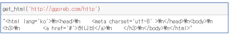


#### 3. requests 모듈

- 기본사용

```python
import requests
res = requests.get('http://ggoreb.com/python/request.jsp')
print(res.status_code) #웹사이트 응답코드
print(res.text)
```

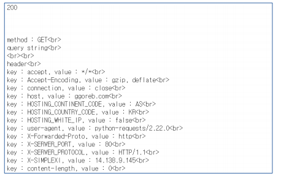

> requests의 메소드인 get을 이용하여 정보를 읽어오고 res 변수안에 저장한다. 출력시 res.text 파일로 읽어옴.


- 파라미터 사용

  > requests 모듈의 get의 속성중 하나를 이용함.

```python
import requests
param = { 'page': 1, 'search': '검색어' }
res = requests.get('http://ggoreb.com/python/request.jsp', params=param)
print(res.text)
```

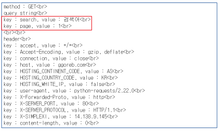


- 헤더 사용

  > requests 모듈의 get의 속성중 하나를 이용함.

```python
import requests
header = { 'user-agent': 'android', 'accept-language': 'en' }
res = requests.get('http://ggoreb.com/python/request.jsp', headers=header)
print(res.text)
```

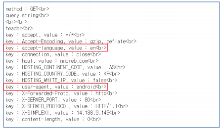


## 02. Parsing ( 반복문 / find / indexing )

> 파이썬 코드로 읽을 수 있게 하는 것

- 응답결과 확인

  ```python
  import requests
  result = get_html('http://ggoreb.com/python/html/data1.html')
  result
  ```

  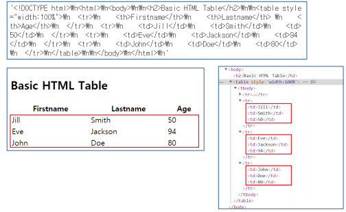

- 원하는 위치를 찾은 후 문자열 잘라내기

  ```python
  s_idx = 0
  e_idx = 0
  while True:
     s_idx = result.find('<td>', e_idx)
     if s_idx == -1:
         break
     e_idx = result.find('</td>', s_idx)
     print(result[s_idx + 4 : e_idx])
  ```

  Result

  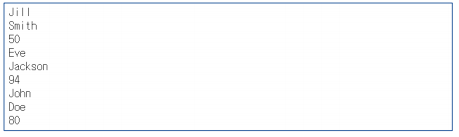

  


## 03. Parsing (BeautifulSoup)

>  네이버 코스피 주소 추출해오기

#### 1. 주소를 가지고 오기

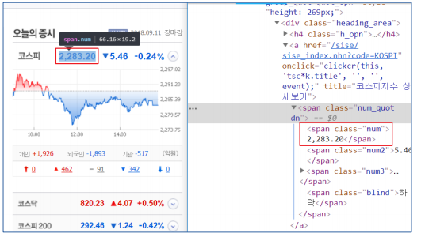


- 응답결과 확인

```
import requests
result = get_html('https://finance.naver.com')
result
```

**Result**

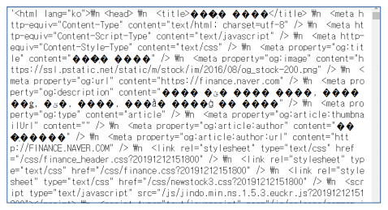

> 만약 한글이 깨진다면 인코딩을 None로 바꿔준다. 

```python
def get_html(url):
    html = ''
    res = requests.get(url)
    if res.status_code == 200:
        res.encoding = 'utf-8' => 'None'
        html = res.text
    return html
```

>  res.encoding = 'utf-8' => 'None'


#### 2. BeautifulSoup 설치하기

​	- cmd창 > `conda install BeautifulSoup4`입력

 - from bs4 import BeautifulSoup 불러오기

   ```python
   from bs4 import BeautifulSoup
   BeautifulSoup(result, 'html.parser')
   ```

   > html을 읽어올때는 항상 html.parser을 쓴다! (중요!)


- CSS 선택자를 이용하여 요소 찾기

  ```python
  from bs4 import BeautifulSoup
  soup = BeautifulSoup(result, 'html.parser')
  tags = soup.select('span.num')
  num = tags[0].getText()
  print(num)
  num = tags[1].getText()
  print(num)
  ```

  > select 태그를 사용하는게 find를 사용하는 것보다 더 유용하다. 


- 반복문을 이용한 문자열 추출

  ```
  for tag in tags:
   print(tag.getText())
  ```

  


#### 3. 네이버 영화 랭크를 끌어와보자! 
##### 	3.1.  주소 끌어오기

```python
import requests
address = 'https://movie.naver.com/movie/sdb/rank/rmovie.nhn'
res = requests.get(address)
res.encoding = None
```

##### 	3.2. Parsing

```python
soup = BeautifulSoup(res.text, 'html.parser')
a_list = soup.select('.tit3 > a')
for a in a_list:
    print(a.getText())
    # getText 가 뷰티풀수프의 함수  (=a.text)
```

##### 	3.3. result

```
닥터 두리틀
백두산
스타워즈: 라이즈 오브 스카이워커
천문: 하늘에 묻는다
미드웨이
해치지않아
시동
나쁜 녀석들 : 포에버
남산의 부장들
겨울왕국 2
...
```


## select


## find

- 태그명을 사용하여 원하는 요소 찾기

  #### 1. find() : object 하나만 가져온다.

  ```python
  import requests
  from bs4 import BeautifulSoup
  res = requests.get('http://ggoreb.com/python/html/example.html')
  soup = BeautifulSoup(res.text, 'html.parser')
  print(soup.find('div'))
  print(soup.find('div').getText())
  ```

  #### 2. find_all() : 모든 object를 가져온다 (list)

  ```python
  import requests
  from bs4 import BeautifulSoup
  res = requests.get('http://ggoreb.com/python/html/example.html')
  soup = BeautifulSoup(res)
  ```

  #### 3. soup.find('div', {'id' : 'ex_id'}) : id 속성을 사용하여 찾기

  ```python
  res = requests.get('http://ggoreb.com/python/html/example.html')
  soup.find('div', {'id': 'ex_id'})
  ```

  ```python
  soup.find(attrs={'id': 'ex_id'})
  ```

  #### 4. class 속성을 사용하여 원하는 요소 찾기

  ```python
  res = requests.get('http://ggoreb.com/python/html/example.html')
  soup.find(attrs={'class': 'ex_class'})
  ```

  #### 5. 그외 여러가지 속성을 사용하여 원하는 요소 찾기

  - 공통사항

    ```python
    import requests
    from bs4 import BeautifulSoup
    res = requests.get('http://ggoreb.com/python/html/example2.html')
    soup = BeautifulSoup(res.text, 'html.parser')
    
    ```

  - 개수 제한

    ```
    print(soup.find_all('p', limit=2))
    ```

  - Text 매칭

    ```
    print(soup.find_all(string='a'))
    ```

  - Text 매칭 (정규식)

    ```
    import re
    print(soup.find_all(string=re.compile('This.*')))
    ```

    

  - 찾은 요소의 지정 속성 확인

    ```
    soup.find('h1', {'class': 'sub'})['class']
    ```

    ```
    soup.find('p', {'data-role': 'click'}).attrs
    ```

    ```
    soup.find(attrs={'class': 'desc'}).find_next()
    ```

select는 모든 요소를 다 가져오지만(list-one)

find는 요소 하나만 가져온다. (object_all) - list


## XML 문서 정보 추출

- 기본 함수 작성

  ```python
  def get_xml(url):
  	xml = ''
  	resp = requests.get(url)
  	if resp.status_code == 200:
  	resp.encoding = None
  	xml = resp.text
  return xml
  ```

  


## Json 문서 정보 추출

기본 문법

```python
import requests
res = requests.get('http://ggoreb.com/python/json/data1.jsp')
result = res.json()
result
```

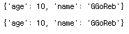

```python
import requests
res = requests.get('http://ggoreb.com/python/json/data2.jsp')
result = res.json()
for r in result:
    print(r['name'], r['age'])
```

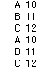

- 필요정보만 추출

  ```python
  for obj in result:
      address = obj['address']
      for o in address:
          print(o, end=' ')
  ```

  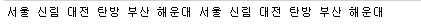


## Selenium

> 자바스크립트로 짜여진 문법은 크롤링을 해올 수 없기 때문에 도입한 기능

- 브라우저 자동화 라이브러리

- 브라우저를 제어 할 수 있는 웹 드라이버를 통해 매크로와 같은 기능 사용

- 지원 브라우저 : Chrome, Fire Fox, Edge, Safari 등

- 지원 언어 : Python, java, C#, JavaScript 등

- 반드시 사용해야하는 경우

  - 자바스크립트를 통해 웹 페이지의 내용을 동적으로 생성하는 사이트

  - 프로그래밍 언어의 코드를 이용한 접속이 아닌 실제 브라우저를 통해서만 접속을 허용하는 사이트

    ex) 네이버 뿜 : http://mbboom.naver.com

    ​	리니지m 공지사항: https://lineagem.plaync.com/board/notice/list

    ​	코인원 사이트

#### 1. 파이썬 라이브러리 셀레니움 설치

- https://selenium.dev/selenium/docs/api/py/index.html 

cmd 창 > conda install selenium

​				pip install selenium

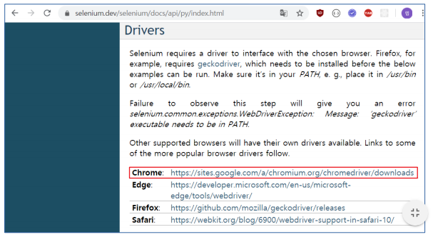


#### 2. 사용할 브라우저의 드라이버 설치

- https://sites.google.com/a/chromium.org/chromedriver/downloads 

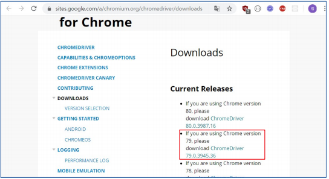

> 설치 경로는 주피터 노트북을 이용하는 폴더 위치


#### 3. 테스트 해보기

- 연습용 사이트 : http://ggoreb.com/http/wait.jsp

- requsts 모듈 이용해보기

  **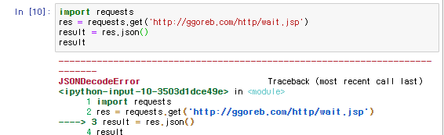**

> 오류 뜸.


## phantomJs

https://phantomjs.org/download.html

