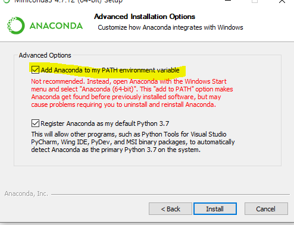
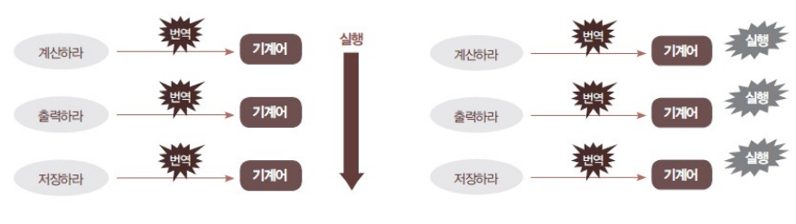

# 일정

#### 파이썬 & 크롤링

​	- 1.10(금) ~ 1.16(목) / 5일

#### RDB 

> (관계형 데이터베이스): Oracle, MySQL

​	- 1.17(금) ~ 1.28(화) / 5일

#### MongoDB

​	- 1.31(금) ~ 2.3(월) / 3일

#### 모듈 프로젝트 - 2

	- 5일

# 정보

1. 파이썬 -> 주피터 노트북 라이브러리

> - python 3.8버전은 주피터가 잘 작동이 안된다.
>
>   최대 단점: 버전이 바뀌면 기존의 라이브러리가 안되는 경우들이 많다.
>
>   그래서 관련된 책에 같은 버전으로 실행해야한다. 
>
> - 아나콘다 개발자툴을 설치하면 
>
>   최대 장점: 파이썬 버전별로, 라이브러리 버전별로 가상환경을 설정가능.
>
>   최대 단점: 용량이 너무 큼.
>
>   아나콘다 경량화 -> 미니콘다

2. 자바 -> 이클립스

3. HTML > VS Code
4. 라즈베리 파이는 파이썬을 이용한다.
5. 요기요 파이썬의 장고 (파이썬으로 웹사이트 만듦)
   - 웹 애플리케이션은 자바가 장악하고 있다.

# 환경설정

1. miniconda 설치 <a href="https://docs.conda.io/en/latest/miniconda.html">download</a>

   > | Python version | Name                                                         | Size     |
   > | -------------- | ------------------------------------------------------------ | -------- |
   > | Python 3.7     | [Miniconda3 Windows 64-bit](https://repo.anaconda.com/miniconda/Miniconda3-latest-Windows-x86_64.exe) | 51.5 MiB |

   

   - 꼭 add 해야한다.

   - 

   

   

   

2.  프로그래밍 언어

   #### 컴파일러 (Compiler) : C / C++ / C# / Java / Go 

   - 모든 명령을 일괄 번역하여 실행 

   - 속도가 빠른 반면 구조가 복잡함 

   

   #### 인터프리터 (Interpreter) : Ruby / Perl / PHP / JavaScript 

   - 명령어를 만날 때마다 즉시 번역하여 실행 

   - 속도는 느리지만 단순하고 쉬움

3. 주피터 노트북 설치

   명령어 : `cmd > conda install jupyter`

   실행 코드 : `jupyter notebook`

   종료방법 : `ctrl + c`

   
   

4. 파이썬에서 기본적으로 가상환경 만들기 

   `python -m venv test-venv`

   

5. 아나콘다 가상환경 만들기 

   `conda create --name myenv`

   

   가상환경이 설치된 경로

   ​	C:\Users\student\Miniconda3\envs

   

6. 아나콘다 들어가기

   `activate myenv`

   나가기 

   `deacctivate`

   

7. 설치된 라이브러리 확인

   `conda list` : 가상환경 별로 객체로 인식

   

8. 라이브러리 설치 

   `conda install matplotlib`

   