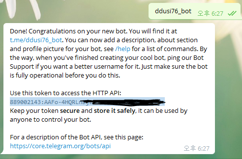
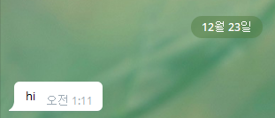
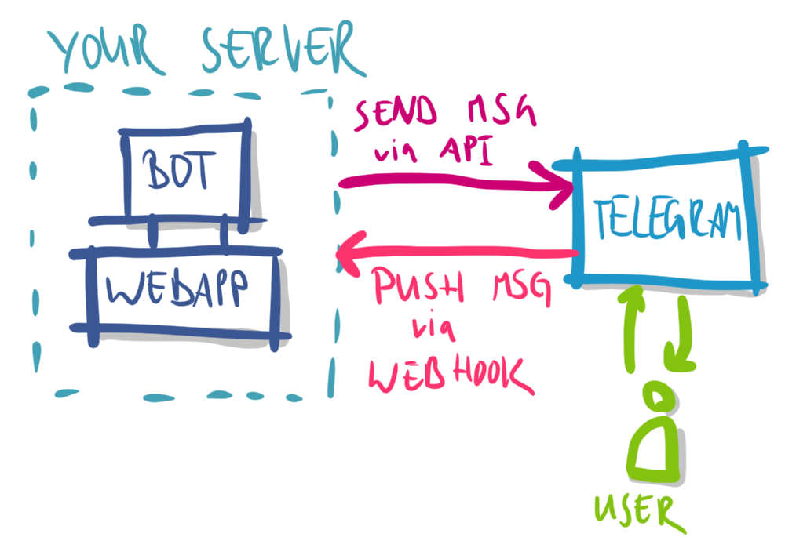
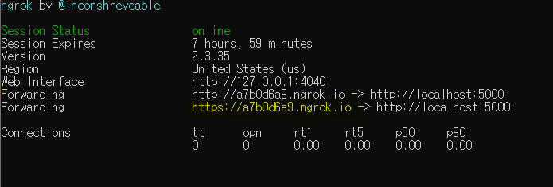
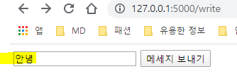

# telegram 챗봇 만들기

> 나만의 텔레그램 챗봇 만들기 

## 1. 챗봇 생성

- 텔레그램 설치 http://www.telegram.pe.kr 에서 PC판 설치

- BotFather에 들어가 /newbot 입력 > 내 bot이름 설정 후 token을 받을 수 있음. 
  

  

- 검색창에 내 bot이름을 검색하여 찾을 수 있음.

  > 난 ddusi로 설정.

- 챗봇과 정보를 주고받을 `app.py` Flask파일 만들기.

  > 웹프레임을 챗봇과 연결함. 

```python

from flask import Flask

app = Flask(__name__)


if __name__ == ("__main__"):
    app.run(debug=True)
```


## 2. 텔레그램 설정하기(메소드)

> 설명서 : https://core.telegram.org/bots/api

1. Making requests

```
 https://api.telegram.org/bot<token>/METHOD_NAME
 
 
```

2. getMe로 제대로 봇이 생성되었는지 확인한다.

```
https://api.telegram.org/bot1050415937:AAF3x9VfT70n4J6cChpO/getMe
```

```shell
{"ok":true,"result":{"id":1050415937,"is_bot":true,"first_name":"ddusi76__bot","username":"ddusibot"}}
```

3. `/start`입력한 후, getUpdates 메소드를 통해 chat_id확인 가능 (chat에 있는 id임)

```shell
https://api.telegram.org/bot1050415937:AAF3x9VfT70n4J6cChpOh9nuDL-X8b9Qe1E/getUpdates
```

```shell
{"ok":true,"result":[{"update_id":323710938,
"message":{"message_id":1,"from":{"id":968854994,"is_bot":false,"first_name":"H","last_name":"Ha","language_code":"ko"},"chat":{"id":968854994,"first_name":"H","last_name":"Ha","type":"private"},"date":1577030899,"text":"/start","entities":[{"offset":0,"length":6,"type":"bot_command"}]}}]}
```


4. seendMessage 메소드로 메세지 보내기.

```
https://api.telegram.org/bot1050415937:AAF3x9VfT70n4J6cChpOh9nuDL-X8b9Qe1E/sendMessage?chat_id=968854994&text=hi
```

> 구조: ?[변수1]=[값1]&[변수2]=[값2]




5.`pip install python-decouple`: python-decouple 라이브러리 설치

> python-decouple: python으로 ini 파일이나 env 설정 파일을 파싱할 수 있는 패키지

- 안전을 위해 `.env`파일을 만들어 이 파일에에 chat_id와 token을 넣어놓자.

```
#.env

CHAT_ID="[chat_id]"
TELEGRAM_BOT_TOKEN="[chat_tocken]"
```

```python
   #app.py
   
   from decouple import config
   
   token=config("TELEGRAM_BOT_TOKEN")
   chat_id=config('CHAT_ID')
```


## 3. gitignore 으로 id와 token 보호하기. 

( http://gitignore.io/ 에서 'window', 'flask', 'python', 'venv', 'visual studio code' 입력 후 코드 복붙)


## 4. WebHook: ngrok사용하기

> WebHook을 통해 Telegram서버와 Flask서버를 연결하기
>
> - Webhook: 역방향 API라고도 한다 . 일반적인 API는 클라이언트가 서버를 호출하는 반면, 웹훅의 경우 웹훅(URL)을 호출하는 서버 측에 등록하면 서버에서 특정 이벤트가 발생했을 때 클라이언트를 호출한다.



 1. ngrok 다운로드

    > ngrok이란 방화벽 뒤에 있는 `로컬 서버`를 안전한 터널을 통해 공개 인터넷에 노출시켜 주는 도구.
    >
    > 즉, 포트 포워딩과 같은 네트워크 환경 설정 변경없이 로컬에 실행중인 서버를 안전하게 외부에서 접근 할 수 있게 해줌.

    https://ngrok.com/ > download > ngrok다운

    cmd 에서 ngrok 실행.

    cmd에서 `ngrok http 5000`입력하여 주소를 받을 수 있음 (※주의: 실행시킬 때마다 주소가 변경됨)

    

    

2. **webhook** 설정하기

- **setWebhook** 메소드 이용

  [](https://user-images.githubusercontent.com/58925328/71307646-4b648680-2434-11ea-8268-cbef549c8a5a.PNG)

- `webhook.py`파일을 통해 setWebhook 메소드 보내기

  ```python
  #webhook.py
  
  from decouple import config 
  import requests
  
  token = config("TELEGRAM_BOT_TOKEN")
  url = "https://api.telegram.org/bot"
  ngrok_url = "https://2ccfe768.ngrok.io"  #여기에다가 ngrok주소쓰기
  
  #setWebhook 설정: requests()로 전송
  data = requests.get(f'{url}{token}/setwebhook?url={ngrok_url}/{token}')
  print(data.text)
  ```

  


## 5. Telegram과 데이터 주고받기

[예제1] `/write`페이지에서 form태그를 이용하여 내 Telegram에 메시지 보내기.

```python
#app.py

from flask import Flask, render_template, request
from decouple import config
import requests

app = Flask(__name__)

token=config("TELEGRAM_BOT_TOKEN")
chat_id=config('CHAT_ID')
url = "https://api.telegram.org/bot"

#write.html에서 form태그로 데이터를 받아 /send로 넘김
@app.route('/write')
def write():
    return render_template('write.html')

#write.html에서 form태그로 text변수를 받음
@app.route('/send')
def send():
    text = request.args.get('text')
    # /sendmessage를 통해 내 텔레그램으로 메시지를 보냄
    requests.get(f'{url}{token}/sendmessage?chat_id={chat_id}&text={text}')
    return render_template('send.html')


if __name__ == ("__main__"):
    app.run(debug=True)
```

```html
<!--write.html-->
<body>
       <form action="/send">
           <input type="text" name = "text">
           <input type="submit" value = "메세지 보내기">
       </form>
   </body>
```




[예제2] 내 말을 그대로 따라하는 챗봇

```python
from flask import Flask, render_template, request
from decouple import config
import requests

app = Flask(__name__)

token=config("TELEGRAM_BOT_TOKEN")
chat_id=config('CHAT_ID')
url = "https://api.telegram.org/bot"

#webhook으로 설정한 url
@app.route(f'/{token}', methods=["POST"])
def telegram():
 # 챗봇에서 내가쓴 데이터 읽어오기
 re_data=request.get_json()

 # json데이터에서 원하는 정보뽑기
 re_id= re_data['message']['chat']['id']
 text=re_data['message']['text']

 # 챗봇에게 다시보내기
 requests.get(f'{url}{token}/sendmessage?chat_id={re_id}&text={text}')

 #200은 접속성공을 의미하는 숫자임!
 return "ok", 200   


if __name__ == ("__main__"):
 app.run(debug=True)
```


[예제3] if문을 이용하여 챗봇의 대답 정하기

```python
from flask import Flask, render_template, request
from decouple import config
import requests
import random

app = Flask(__name__)

token=config("TELEGRAM_BOT_TOKEN")
chat_id=config('CHAT_ID')
url = "https://api.telegram.org/bot"

#webhook으로 설정한 url
@app.route(f'/{token}', methods=["POST"])
def telegram():
 # 챗봇에서 내가쓴 데이터 읽어오기
 re_data=request.get_json()
 re_id= re_data['message']['chat']['id']
 text=re_data['message']['text']
 
 if text=="안녕":
     return_text= "안녕하세요."
 elif text =="로또":
     numbers = range(1,46)
     return_text= sorted(random.sample(numbers, 6))
 else:
     return_text="지금 지원하는 채팅은 '안녕'입니다."

 # 챗봇에게 다시보내기
 requests.get(f'{url}{token}/sendmessage?chat_id={re_id}&text={return_text}')

 return "ok", 200   


if __name__ == ("__main__"):
 app.run(debug=True)
```


## 6.python anywhere 이용하기

> python anywhere 사이트: https://www.pythonanywhere.com/

1. 회원가입
2. web > 생성
3. python 3.7..?
4. Files > mysite/ > `flask_app.py`에 `app.py` 복붙 & `.env`파일 생성