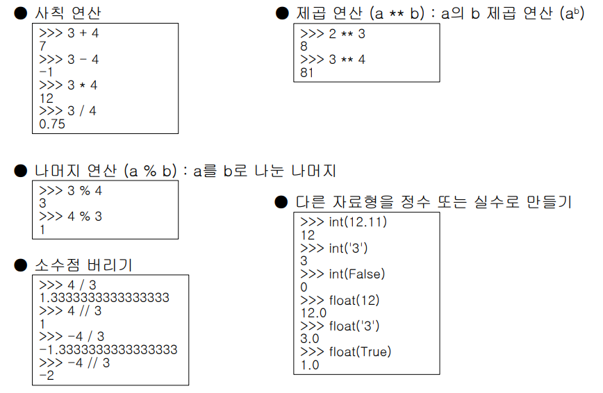

## 자료형


0. #### 파이썬 자료형 

   |    숫자     |
   | :---------: |
   |    문자     |
   |    List     |
   |    Tuple    |
   | Dicitionary |
   |      s      |
   |    Bool     |


1. #### 숫자 (Number)

- ##### 정수, 실수123, 1.23, -97, -3.14e10 

- ##### 16진수

   0x9 => 9, 0xA => 10, 0x10 => 16

- ##### 8진수

     0o8 => 8, 0o10 => 8 

- ##### 2진수 

    0b1 => 1, 0b10 => 2

- 그 외
  
    


2. #### 문자 (String) 

- 작은 따옴표, 큰 따옴표를 사용하여 표현

  'A', 'Hello', "888", "-17"

- 더하기 연산 

  'hello' + 'world' = 'hello wrold'

- 곱하기 연산

  'hello' * 3 = 'hellohellohello'

- index도 사용 가능

- Slicing

  str[2:] : 두번째 인덱스부터 끝까지

  str[:-4]: 처음부터 뒤에서 4번째 인덱스 까지

  str[6:10]: 6번째 인덱스에서 10번째 인덱스 까지

- Formatting

  문자열의 특정 부분만 바꿔 사용

  - 동적으로 입력되는 부분에 특수코드 사용
  - 여러개의 값을 넣는 경우 `()`와 `,` 를 이용하여 구분

| 코드 |      설명       |
| :--: | :-------------: |
|  %s  | 문자열(string)  |
|  %c  | 문자(character) |
|  %d  |      정수       |
|  %f  |      실수       |
|  %o  |      8진수      |
|  %x  |     16진수      |
|  %%  |      %문자      |


- #### format 함수

  - {index}

    ```python
    >>> 'score {0}'.format(100)
    'score 100'
    
    >>> 'score {0}, {1}'.format(100, 80)
    'score 100, 80'
    
    >>> '{0} {1}'.format('score', 70)
    'score 70'
    ```

  - {name}

    ```python
    >>> '{lang} is easy'.format(lang='Python')
    'Python is easy'
    >>> '{lang} is easy, version {ver}'.format(ver=3.6, lang='Python')
    'Python is easy, version 3.6'
    ```

  - {index}, {name} 혼용 가능

    ```python
    >>> '{lang} is easy, version {0}.{1}'.format(3, 6, lang='Python')
    'Python is easy, version 3.6'
    ```

  - f 문자열 Formatting

    ```python
    >>> name = 'ggoreb'
    >>> f'name is {name}'
    'name is ggoreb'
    
    >>> age = 10
    >>> f'10년 후 나이 {age + 10}살'
    '10년 후 나이 20살'
    
    >>> f'{{ }}'
    '{ }'
    ```


- #### 문자열 관련 함수

  - count(): 특정 문자의 갯수

  - find(): 특정 문자의 위치

  - index(): 특정 문자의 위치

    find와 index의 차이는 없는 것을 찾을때 find는 -1을 출력 index는 에러를 가져온다.

  - join(): 각 문자 사이에 문자 삽입

    ```python
    >>> '/'.join('가나다라')
    '가/나/다/라'
    >>> str = '12345'
    >>> sep = ', '
    >>> sep.join(str)
    '1, 2, 3, 4, 5'
    >>> ','.join('1')
    '1'
    ```

  -  upper() : 대문자로 변경

  -  lower() : 소문자로 변경

  -  strip(), rstrip(), lstrip() : 공백 제거

    ```python
    >>> str = ' space '
    >>> str.rstrip()
    ' space'
    >>> str.lstrip()
    'space '
    >>> str.strip()
    'space'
    ```

  - replace() : 문자열 치환

  - split() : 특정 문자열을 기준으로 전체 문자열을 리스트로 변경

    ```python
    >>> str = 'Life is too short, You need Python'
    >>> str.split()
    ['Life', 'is', 'too', 'short,', 'You', 'need', 'Python']
    >>> str.split(', ')
    ['Life is too short', 'You need Python']
    >>> str.split('o')
    ['Life is t', '', ' sh', 'rt, Y', 'u need Pyth', 'n']
    ```

  - str(): 문자열로 만들기

    ```python
    >>> str(123)
    '123'
    >>> str(False)
    'False'
    >>> str([1, 2, 3])
    '[1, 2, 3]'
    >>> str({'a', 'b', 'c'})
    "{'a', 'b', 'c'}"
    ```

    


3. #### List : 수정 가능

- [1, 2, 3], ['H', 'e', 'l', 'l', 'o'] 


4. #### Tuple : 수정 불가 

- (1, 2, 3), ('H', 'e', 'l', 'l', 'o')


5. #### Dictionary 

- {'a' : 10, 'b' : 20}, {'seoul' : '서울', 'busan' : '부산'} 


6. #### Set

- {1, 2, 3}, {'H', 'e', 'l', 'l', 'o'} 


7. #### 논리 (Bool 또는 Boolean) 

- True, False


## 주피터 노트북

- 명령어

  `dd` : 삭제

  `a`: 위에 추가 

  `b`: 아래 추가

  `ctrl + enter` :  현재 셀 실행

  `shift + enter`: 현재 셀 실행하고 다음줄

  `alt + enter`: 현재 셀 실행하고 다음줄에 추가

  


## format


## 자료형 - 문자

1. 문자열 관련함수
   - join() : 각 문자 사이에 문자 삽입
   - upper() : 대문자로 변경
   - lower() : 소문자로 변경
   - strip(), rstrip(), lstrip(): 공백제거
   - replace('i','1') : 문자열 i를 1로 치환
   - split('o') : 특정 문자열('o') 기준으로 기준을 제외한채 전체 문자열을 리스트로 변경


2. 리스트

   

   ```
   # 4번째 요소 삭제
   list = [1,2,3,4]
   list[3:4] =[ ] 
   ```

   리스트 인덱스를 변수로 줄 수 있나요? 가능

   리스트 요소 삭제 pop는 맨 뒤 리스트요소 삭제

   

   

3. 튜플


4. 딕셔너리

   중복 값은 되지만, 중복 키는 안된다.

   메소드 items는 튜플로 묶어서 리스트(변환해야함)로 만들어준다.


%reset

프로젝트 우클릭 -> export -> 아카이브 