## 시험 12월 27일 (금)

1. Java, HTML
2. CSS/Java Script
3. Spring

12/27일 금요일 필기, 실기 


## Spring Boot

> 어디서 이 기술만 배워도 굶어 죽지 않는다. 웹 애플리케이션 제작, 웹 프레임 워크
>
> - Java, HTML/CSS/JS, Database +Spring

#### 1. STS 다운로드

> http://spring.io/tools

​	java -jar sp[tab키]

​	제어판 - 시스템 - 환경변수 - path - java폴더

​	C:\Program Files\bin 경로를 풀로 써서 실행


#### 2. Lombok

> 게으른 사람을 위해 변수명만 입력하면 사용 할 수있게 하는 특별한 라이브러리

- lombok 1.18.0 으로 설치한다.

- SpringToolSuite4.exe파일을 선택하여 설치한다.


#### 3. Create new Spring Starter

- name, type, group, package 선택


- Dependencies

  


#### 4. BasicApplication.java 설정

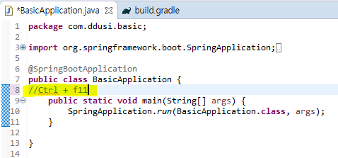

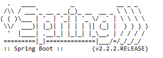

#### 5.  통신 흐름

> 클라이언트 요청 - 서버 응답1

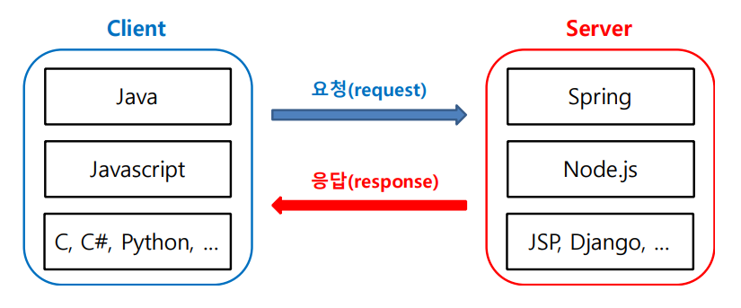

- 요청, 응답 (신입) -> Ddos 공격 방어, 벤, 네트워크 방어 (고액 연봉자)


> 클라이언트 요청 - 서버 응답2

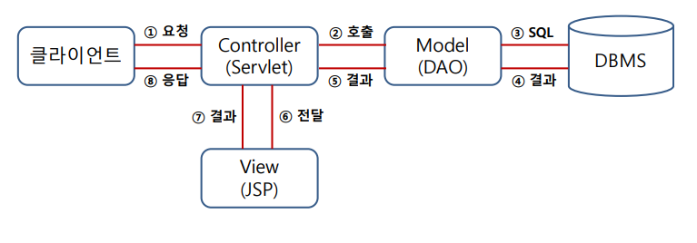


> 클라이언트 요청 - 서버 응답3
>
> Spring MVC

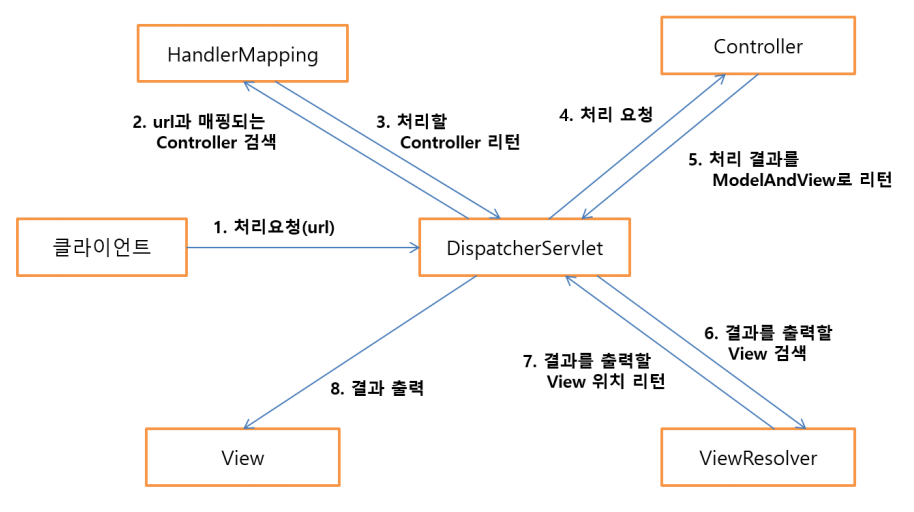


#### 6. 파일 생성하기 

 - `com.ddusi.basic`에 `package `생성

   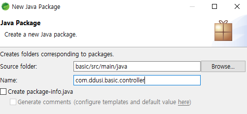

- `com.ddusi.basic.controller`에` class` 생성

  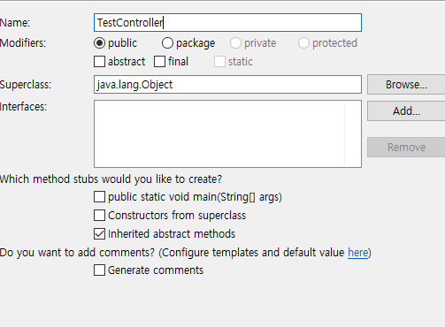

  ##### 기본구조 내용

  - import `@RestController`

    ​				`@GetMapping`

    ```java
    package com.ddusi.basic.controller;
    
    import org.springframework.web.bind.annotation.GetMapping;
    import org.springframework.web.bind.annotation.RestController;
    
    // Shift + Ctrl + O : 전체 import
    
    @RestController
    public class TestController {
    	@GetMapping("/test")
    	public String test() {
    		return "<h1>Hello~</h1>";
    	}
    	
    }
    
    ```

- 컴파일 후 서버 들어가기 `F11`

  **내가 만든 서버 들어가는 주소**: http://localhost:8080/test

- tip: `//`은 사람이 보기 위한 주석

  ​		`@`(이노테이션)은 컴퓨터가 보기 위한 주석

  

- **result**

  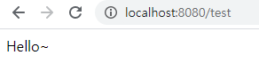

#### Controller 구조

```java
package com.ddusi.basic.controller;

import org.springframework.stereotype.Controller;
import org.springframework.web.bind.annotation.GetMapping;

@Controller
public class Test2Controller {
	@GetMapping("/test2")
	public String test2() {
		return "hello";
	}
}
```

- 연결해주는 HTML 파일 

```html
<!DOCTYPE html>
<html>
<head>
<meta charset="utf-8">
<title>Insert title here</title>
</head>
<body>
	<h1>헬로우!</h1>
</body>
</html>

```


* `@RestController`, 	`@Controller `와 차이점

  `@RestController`: return에 내용을 바로 인코딩한다.

  `@Controller `: return으로 HTML파일을 연결 인코딩한다.


#### 6.STS 설정 (utf-8설정해야 한글이 깨지지 않고 출력된다.)

> Window -> preference -> utf-8로 모두 수정 (content Types만 제외)

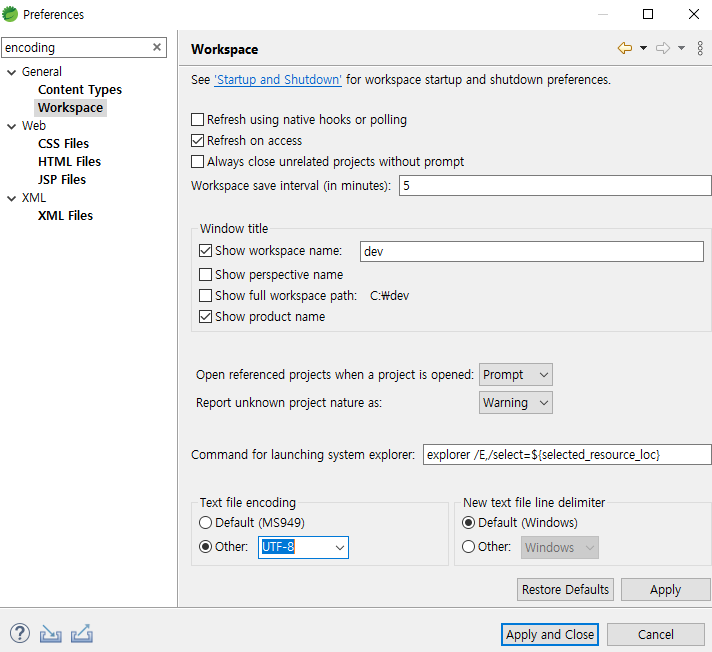


#### 7. 로그 관리 Logger

> 자바 스크립트에서 꼭 필요한 라이브러리 Logger

```javascript
package com.ddusi.basic.controller;
import org.slf4j.Logger;
import org.slf4j.LoggerFactory;
import org.springframework.stereotype.Controller;
import org.springframework.web.bind.annotation.RequestMapping;

//shift + ctrl + F : 코드 정렬
@Controller
public class HomeController {
	// 1. 출력속도가 빠르다
	// 2. 파일 등을 이용하여 관리가 용이함.
	Logger logger = 
			LoggerFactory.getLogger(this.getClass());
	
	@RequestMapping("/")
	public String home() {
		logger.trace("trace!");
		logger.debug("debug!"); // 개발단계에서 확인용
		logger.info("info!"); // 운용 상 필요한 정보
		logger.warn("warning"); // 메모리 문제 등 경고
		logger.error("error!"); // 치명적인 오류
				return "home";
	}
}

```

#### consol창 result

```javascript
2019-12-23 11:19:39.904 TRACE 7472 --- [nio-8080-exec-1] c.ddusi.basic.controller.HomeController  : trace!
2019-12-23 11:19:39.904 DEBUG 7472 --- [nio-8080-exec-1] c.ddusi.basic.controller.HomeController  : debug!
2019-12-23 11:19:39.904  INFO 7472 --- [nio-8080-exec-1] c.ddusi.basic.controller.HomeController  : info!
2019-12-23 11:19:39.904  WARN 7472 --- [nio-8080-exec-1] c.ddusi.basic.controller.HomeController  : warning
2019-12-23 11:19:39.904 ERROR 7472 --- [nio-8080-exec-1] c.ddusi.basic.controller.HomeController  : error!
```

> application.properties 안에 코드를 넣어야 trace까지 출력된다.

```java
logging.level.com.ddusi.basic=trace
```

로그에 관한 더 자세한 정보 : http://logback.qos.ch/manual/


-  shift + alt + A : 열 편집기능


#### 8. SpringBoot DevTools - 서버 재기동없이 수정사항 적용

> build.gradle 파일에 코드를 넣는다. 

```java
//dependencies {
	//implementation 'org.springframework.boot:spring-boot-starter-data-jpa'
	//implementation 'org.springframework.boot:spring-boot-starter-thymeleaf'
	//implementation 'org.springframework.boot:spring-boot-starter-web'
	//compileOnly 'org.projectlombok:lombok'
	//runtimeOnly 'com.h2database:h2'
	//annotationProcessor 'org.projectlombok:lombok'
	//testImplementation('org.springframework.boot:spring-boot-starter-test') {
	//	exclude group: 'org.junit.vintage', module: 'junit-vintage-engine'
	//}
	implementation "org.springframework.boot:spring-boot-devtools"
}
```

> 우클릭 > Gardle > refresh로 서버 재구동
>
> 이제부터 서버 껏다 안켜도 바로바로 적용됌.


#### 9. 응답 처리

- **HTML / JSON / XML / Excel / PDF / Image / File** (zip, exe 등) 
- HTML 
  - **String / void / Map / Model / ModelAndView / DTO **
- JSON 
  -  Map / DTO / List


- 롬버가 적용 안되면 해준다.

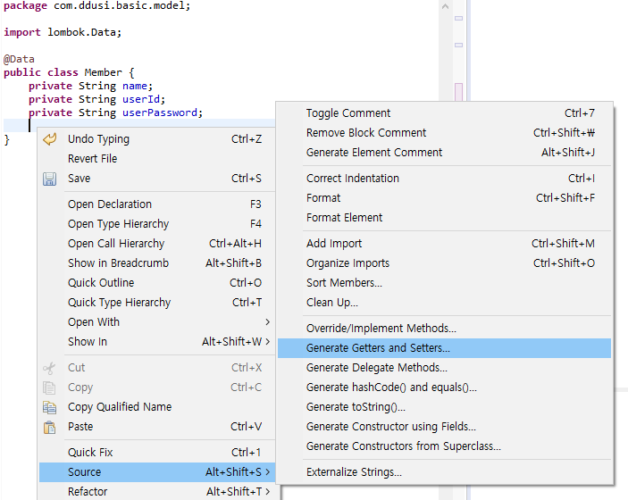


- @GetMapping("html/string"), ("html/void")

  ```java
  package com.ddusi.basic.controller;
  
  import java.util.HashMap;
  import java.util.Map;
  import org.springframework.stereotype.Controller;
  import org.springframework.ui.Model;
  import org.springframework.web.bind.annotation.GetMapping;
  import org.springframework.web.servlet.ModelAndView;
  import com.ddusi.basic.model.Member;
  
  
  @Controller
  public class HtmlController {
  	@GetMapping("html/string")	//string 방식, return으로 받음
  	public String html() {
  		return "html/string"; 
  	}
  
  	@GetMapping("html/void")	//void 방식 return이 없어도 됌
  	public void htmlVoid() {
  	}
  
  	@GetMapping("html/map")
  	public Map<String, Object> htmlMap(Map<String, Object> map) {
  		Map<String, Object> map2 = new HashMap<String, Object>();
  		return map2;
  	}
  
  	@GetMapping("html/model")
  	public Model htmlModel(Model model) {
  		return model;
  	}
  
  	@GetMapping("html/model_and_view")
  	public ModelAndView htmlModel() {
  		ModelAndView mav = new ModelAndView();
  		mav.setViewName("html/model_and_view");
  		return mav;
  	}
  
  	@GetMapping("html/object")
  	public Member htmlObject() {
  		Member member = new Member();
  		member.setName("kim");
  		return member;
  	}
  }
  ```


 - 패키지 templates.html을 만들어서 연동시킬 html파일을 만든다

   ```html
   <body>
   	<h1>string!</h1>
   </body>
   ```

   ```html
   <body>
   	<h1>string!</h1>
   </body>
   ```

   

- **object** 형식 Member.java 출력

  ```java
  	@GetMapping("html/object")
  	@ResponseBody	// json의 형태로 보이게 만들어 준다.
  	public Member htmlObject() {
  		Member member = new Member();
  		member.setName("kim");
  		return member;
  	}
  ```


  ```java
  package com.ddusi.basic.model;
  
  import lombok.Data;
  
  @Data
  public class Member {
  	private String name;
  	private String userId;
  	private String userPassword;
  	}
  ```

  ```html
  <html xmlns:th="http://www.thymeleaf.org">
  <head>
  </head>
  <body>
  	<h1>HTML object</h1>
  	[[${member}]]
  	<hr>
      [[${member.name}]]		 <!--여기에선 thymeleaf라는 것. python에선 jinja였음-->
  </body>
  </html>
  ```

  #### result

  ```json
  {
  "name": "kim",
  "userId": null,
  "userPassword": null
  }
  ```

  > 크롬 확장프로그램 : json Formatter 설치.


- 응답방식

  - HTML

    => string

  - Json

    => map, array, list, object // @ResponseBody

    >html의 형태가 아닌 json의 형태로 찾겠다. 라는 뜻.

  

#### 10. Json Controller

> #### 		@ResponseBody	// json의 형태로 보이게 만들어 준다.


 1. json1 controller

    ```java
    package com.ddusi.basic.controller;
    
    import java.util.ArrayList;
    import java.util.HashMap;
    import java.util.List;
    import java.util.Map;
    
    import org.springframework.stereotype.Controller;
    import org.springframework.web.bind.annotation.GetMapping;
    import org.springframework.web.bind.annotation.ResponseBody;
    
    import com.ddusi.basic.model.Member;
    
    @Controller
    public class Json1Controller {
    	@GetMapping("json/string")
    	@ResponseBody
    	public String json() {
    		return "json/string";
    	}
    
    	@GetMapping("json/map")
    	@ResponseBody
    	public Map<String, Object> jsonMap(Map<String, Object> map) {
    		Map<String, Object> map2 = new HashMap<String, Object>();
    		map2.put("key1", "value");
    		map2.put("key2", 2324);
    		map2.put("key3", true);
    		return map2;
    	}
    
    	@GetMapping("json/object")
    	@ResponseBody
    	public Member jsonObject() {
    		Member member = new Member();
    		member.setName("kim");
    		return member;
    	}
    
    	@GetMapping("json/list")
    	@ResponseBody
    	public List<String> jsonList() {
    		List<String> list = new ArrayList<>();
    		list.add("1");
    		list.add("2");
    		list.add("3");
    		return list;
    	}
    }
    ```

    #### result

    ```json
    //json/map
    {
    "key1": "value",
    "key2": 2324,
    "key3": true
    }
    ```

    ```json
    //json/object
    {
    "name": "kim",
    "userId": null,
    "userPassword": null
    }
    ```

    ```json
    //json/list
    [
    "1",
    "2",
    "3"
    ]
    ```

    

    

	2. json2 controller

    ```java
    package com.ddusi.basic.controller;
    
    import java.util.ArrayList;
    import java.util.HashMap;
    import java.util.List;
    import java.util.Map;
    
    import org.springframework.web.bind.annotation.GetMapping;
    import org.springframework.web.bind.annotation.RestController;
    
    import com.ddusi.basic.model.Member;
    
    @RestController
    public class Json2Controller {
    	@GetMapping("json2/string")
    	public String json() {
    		return "json2/string";
    	}
    
    	@GetMapping("json2/map")
    	public Map<String, Object> jsonMap(Map<String, Object> map) {
    		Map<String, Object> map2 = new HashMap<String, Object>();
    		map2.put("key1", "value");
    		map2.put("key2", 2324);
    		map2.put("key3", true);
    		return map2;
    	}
    
    	@GetMapping("json2/object")
    	public Member jsonObject() {
    		Member member = new Member();
    		member.setName("kim");
    		return member;
    	}
    
    	@GetMapping("json2/list")
    	public List<String> jsonList() {
    		List<String> list = new ArrayList<>();
    		list.add("1");
    		list.add("2");
    		list.add("3");
    		return list;
    	}
    }
    ```

    #### result

    ```json
    //json2/map
    {
    "key1": "value",
    "key2": 2324,
    "key3": true
    }
    ```

    ```json
    //json2/object
    {
    "name": "kim",
    "userId": null,
    "userPassword": null
    }
    ```

    ```json
    //json2/list
    [
    "1",
    "2",
    "3"
    ]
    ```

    


#### 11. restlet client 설치, Json formatter 설치

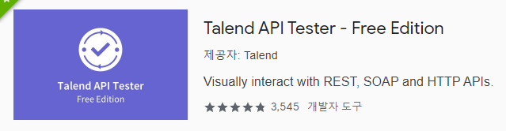

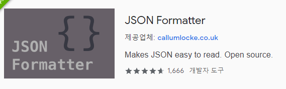


#### 12. 요청처리 (http method)

- GET – 데이터를 가져오기 

- POST – 데이터 저장

- PUT – 데이터 수정

- DELETE – 데이터 삭제

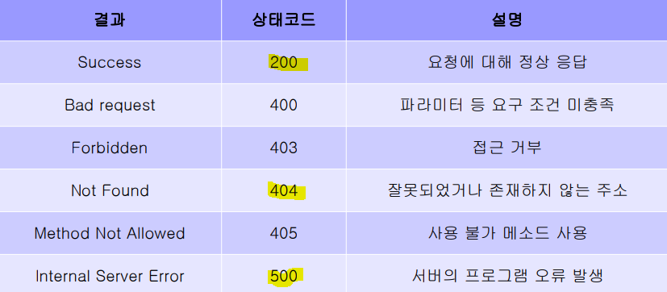


- http://ggoreb.com/http/method_form.jsp 선생님이 만들어 논 jsp

  1. 개발도구에서 Network본다.
  2.  get방식, post방식, put방식, ,delete방식 삭제

  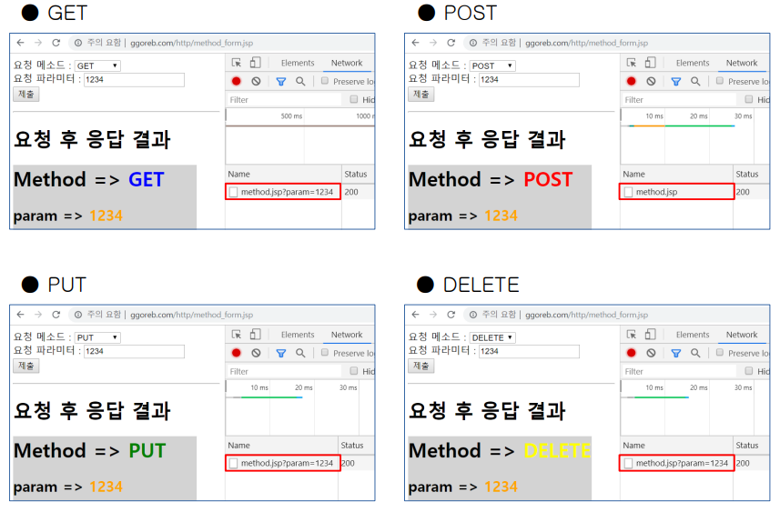


- get, post 방식을 서버에 만들어보기

  ```java
  package com.ddusi.basic.controller;
  
  import org.springframework.web.bind.annotation.GetMapping;
  import org.springframework.web.bind.annotation.PostMapping;
  import org.springframework.web.bind.annotation.RequestMapping;
  import org.springframework.web.bind.annotation.RequestMethod;
  import org.springframework.web.bind.annotation.RestController;
  
  @RestController
  public class MethodController {
  	@GetMapping("req/get")
  	@RequestMapping(value = "req/get", method = RequestMethod.GET)
  	public String get() {
  		return "GET";
  	}
  
  	@PostMapping("req/post")
  	@RequestMapping(value = "req/post", method = RequestMethod.POST)
  	public String post() {
  		return "POST";
  	}
  }
  ```

  #### http://localhost:8080/req/get

  ```
  get //정상 출력
  ```

  #### http://localhost:8080/req/post

  ```
  출력 오류 뜸. 
  // post 방식은 restlet client(확장프로그램)을 이용해야함.
  ```

  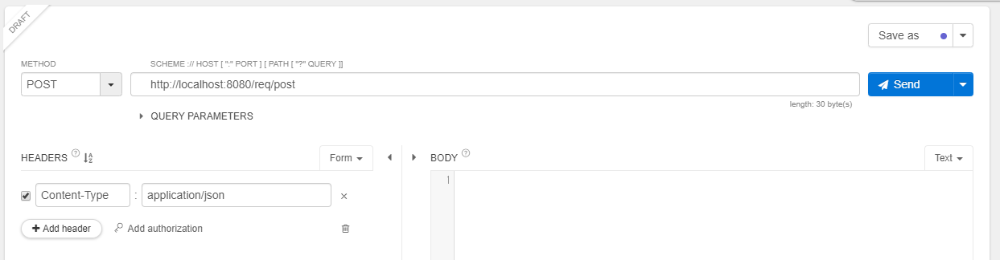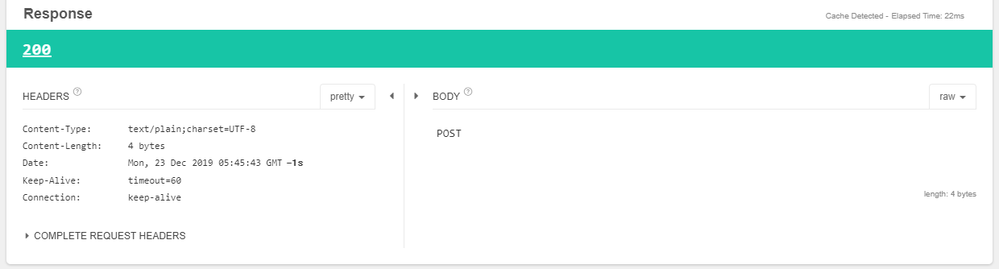


	- **레스트 주소방식**


#### 파라미터 (Param)

```
 ● HttpServletRequest - 가장 전통적으로 사용되는 방식
 ● RequestParam (편리함)
	 - 파라미터 명칭에 맞게 변수 사용
	 - 파라미터 종류 및 개수 상관없이 사용
 ● PathVariable - 요청 주소의 경로명 활용
 ● ModelAttribute (명확함)
 	- Model / DTO / VO 등 객체와 연계하여 활용
	 - JPA, MyBatis 등 ORM 프레임워크 활용
 ● RequestBody
 	- 보편적인 요청 파라미터 형식을 사용하지 않고 JSON 형태의 파라미터 사용
 	- 사용 시 메소드 방식을 POST로 지정
```


 - **RequestParam** (편리함)

   ```
- 파라미터 명칭에 맞게 변수 사용 
   
   - 파라미터 종류 및 개수 상관없이 사용
   
   - 요청 시 지정된 파라미터가 없는 경우 400 오류 (기본값)
   
   - defaultValue 또는 required 옵션으로 파라미터 사용 여부 지정
   
   - 지정 여부와 관계없이 모든 파라미터 사용 시 Map으로 사용
   ```
   
   
   
   1. 방법
   
      ```java
      package com.ddusi.basic.controller;
      
      import javax.servlet.http.HttpServletRequest;
      
      import org.springframework.web.bind.annotation.GetMapping;
      import org.springframework.web.bind.annotation.RequestParam;
      import org.springframework.web.bind.annotation.RestController;
      
      @RestController
      public class RequestController {
      	@GetMapping("req/http")
      	public String http(HttpServletRequest request) {
      		String name = request.getParameter("name");
      		String pageNum = request.getParameter("pageNum");
      		return name + ", " + pageNum;
      	}
      
      	@GetMapping("req/param1")
      	public String param1(@RequestParam("key1") String key1, @RequestParam("key2") String key2) {
      		return key1 + ", " + key2;
      	}
      
      }
      ```
   
      #### result
   
      ```
      http://localhost:8080/req/param1?key1=a&key2=1
      a, 1
      ```
   
      
   
   2. 방법
   
      ```java
      package com.ddusi.basic.controller;
      import java.util.Map;
      import javax.servlet.http.HttpServletRequest;
      import org.springframework.web.bind.annotation.GetMapping;
      import org.springframework.web.bind.annotation.RequestParam;
      import org.springframework.web.bind.annotation.RestController;
      
      @RestController
      public class RequestController2 {
      	@GetMapping("req/http")
      	public String http(HttpServletRequest request) {
      		String name = request.getParameter("name");
      		String pageNum = request.getParameter("pageNum");
      		return name + ", " + pageNum;
      	}
      
      	@GetMapping("req/param2")
      	public String param2(@RequestParam Map<String, Object> map) {
      		return map.toString();
      	}
      
      }
      ```
   
      #### result
   
      ```
      http://localhost:8080/req/param2?key1=a&key2=1
      {key1=a, key2=1}
      ```
   
      
   
   3. Login 만들기
   
      ```java
      package com.ddusi.basic.controller;
      
      import org.springframework.stereotype.Controller;
      import org.springframework.web.bind.annotation.GetMapping;
      import org.springframework.web.bind.annotation.PostMapping;
      import org.springframework.web.bind.annotation.RequestParam;
      import org.springframework.web.bind.annotation.ResponseBody;
      
      @Controller
      public class LoginController {
      	@GetMapping("/login")
      	public String login() {
      		return "login";
      	}
      
      	@PostMapping("/login")
      	@ResponseBody
      	public String loginPost( 
      		@RequestParam("id") String id,
      		@RequestParam("pw") String pw) {
      			String dbId = "boot";
      			String dbPw = "1234";
      			
      			if(dbId.equals(id) && dbPw.equals(pw)) {
      				return "로그인 성공";
      			}
      			return "로그인 실패";
      	}
      }
      
      ```
   
      #### Login.html
   
      ```html
      <form method="post" action="/login">
      	ID : <input type="text" name="id"><br>
      	PW : <input type="text" name="pw"><br>
      	<input type="submit">
      </form>
      ```
   
      #### result
   
      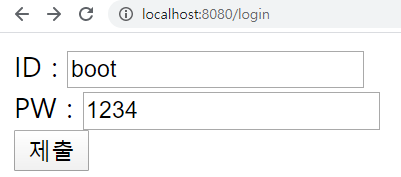


- **Modelattribute**(명확함)

  ```
  - Model / DTO / VO 등 객체와 연계하여 활용
  
  - JPA, MyBatis 등 ORM 프레임워크 활용 
  
  - Model에 작성되어 있는 변수/자료형과 파라미터명이 동일하면 자동으로 대입
  
  - JPA/MyBatis 등 ORM 프레임워크 연계 시 편리하게 사용 가능
  
  - 요청 파라미터 저장과 응답 시 사용되는 모델의 역할을 동시에 수행
  ```

> 파라미터를 받는 방법 (로그인시)


#### 구조 

```java
@GetMapping("req/model")
public String model(
@ModelAttribute Member member) {
return member.toString();
```

```
http://localhost:8080/req/model?name=11&userId=22&userPassword=33
```

#### result

```
Member(name=11, userId=22, userPassword=33)
```


### 

