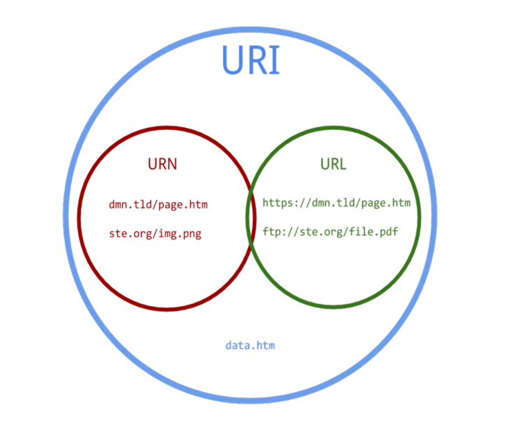

# REST API 

>  개발자들이 서로간에 약속한 형식


## 1. REST API의 탄생

 REST는 Representational State Transfer라는 용어의 약자로서 2000년도에 로이 필딩 (Roy Fielding)의 박사학위 논문에서 최초로 소개되었습니다. 로이 필딩은 HTTP의 주요 저자 중 한 사람으로 그 당시 웹(HTTP) 설계의 우수성에 비해 제대로 사용되어지지 못하는 모습에 안타까워하며 웹의 장점을 최대한 활용할 수 있는 아키텍처로써 REST를 발표했다고 합니다.


## 2. REST 구성

- **자원(RESOURCE)** - URI

- **행위(Verb)** - HTTP METHOD

  - GET : 내용 조회 

    > https://(도메인 )/classes/2/students

  - POST : 새로운 정보를 추가 

    > https://(도메인)/classes/2/students (BODY에 담아서 정보를 보냄)

  - PUT : 변경 업데이트 , 정보를 통째로 갈아 치울때, 

    > https://(도메인)/classes/2/students (BODY에 담아서 정보를 보냄)

  - PATCH : 특정 정보만 수정 할 때
  - DELETE : 정보를 삭제 할 때
    
    - POST, PUT, PATCH 는 BODY라는 주머니가 있어 GET, DELETE보다 정보를 많이 실어나를 수 있고, 비교적 안전하게 숨겨서 보낼 수 있다.

- **표현(Representations)**


## 3. REST 의 특징

#### 1) Uniform (유니폼 인터페이스)

Uniform Interface는 URI로 지정한 리소스에 대한 조작을 통일되고 한정적인 인터페이스로 수행하는 아키텍처 스타일을 말합니다.

#### 2) Stateless (무상태성)

REST는 무상태성 성격을 갖습니다. 다시 말해 작업을 위한 상태정보를 따로 저장하고 관리하지 않습니다. 세션 정보나 쿠키정보를 별도로 저장하고 관리하지 않기 때문에 API 서버는 들어오는 요청만을 단순히 처리하면 됩니다. 때문에 서비스의 자유도가 높아지고 서버에서 불필요한 정보를 관리하지 않음으로써 구현이 단순해집니다.

#### 3) Cacheable (캐시 가능)

REST의 가장 큰 특징 중 하나는 HTTP라는 기존 웹표준을 그대로 사용하기 때문에, 웹에서 사용하는 기존 인프라를 그대로 활용이 가능합니다. 따라서 HTTP가 가진 캐싱 기능이 적용 가능합니다. HTTP 프로토콜 표준에서 사용하는 Last-Modified태그나 E-Tag를 이용하면 캐싱 구현이 가능합니다.

#### 4) Self-descriptiveness (자체 표현 구조)

REST의 또 다른 큰 특징 중 하나는 REST API 메시지만 보고도 이를 쉽게 이해 할 수 있는 자체 표현 구조로 되어 있다는 것입니다.

#### 5) Client - Server 구조

REST 서버는 API 제공, 클라이언트는 사용자 인증이나 컨텍스트(세션, 로그인 정보)등을 직접 관리하는 구조로 각각의 역할이 확실히 구분되기 때문에 클라이언트와 서버에서 개발해야 할 내용이 명확해지고 서로간 의존성이 줄어들게 됩니다.

#### 6) 계층형 구조

REST 서버는 다중 계층으로 구성될 수 있으며 보안, 로드 밸런싱, 암호화 계층을 추가해 구조상의 유연성을 둘 수 있고 PROXY, 게이트웨이 같은 네트워크 기반의 중간매체를 사용할 수 있게 합니다.

REST 형식의 API

> ex. 우편 소포 양식


## 4. REST API 디자인 가이드

REST API 설계 시 가장 중요한 항목은 다음의 2가지로 요약할 수 있습니다.

**첫 번째,** URI는 정보의 자원을 표현해야 한다.
**두 번째,** 자원에 대한 행위는 HTTP Method(GET, POST, PUT, DELETE)로 표현한다.

### 4-1. REST API 중심 규칙

------

#### 1) URI는 정보의 자원을 표현해야 한다. (리소스명은 동사보다는 `명사`를 사용)

```
    GET /members/delete/1
```

위와 같은 방식은 REST를 제대로 적용하지 않은 URI입니다. URI는 자원을 표현하는데 중점을 두어야 합니다. delete와 같은 행위에 대한 표현이 들어가서는 안됩니다.


#### 4) 자원에 대한 행위는 메소드로 표현

```java
    DELETE /members/1
    GET/members/1		//회원정보를 가져오는 URI
    POST/members/2		//회원을 추가할 때
```


### 4-2. URI 설계 시 주의할 점

------

#### 1) 슬래시 구분자(/)는 계층 관계를 나타내는 데 사용

```
    http://restapi.example.com/houses/apartments
    http://restapi.example.com/animals/mammals/whales
```


#### 2) URI 마지막 문자로 슬래시(/)를 포함하지 않는다.

URI에 포함되는 모든 글자는 리소스의 유일한 식별자로 사용되어야 하며 URI가 다르다는 것은 리소스가 다르다는 것이고, 역으로 리소스가 다르면 URI도 달라져야 합니다. REST API는 분명한 URI를 만들어 통신을 해야 하기 때문에 혼동을 주지 않도록 **URI 경로의 마지막에는 슬래시(/)를 사용하지 않습니다.**

```http
    http://restapi.example.com/houses/apartments/ (X)
    http://restapi.example.com/houses/apartments  (0)
```


#### 3) 하이픈(-)은 URI 가독성을 높이는데 사용

URI를 쉽게 읽고 해석하기 위해, 불가피하게 긴 URI경로를 사용하게 된다면 하이픈을 사용해 가독성을 높일 수 있습니다.


#### 4) 밑줄(_)은 URI에 사용하지 않는다.

글꼴에 따라 다르긴 하지만 밑줄은 보기 어렵거나 밑줄 때문에 문자가 가려지기도 합니다. 이런 문제를 피하기 위해 밑줄 대신 하이픈(-)을 사용하는 것이 좋습니다.(가독성)


#### 5) URI 경로에는 `소문자`가 적합하다.

URI 경로에 대문자 사용은 피하도록 해야 합니다. 대소문자에 따라 다른 리소스로 인식하게 되기 때문입니다. RFC 3986(URI 문법 형식)은 URI 스키마와 호스트를 제외하고는 대소문자를 구별하도록 규정하기 때문이지요.

```
    RFC 3986 is the URI (Unified Resource Identifier) Syntax document
```


#### 6) 파일 확장자는 URI에 포함시키지 않는다.

```http
    http://restapi.example.com/members/soccer/345/photo.jpg (X)
```

REST API에서는 메시지 바디 내용의 포맷을 나타내기 위한 파일 확장자를 URI 안에 포함시키지 않습니다. Accept header를 사용하도록 합시다.

```
    GET / members/soccer/345/photo HTTP/1.1 Host: restapi.example.com Accept: image/jpg
```


### 4-3. 리소스 간의 관계를 표현하는 방법

------

REST 리소스 간에는 연관 관계가 있을 수 있고, 이런 경우 다음과 같은 표현방법으로 사용합니다.

```
    /리소스명/리소스 ID/관계가 있는 다른 리소스명

    ex)    GET : /users/{userid}/devices (일반적으로 소유 ‘has’의 관계를 표현할 때)
```

만약에 관계명이 복잡하다면 이를 서브 리소스에 명시적으로 표현하는 방법이 있습니다. 예를 들어 사용자가 ‘좋아하는’ 디바이스 목록을 표현해야 할 경우 다음과 같은 형태로 사용될 수 있습니다.

```
    GET : /users/{userid}/likes/devices (관계명이 애매하거나 구체적 표현이 필요할 때)
```


### 4-4. 자원을 표현하는 Colllection과 Document

------

Collection과 Document에 대해 알면 URI 설계가 한 층 더 쉬워집니다. DOCUMENT는 단순히 문서로 이해해도 되고, 한 객체라고 이해하셔도 될 것 같습니다. 컬렉션은 문서들의 집합, 객체들의 집합이라고 생각하시면 이해하시는데 좀더 편하실 것 같습니다. 컬렉션과 도큐먼트는 모두 리소스라고 표현할 수 있으며 URI에 표현됩니다. 예를 살펴보도록 하겠습니다.

```
    http:// restapi.example.com/sports/soccer
```

위 URI를 보시면 sports라는 컬렉션과 soccer라는 도큐먼트로 표현되고 있다고 생각하면 됩니다. 좀 더 예를 들어보자면

```
    http:// restapi.example.com/sports/soccer/players/13
```

sports, players 컬렉션과 soccer, 13(13번인 선수)를 의미하는 도큐먼트로 URI가 이루어지게 됩니다. 여기서 중요한 점은 **컬렉션은 복수**로 사용하고 있다는 점입니다. 좀 더 직관적인 REST API를 위해서는 컬렉션과 도큐먼트를 사용할 때 단수 복수도 지켜준다면 좀 더 이해하기 쉬운 URI를 설계할 수 있습니다.


## 5. API - Application Programming Interface

>소프트웨어가 소프트웨어로 부터 **지정된 형식**으로 명령을 받을수 있는 수단.


## 6. URI와 URL의 차이

#### URI == Unifrom Resource `Identifier`

#### URL == Uniform Resource `Locator`

#### URN == Uniform Resource `Name`

>  즉, URL은 어떤 자원의 위치를 나타내고 URI는 어떤 자원을 식별하기까지 한다.
> URL은 URI에 포함되는 하위 개념이다.




```http
https://www.google.co.kr/search?q=hello+world
```

위의 주소에서 URL은 `https://www.google.co.kr/search` 까지 이다. 

뒷부분 `?q=hello+world` 은 파라미터라고 부르며, `?q=` 라는 식별자 뒤에 무엇이 오느냐에 따라 나타나는 결과가 달라지게 되기 때문에 파라미터까지 포함한 주소는 **URI**이다. 


## 7. REST의 장단점
#### 장점

- HTTP 프로토콜의 인프라를 그대로 사용하므로 REST API 사용을 위한 별도의 인프라를 구출할 필요가 없다.

- HTTP 프로토콜의 표준을 최대한 활용하여 여러 추가적인 장점을 함께 가져갈 수 있게 해준다.

- HTTP 표준 프로토콜에 따르는 모든 플랫폼에서 사용이 가능하다.

- Hypermedia API의 기본을 충실히 지키면서 범용성을 보장한다.

- REST API 메시지가 의도하는 바를 명확하게 나타내므로 의도하는 바를 쉽게 파악할 수 있다.

- 여러가지 서비스 디자인에서 생길 수 있는 문제를 최소화한다.

- 서버와 클라이언트의 역할을 명확하게 분리한다.


#### 단점
- 표준이 존재하지 않는다.

- 사용할 수 있는 메소드가 4가지 밖에 없다.

- HTTP Method 형태가 제한적이다.

- 브라우저를 통해 테스트할 일이 많은 서비스라면 쉽게 고칠 수 있는 URL보다 Header 값이 왠지 더 어렵게 느껴진다.

- 구형 브라우저가 아직 제대로 지원해주지 못하는 부분이 존재한다.

- PUT, DELETE를 사용하지 못하는 점

- pushState를 지원하지 않는 점


#### REST가 필요한 이유
- ‘애플리케이션 분리 및 통합’

- ‘다양한 클라이언트의 등장’

- 최근의 서버 프로그램은 다양한 브라우저와 안드로이폰, 아이폰과 같은 모바일 디바이스에서도 통신을 할 수 있어야 한다.

- 이러한 멀티 플랫폼에 대한 지원을 위해 서비스 자원에 대한 아키텍처를 세우고 이용하는 방법을 모색한 결과, REST에 관심을 가지게 되었다.
