## 1. Spring tool suite 4로 github랑 연동하기

1. file > import > Git > prijects from Git > next > clone URI


## 2. HTTP

**Hyper Text Transfer Protocol [Secure]**

> secure라는 프로토콜을 이용하면 남이 패킷을 열어 볼 수가 없다. (암호화)
>
> https를 이용하려면 인증서를 갖고 있는 서버에서 구매를 해야한다.
>
> 우리의 파일을 서버에 업로드하면 그쪽에서 https로 보호해준다.

- 특징 

  1. stateless : 상태를 기억하지 않는다.

     > 로그인이 풀리는 현상이 있기 때문에 Session이라는 개념이 생겼다.


## 3. Session

> 브라우저에 저장되는 쿠키

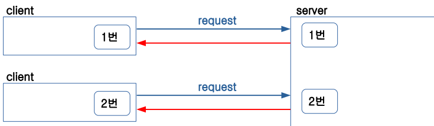


쿠키라는 접속티켓을 서버가 클라이언트에게 발급을 해준다. (로그인 유지)

- 쿠키 잃어버리는 법 

  개발자도구 > Application > Cookies에서 모두 삭제.

- 세션만료 : 보통 15,30분으로 설정되어있다.


## CMD Consol 명령어

네트워크 설정시 자주쓰는 것 

- `netstat` : 현재 자시느이 컴퓨터와 연결된 목록을 프로토콜과 함께 보여줌.

- `netstat -a` : 현재 자신의 컴퓨터와 연결되었거나 연결 될 목목을 모두 보여줌.

- `netstat -n` : 통상 연결 목록이 컴퓨터 이름으로 나오는데, -n 옵션을 주면 컴퓨터 이름대신 ip주소가 뜬다.

- `netstat -an or -na` : 아이피 주소로 바꾸어 보여준다.

-  `tracert` [URL] : URL에 들어가는데 필요한 경로 추적

- Spring boot에서 서버 포트 바꾸는법 

  > application.properties > sever.port=[변경할 포트번호]


## 4. 스프링의 특징

### - AOP

 #### 관점 지향 프로그래밍 (Aspect Oriented Programming)


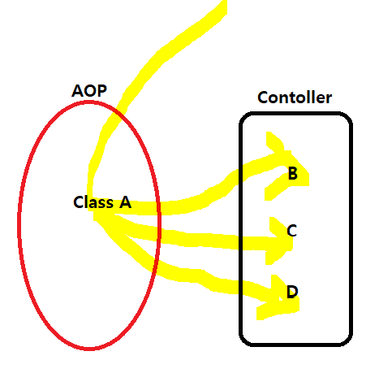

> 클라이언트가 접속할 때, 가장 먼저 공통적으로 실행되어야 할 클래스를 지정할 수 있다.


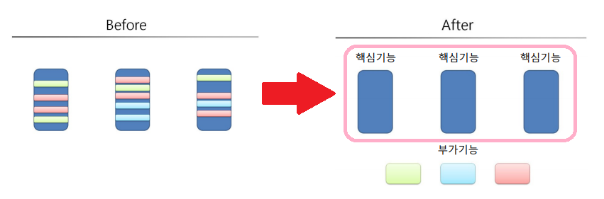

> 거시적인 관점에서 본다면 AOP를 통해서 공통적인 업무를 따로 빼서 관리하고,
>
> 먼저 실행한 다음 각 부가기능을 절차적으로 배열하여(사용자의 의도대로) 실행한다.


#### 특징

- 공통적으로 적용될 모듈(클래스/메소드)를 만든 후 적용하고자 하는 부분의 코드 밖에서 삽입하는 방법

- 사용분야

  - 메소드의 성능 테스트

  - **트랜잭션** 처리

    > 스프링에서는 코드 한줄만 쓰면 사용 가능 
    >
    > 일단, 모든 프로세서가 하나라도 제대로 구동이 안되면 실행이 되지 않는다 라고만 이해하자
- 예외반환
  
- 로깅, 인증, 권한 처리
  
- 로그 남기기
  
  
  
- AOP 용어

  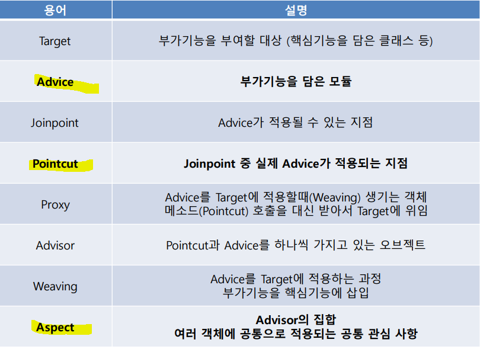

  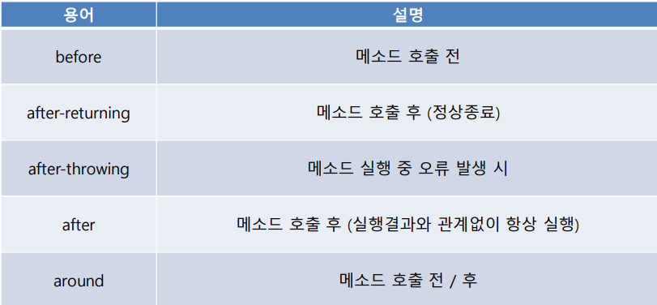


### - IoC/DI 

#### 	(Inversion of Control / Dependency Injection)

- IoC : 자동으로 만들어주는거

- DI : 자동으로 집어 넣어주는 거


### AOP 메소드 execution()

#### execution() : 적용할 메소드를 세부적으로 명시 

- `execution(public void set*(..))` 

​		 리턴 타입 : void , 메소드명 : set으로 시작, 파라미터 : 0개 이상 


- `execution(* com.spring.aop.*.*()) `

​		 리턴 타입 : All, 메소드명 : All, 파라미터 : 없음 


- `execution(* com.spring.aop..First.process(..)) `

​		 리턴 타입 : All, 메소드명 : process, 파라미터 : 0개 이상 


- `execution(String com.spring.aop.exam.First.process()) `

​		 리턴 타입 : String, 메소드명 : process, 파라미터 : 없음 


- `execution(* get*(*))` 

​		 리턴 타입 : All, 메소드명 : get으로 시작, 파라미터 : 1개 


- `execution(* get*(*, *)) `

​		 리턴 타입 : All, 메소드명 : get으로 시작, 파라미터 : 2개


##### 5. ControllerAdvice

- Controller에서 발생되는 **오류를 감지하고 처리**해주는 기능
- 사용이유
  - 예외처리를 한 곳에 묶어서 편하게 관리
  - 처리가 제대로 되지 못한 부분에 예외가 발생되는 경우 브라우저에 Exception Message가 노출되어 버리는데 모든 예측하지 못한 예외도 한꺼번에 처리 가능


#### 기본구조

```java
@ControllerAdvice
public class MyControllerAdvice {
 @ExceptionHandler
 [@ResponseStatus]
 [@ResponseBody]
 public String handle(RuntimeException e, WebRequest request) {
 return [view];
 }
}
```

> 만들어 져있는 것을 살짝 다듬어 쓰는구나 

- @ControllerAdvice의 옵션으로 특정 패키지, 특정 클래스만 지정 가능
  - 기본값 : 프로젝트 기본 패키지 내의 모든 컨트롤러 

- @ExceptionHandler의 옵션으로 특정 Exception에 대해서만 동작 가능
  - 기본값 : Exception (모든 예외) ● @ResponseStatus의 옵션으로 응답 코드 지정 가능 - 기본값 : HttpStatus.INTERNAL_SERVER_ERROR (500) 
- 메소드의 리턴 타입은 컨트롤러에서 사용하는 것과 동일


## 6. AOP, Filter, Intercepter의 차이

 1. AOP : 어떠한 클래스든, 어떠한 메소드든 모든 것을 대상으로 함. (**스프링의 기능**)

    > 1순위로 가장 먼저 실행. Spring에서 구동

    

 2. Filter : 접속하는 주소(URL)을 대상으로 함. (**자바의 고유기능**)

    > 클라이언트와 서버랑 주고받는 환경에서만 작용

    

	3. Interceptor : 접속하는 주소(URL)을 대상으로 함.  (**스프링의 기능**)


### AOP

#### 기본구조

#### aspect/ControllerAspect.java

```java
package com.ddusi.basic.aspect;

import org.aspectj.lang.JoinPoint;
import org.aspectj.lang.annotation.After;
import org.aspectj.lang.annotation.AfterReturning;
import org.aspectj.lang.annotation.Aspect;
import org.aspectj.lang.annotation.Before;
import org.springframework.stereotype.Component;
import lombok.extern.slf4j.Slf4j;

@Slf4j
@Aspect
@Component
public class ControllerAspect {
	@Before(value = "execution (* com.ddusi.basic.controller.*.*(..))")
	public void onBeforeHandler(JoinPoint joinPoint) {
		log.debug("@Before run");
	}

	@After(value = "execution (* com.ddusi.basic.controller.*.*(..))")
	public void onAfterHandler(JoinPoint joinPoint) {
		log.debug("@After run");
	}

	@AfterReturning(value = "execution (* com.ddusi.basic.controller.*.*(..))", returning = "data")

	public void onAfterReturningHandler(JoinPoint joinPoint, Object data) {
		if (data != null) {
			log.debug(data.toString());
		}
		log.debug("@AfterReturning run");
	}
}
```


### Filter

> 필터라는 것은 원래 이런 역활을 하는 것이 아니였지만 누군가가 최초로 시도해서 이렇게 개념적으로 굳게 됌.

- HTTP 요청과 응답을 변경 할 수 있는 클래스
-  사용 분야
  - XSS (Cross Site Scripting) 방지
  - Logging - Encoding 
  - IP 검사 등

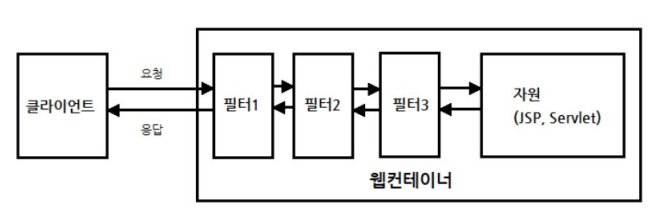


#### 기본구조

##### IPCheckFilter.java

```java
package com.ddusi.basic.filter;

import java.io.IOException;
import javax.servlet.Filter;
import javax.servlet.FilterChain;
import javax.servlet.ServletException;
import javax.servlet.ServletRequest;
import javax.servlet.ServletResponse;
import javax.servlet.http.HttpServletRequest;
import lombok.extern.slf4j.Slf4j;

@Slf4j
public class IPCheckFilter implements Filter {
	@Override
	public void doFilter(ServletRequest request, ServletResponse response, FilterChain chain)
			throws IOException, ServletException {
		log.debug("filter begin");
		HttpServletRequest req = (HttpServletRequest) request;
		String ip = request.getRemoteAddr();
		log.debug("ip : " + ip);
		chain.doFilter(req, response); // <== 
		log.debug("filter end");
	}
}
```

##### VisitorController.java

```java
package com.ddusi.basic.filter;

import org.springframework.web.bind.annotation.GetMapping;
import org.springframework.web.bind.annotation.RequestHeader;
import org.springframework.web.bind.annotation.RestController;

@RestController
public class VisitorController {
	@GetMapping("/visitor")
	public String visitor(@RequestHeader("user-agent") String userAgent) {
		return userAgent;
	}
}
```

##### FilterConfig.java

```java
package com.ddusi.basic.config;

import javax.servlet.Filter;

import org.springframework.boot.web.servlet.FilterRegistrationBean;
import org.springframework.context.annotation.Bean;
import org.springframework.context.annotation.Configuration;

import com.ddusi.basic.filter.IPCheckFilter;

@Configuration
public class FilterConfig {
	@Bean
	public FilterRegistrationBean<Filter> getFilterRegistrationBean() {
		FilterRegistrationBean<Filter> bean = 
				new FilterRegistrationBean<>(new IPCheckFilter());
		bean.addUrlPatterns("/visitor");
		bean.addUrlPatterns("/main");
		return bean;
	}
}
```


### Interceptor

> Filter랑 같은 일을 하지만, 얘는 스프링에서 제공하는 것, Filter는 Java에서 제공하는 것

- Controller에 들어오는 요청 및 응답을 가로채는 역할 

- Filter와 유사하지만 동작하는 시기가 다름 

- 주요 메소드
  - preHandler() : Controller의 메소드가 실행되기 전 **(요청) **
  - postHandler() : Controller의 메소드가 실행된 후 **(응답) **
  - afterCompletion() - View가 Rendering 된 이후


#### 기본구조

#### interceptor/SignInCheckInterceptor.java

```java
package com.ddusi.basic.intercepter;
import javax.servlet.http.HttpServletRequest;
import javax.servlet.http.HttpServletResponse;
import javax.servlet.http.HttpSession;
import org.springframework.stereotype.Component;
import org.springframework.web.servlet.ModelAndView;
import org.springframework.web.servlet.handler.HandlerInterceptorAdapter;
import com.ddusi.basic.model.User;
import lombok.extern.slf4j.Slf4j;

@Component
@Slf4j
public class SignInCheckInterceptor extends HandlerInterceptorAdapter {
	@Override
	public boolean preHandle(HttpServletRequest request, HttpServletResponse response, Object handler)
			throws Exception {
		log.debug("preHandle");
		HttpSession session = request.getSession();
		User user = (User) session.getAttribute("user");
		if (user == null) {
			response.sendRedirect("/login");
		}
		return super.preHandle(request, response, handler);
	}

	@Override
	public void postHandle(HttpServletRequest request, HttpServletResponse response, Object handler,
			ModelAndView modelAndView) throws Exception {
		log.debug("postHandle");
		super.postHandle(request, response, handler, modelAndView);
	}

	@Override
	public void afterCompletion(HttpServletRequest request, HttpServletResponse response, Object handler, Exception ex)
			throws Exception {
		log.debug("afterCompletion");
		super.afterCompletion(request, response, handler, ex);
	}
}
```


#### config/SignInCheckInterceptor.java

```java
package com.ddusi.basic.config;

import org.springframework.beans.factory.annotation.Autowired;
import org.springframework.context.annotation.Configuration;
import org.springframework.web.servlet.config.annotation.InterceptorRegistry;
import org.springframework.web.servlet.config.annotation.WebMvcConfigurer;

import com.ddusi.basic.intercepter.SignInCheckInterceptor;

@Configuration
public class InterceptorConfig implements WebMvcConfigurer {
	@Autowired
	private SignInCheckInterceptor signInCheckInterceptor;

	@Override
	public void addInterceptors(InterceptorRegistry registry) {
		registry.addInterceptor(signInCheckInterceptor)
		.addPathPatterns("/main")
		.addPathPatterns("/visitor");
		
		WebMvcConfigurer.super.addInterceptors(registry);
	}
}
```


### AOP, Filter, Interceptor 동시에 실행 할때, 우선순위

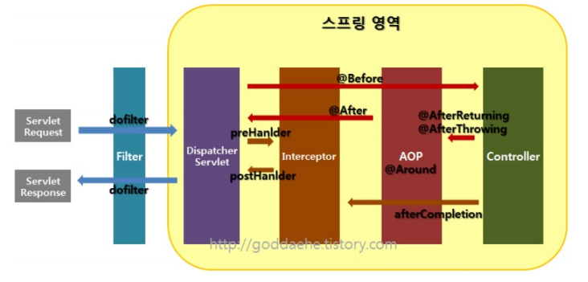


#### console창에서의 결과

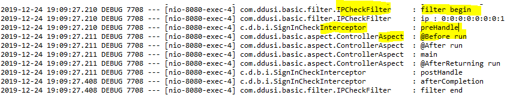

> 구동 순서 
>
> `Filter` > `Interceptor` > `Aop` > `Aop` > `Interceptor` > `Filter`


## 7. JPA

- Java Persistence API 

- **ORM 프레임워크 (Object Relational Mapping)** 
  
- 객체는 객체대로, 관계형 데이터베이스는 관계형 데이터베이스대로 설계 
  
- 특징 - DAO와 Database Table의 강한 의존성 문제 해결 
   - Model(자바 클래스)을 작성하면 자동으로 Table 생성 
   - SQL 문장을 이용하지 않고 메소드를 호출하면 자동으로 SQL 문장 실행 

- 장점 

  - 생산성 향상 

  - 유지보수 

  - **특정 벤더(DB)에 종속적이지 않음**

    > 모든 데이터베이스 프로그램 별로 변환해줌.

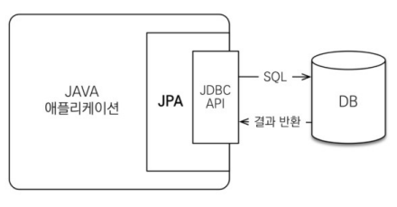


#### JPA테스트를 위해 초경량 데이터베이스(DB)를 다운로드

- H2 데이터베이스 설치 - https://h2database.com/html/main.html

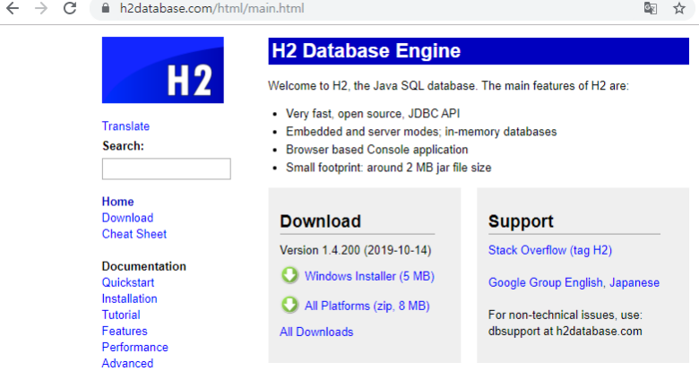

- H2 데이터베이스 실행

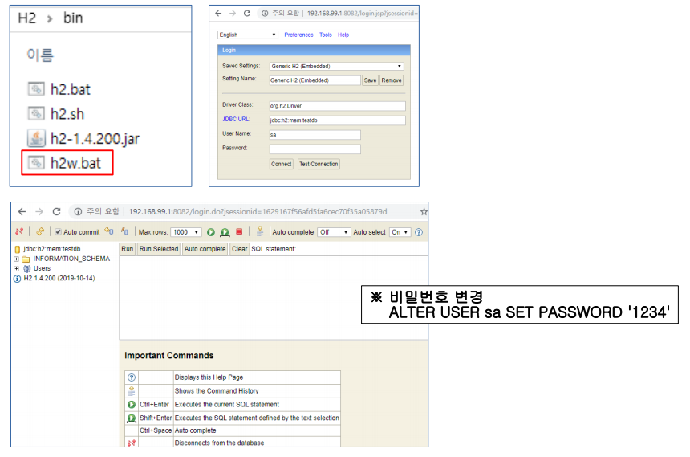

> 저장한 설정이름을 Embedded를 최초로 실행해야 데이터베이스 파일이 만들어진다. 이 이후에 sever파일로 실행해야 구동가능
>
> - 스프링 부트가 켜져있으면 실행 안됌.

- H2 끄는법

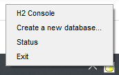

> 여기서 꺼야지만 꺼진다.


#### 스프링 부트와 연결하기

##### application.properties

```properties
# log level
logging.level.com.ggoreb.basic=trace
# datasource
spring.datasource.url=jdbc:h2:~/test
spring.datasource.driverClassName=org.h2.Driver
spring.datasource.username=sa
spring.datasource.password=

# jpa
spring.jpa.hibernate.ddl-auto=update
spring.jpa.database-platform=org.hibernate.dialect.H2Dialect
spring.jpa.show-sql=true
```

> spring.datasource.url=jdbc:h2:~/test 
>
> ​	여기서 URL으로 위치를 알려준다.


#### JPA를 이용하여 각 DB로 변환시켜주는 것

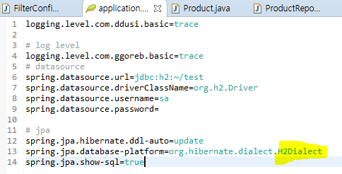

> application.properties파일에서
>
> spring.jpa.database-platform=org.hibernate.dialect.**H2Dialect** 를 수정한다.
>
> ex)	spring.jpa.database-platform=org.hibernate.dialect.**MySQL**
> 		spring.jpa.database-platform=org.hibernate.dialect.**Oracle**


### JPA를 활용하여 DB에 데이터를 만들어보자.


#### 1. 파일 설정

#### model/Product.java

```java
package com.ddusi.basic.model;
import javax.persistence.Entity;
import javax.persistence.GeneratedValue;
import javax.persistence.GenerationType;
import javax.persistence.Id;

import lombok.Data;

@Data
@Entity
public class Product {
	@Id
	@GeneratedValue(strategy = GenerationType.AUTO)
	private long id;
	private String name;
	private int price;
	private int count;
}
```


#### repository/ProductRepository.java

```java
package com.ddusi.basic.repository;

import org.springframework.data.jpa.repository.JpaRepository;
import org.springframework.stereotype.Repository;

import com.ddusi.basic.model.Product;

@Repository
public interface ProductRepository extends JpaRepository<Product, Long> {
}
```


#### controller/JpaController.java

```java
package com.ddusi.basic.controller;

import java.util.List;

import org.springframework.beans.factory.annotation.Autowired;
import org.springframework.web.bind.annotation.GetMapping;
import org.springframework.web.bind.annotation.ModelAttribute;
import org.springframework.web.bind.annotation.PostMapping;
import org.springframework.web.bind.annotation.RestController;

import com.ddusi.basic.model.Product;
import com.ddusi.basic.repository.ProductRepository;

@RestController
public class JpaController {
	@Autowired
	ProductRepository productRepository;

	@GetMapping("/jpa/product")
	public List<Product> product() {
		List<Product> list = productRepository.findAll();
		return list;
	}

	@PostMapping("/jpa/product")
	public String productPost(@ModelAttribute Product product) {
		productRepository.save(product);
		return "redirect:/jpa/product";
	}
}
```


#### 2. POST 리더기를 이용하여 POST방식으로 서버에 데이터 전송

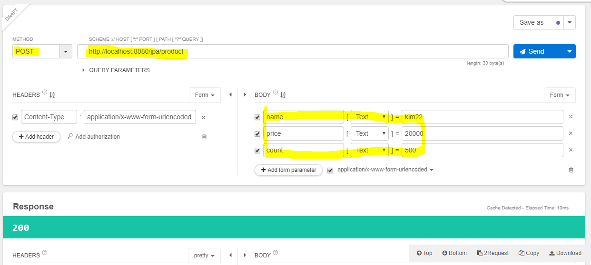

> - POST 방식으로 손쉽게 데이터 전송을 하기위해 크롬프로그램 리더기를 이용함. 
>
> - 페이지응답번호 200은 성공했다는 의미


#### 3. H2 데이터베이스로 테이블 확인하기

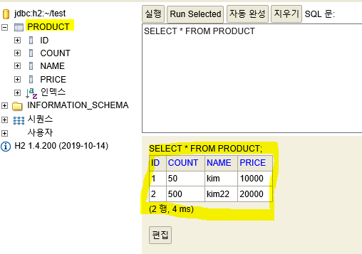


> 서버를 끄고 H2을 실행하여 테이블이 정상적으로 적용 됐는지 확인한다. 


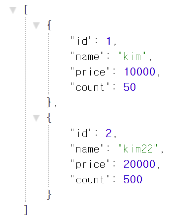

> 크롬에서 확인한 결과


