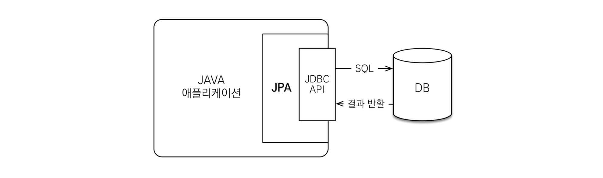
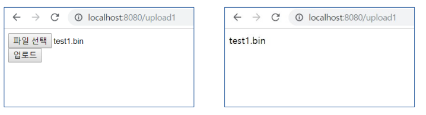
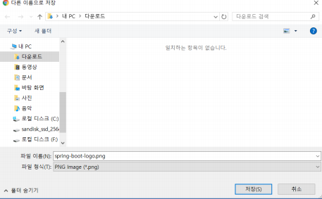
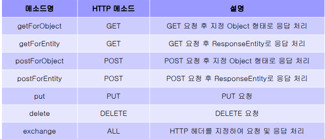
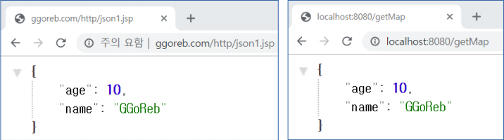
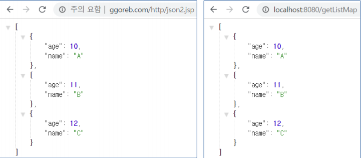
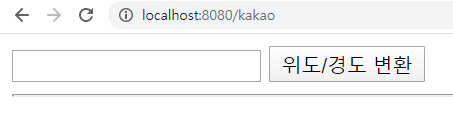
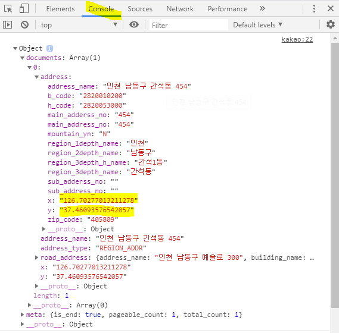
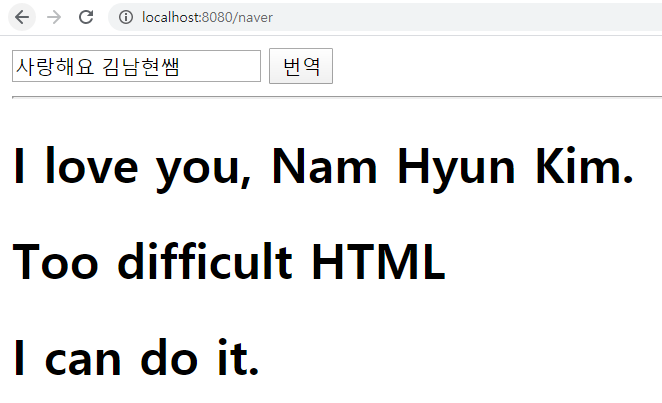

단축키

- ctrl + shift + * or / : 접었다 폈다.

- Shift + Ctrl + R = 파일 찾기


#### 구동될 때 메모리에 같이 올려주는 것 (IoC)

1. @Repository
2. @Service
3. @Controller
4. @component 


# JPA

### 1. ORM

##### Object-relational mapping

- **O**bject-**R**elational **M**apping (객체 관계 매핑)

  - **객체**는 **객체대로** 설계하고, **관계형 데이터베이스**는 **관계형 데이터베이스대로** 설계한다.
  - ORM 프레임워크가 중간에서 매핑해준다.

  

- 대중적인 언어에는 대부분 ORM 기술이 존재한다.

- ORM은 객체와 RDB 두 기둥 위에 있는 기술 이다.


### 2. JPA

##### Java Persistence API

> 과거 자바 표준인 EJB를 이용했지만, 코드가 매우 지저분하고 속도가 느리기 때문에 개발된 현재 자바진영의 ORM기술 표준으로 **인터페이스의 모음**이다.


#### JPA의 동작 과정



- JPA는 애플리케이션과 JDBC 사이에서 동작한다.

- 개발자가 JPA를 사용하면, JPA 내부에서 JDBC API를 사용하여 SQL을 호출하여 DB와 통신한다.

- 즉, 개발자가 직접 JDBC API를 쓰는 것이 아니다.

> JPA를 통해 데이터 베이스에 손쉽게 접근하는 것.


### 3. JPA를 왜 사용해야해?

#### 	1. SQL 중심적인 개발에서 객체 중심으로 개발

  

#### 	2. 생산성

  - JPA를 사용하는 것은 마치 Java Collection에 데이터를 넣었다 빼는 것처럼 사용할 수 있게 만든 것이다.

  - 간단한 CRUD
    - 저장: `jpa.persist(member`)
    - 조회: `Member member = jpa.find(memberId)`
    - 수정: `member.setName("변경할 이름")`
    - 삭제: `jpa.remove(member)`

  - 특히, 수정이 굉장히 간단하다.
    - 객체를 변경하면 그냥 알아서 DB에 UPDATE Query가 나간다.

    
    
    #### 3. 유지보수
    
      - 기존: 필드 변경 시 모든 SQL을 수정해야 한다.
    
      - JPA: 필드만 추가하면 된다. SQL은 JPA가 처리하기 때문에 손댈 것이 없다.

  

#### 	4. Object와 RDB 간의 패러다임 불일치 해결


### 4. JSP에서 File Upload하는 여러가지 방법

> 스프링에서 파일을 Upload를 받고 데이터베이스에서 처리하는 메서드들


#### 1. 방법) Multipart Http Servlet Request

> 이 방법이 가장 많은 것을 제어 할 수있다. (파일 이름)

##### controller/UploadController.java 

```java
package com.ddusi.basic.controller;
import org.springframework.stereotype.Controller;
import org.springframework.web.bind.annotation.GetMapping;
import org.springframework.web.bind.annotation.PostMapping;
import org.springframework.web.bind.annotation.ResponseBody;
import org.springframework.web.multipart.MultipartFile;
import org.springframework.web.multipart.MultipartHttpServletRequest;

@Controller
public class UploadController {
	@GetMapping("/upload1")
	public String upload1() {
		return "upload1";
	}
	@PostMapping("/upload1")
	@ResponseBody
	public String upload1Post(MultipartHttpServletRequest mRequest) {
		String result = "";
	// MultipartHttpServletRequest라이브러리를 이용하여 데이터베이스에 변수형태로 저장.

		List<MultipartFile> mFiles = mRequest.getFiles("file");
		for (int i = 0; i < mFiles.size(); i++) {
			mFiles.get(i);
			// 이름은 하나지만 multi file로 여러가지 파일을 받았을때 해결해줌.

			MultipartFile mFile = mFiles.get(i);
			// 업로드 된 파일 정보 (mFile에 다 들어감)
			String oName = mFile.getOriginalFilename();
			// getOriginalFilename 업로드 받았을때 파일의 원래 이름을 끄집어내서 저장해
			result += oName + "\n";
			try {
				mFile.transferTo(new File("C:/dev/" + oName));
			} catch (IllegalStateException e) {
				// TODO Auto-generated catch block
				System.out.println("");
				e.printStackTrace();
			} catch (IOException e) {
				// TODO Auto-generated catch block
				e.printStackTrace();
			}
			// 지정 경로에 지정 파일명으로 저장
		}
		return result;
	}
```

#### 파일 업로드 양식

##### templates/upload1.html

```html
<form method="post" enctype="multipart/form-data">
	<input type="file" name="file" multiple><br>
 	<input type="submit" value="업로드">
</form>

```

> 무조건 enctype="multipart/form-data" 형식으로 써야한다.

#### 파일 업로드 사이즈 제한

##### application.properties

```properties
# file upload
spring.servlet.multipart.max-file-size=2097152
spring.servlet.multipart.max-request-size=2097152
```

#### result




#### 2. 방법) @RequestParam 

#### controller/UploadController.java

```java
@GetMapping("/upload2")
public String upload2() {
return "upload2";
}
@PostMapping("/upload2")
@ResponseBody
public String upload2Post(@RequestParam("file") MultipartFile mFile) {
String result = "";
String oName = mFile.getOriginalFilename();
result += oName + "\n";
return result;
}
```


#### templates/upload2.html

```html
form method="post" enctype="multipart/form-data">
 	<input type="file" name="file" multiple><br>
	<input type="submit" value="업로드">
</form>
```


#### 3. 방법) @Modelattribute

##### controller/UploadController.java

```java
	@PostMapping("/upload3")
	@ResponseBody
	public String upload3Post(@ModelAttribute FileInfo info) {
		String result = "";
		String oName = info.getFile().getOriginalFilename();
		result += oName + "\n";
		return result;
	}
```

##### model/FileInfo.java

```java
package com.ddusi.basic.model;

import org.springframework.web.multipart.MultipartFile;

import lombok.Data;

@Data
public class FileInfo {
	private MultipartFile file;
}
```

##### templates/upload3.html

```html
<form method="post" enctype="multipart/form-data">
 <input type="file" name="file" multiple><br>
 <input type="submit" value="업로드">
</form>
```


### 5. 업로드

##### controller/DownloadController.java

```java
@Controller
public class DownloadController {
	@GetMapping("/download")
	public ResponseEntity<Resource> download() throws Exception {
		File file = new File("C:\\Users\\student\\Downloads/AtomSetup-x64.exe");
		InputStreamResource resource = new InputStreamResource(new FileInputStream(file));
		return ResponseEntity.ok()
		//ok는 성공했을때 200값을 리턴해줌
				
				.header("content-disposition"
					, "filename=" + URLEncoder.encode(file.getName(), "utf-8"))
				// header 안에 이런 형식으로 써 넣으면 다운로드 실행하게끔 약속함.
				
			.contentLength(file.length())
			.contentType(MediaType.parseMediaType("application/octet-stream"))
			// 파일의 총용량을 알려줌. 없으면 다운로드시 총 용량을 모르는 상태로 다운로드함.
				.body(resource);
	}
}
```

##### result




### 6. RestTemplate

> spring 3.0 부터 지원한다. 스프링에서 제공하는 http 통신에 유용하게 쓸 수 있는 템플릿이며, HTTP 서버와의 통신을 단순화하고 RESTful 원칙을 지킨다. jdbcTemplate 처럼 RestTemplate 도 기계적이고 반복적인 코드들을 깔끔하게 정리해준다.


### 특징

- HTTP 통신에 유용하게 사용할 수 있는 라이브러리
- 기계적이고 반복적인 코드를 최대한 줄여줌
- RESTful형식에 맞춤
- json, xml 를 쉽게 응답받음


#### 주요 메소드




#### 주요 메서드들을 이용하여 응답처리

#### - getForObject / String

##### controller/ResTemplateController.java

```java
public class RestTemplateController {
	@GetMapping("/getString")
	public String getString() {
		RestTemplate rt = new RestTemplate();
		String result = rt.getForObject("http://ggoreb.com/http/json1.jsp", String.class);
		return result;
	}
```

##### result

```json
{"age":10,"name":"GGoReb"}
```


#### - getForObject / Map

##### controller/RestTemplateController.java 

```java
	@GetMapping("/getMap")
	public Map<String, Object> getMap() {
		RestTemplate rt = new RestTemplate();
		Map<String, Object> map =
				rt.getForObject("http://ggoreb.com/http/json1.jsp", Map.class);
		return map;
	}
```

##### result




#### - getForObject / List

##### controller/RestTemplateController.java 

```java
@GetMapping("/getMap")
	public Map<String, Object> getMap() {
		RestTemplate rt = new RestTemplate();
		Map<String, Object> map =
				rt.getForObject("http://ggoreb.com/http/json1.jsp", Map.class);
		return map;
	}
```

##### result




### 카카오 맵 API 이용하여 위도와 경도 찍기


##### RestTemplateController.java

```JAVA
@GetMapping("/getKakao")
	public ResponseEntity<Map> getKakao(
			@RequestParam("address") String address) {
        //@RequestParam 으로 address변수의 값을 받는다.
		RestTemplate rt = new RestTemplate();
		RequestEntity requestEntity = null;
		try {
			requestEntity = RequestEntity
					.get(new URI("https://dapi.kakao.com/v2/local/search/address.json?query="
							+ URLEncoder.encode(address, "utf-8")))
					.header("Authorization", "KakaoAK d4be7b479f4b4cbd99bd19ae87f88b4b").build();
		} catch (UnsupportedEncodingException e) {
			e.printStackTrace();
		} catch (URISyntaxException e) {
			e.printStackTrace();
		}
		ResponseEntity<Map> entity = rt.exchange(requestEntity, Map.class);
		return entity;
	}
```

##### SverviceController.java

```java
package com.ddusi.basic.controller;

import org.springframework.stereotype.Controller;
import org.springframework.web.bind.annotation.GetMapping;

@Controller
public class SverviceController {
	@GetMapping("/kakao")
	public String kakao() {
		return "kakao";
	}
```

##### kakao.html

```html
<!DOCTYPE html>
<html>
<head>
<meta charset="UTF-8">
<title></title>
	<script src = "http://code.jquery.com/jquery-3.1.1.min.js"></script>
</head>
<body>
	<input type="text" id="address">
	<button>위도/경도 변환</button>
	<hr>
	<!-- 자바스크립트 (jQuery) AJAX 활용 -->
	<!-- getKakao 주소를 호출 -->
	<!-- parsing 후 화면에 출력 -->
	<script>
		$('button').click(function() { // 버튼을 클릭하면..
			$.ajax({
				url : '/getKakao',
				type : 'get',
				data : {'address' : $('#address').val()},
				success : function(res) {
					console.log(res);
				}
			})
		});
	</script>
</body>
</html>
```

##### result

###  




### 네이버 파파고 API 이용하여 한글 영어로 번역하기

##### RestTemplateController.java

```java
	@GetMapping("/getNaver")
	public ResponseEntity<Map> getNaver(
			@RequestParam("text") String text) {
		RestTemplate rt = new RestTemplate();
		
		RequestEntity<Map<String, String>> requestEntity = null;
		try {
			Map<String, String> body = new HashMap<>();
			body.put("source", "ko");
			body.put("target", "en");
			body.put("text", text);
			
			requestEntity = RequestEntity.post(new URI("https://openapi.naver.com/v1/papago/n2mt"))
					.header("X-Naver-Client-Id", "OpcnSsAIn37qIu6Iyad6").header("X-Naver-Client-Secret", "p7qtbsYx8N")
					.body(body);
		} catch (URISyntaxException e) {
			e.printStackTrace();
		}
		ResponseEntity<Map> entity = rt.exchange(requestEntity, Map.class);
		return entity;
	}
```


##### SverviceController.java

```java
@Controller
public class SverviceController {
	@GetMapping("/naver")
	public String naver() {
		return "naver";
	}
}
```


##### kakao.html

```html
<!DOCTYPE html>
<html>
<head>
<meta charset="UTF-8">
<title></title>
	<script src = "http://code.jquery.com/jquery-3.1.1.min.js"></script>
</head>
<body>
	<input type="text" id="text">
	<button>번역</button>
	<hr>
	<!-- 자바스크립트 (jQuery) AJAX 활용 -->
	<!-- getKakao 주소를 호출 -->
	<!-- parsing 후 화면에 출력 -->
	<script>
		$('button').click(function() { // 버튼을 클릭하면..
			$.ajax({
				url : '/getNaver',
				type : 'get',
				data : {'text' : $('#text').val() },
				success : function(res) {
					var message = res.message; 
					var result = message.result;
					var translatedText = result.translatedText;
					var html = '<h1>' + translatedText + '</h1>';
					$('hr').after(html);
				}
			})
		});
	</script>
</body>
</html>
```


##### result




