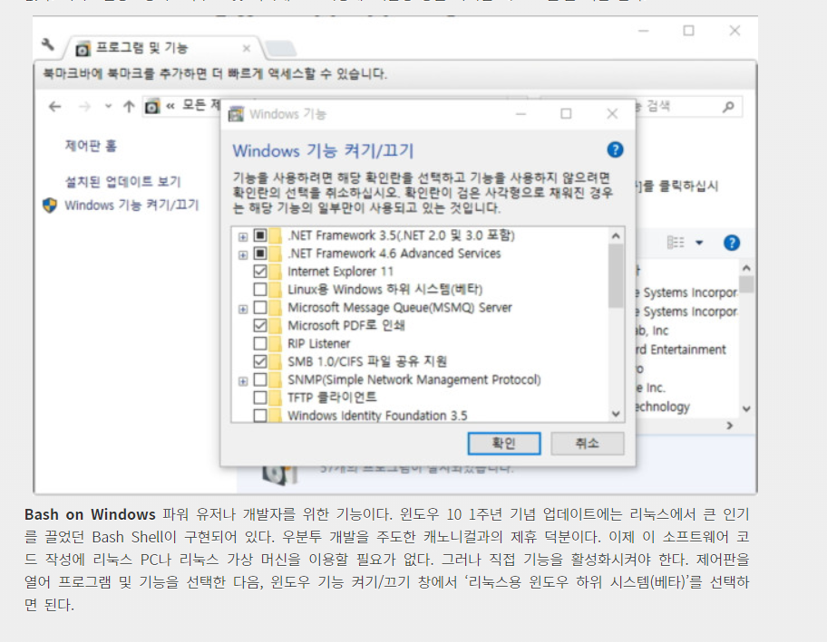
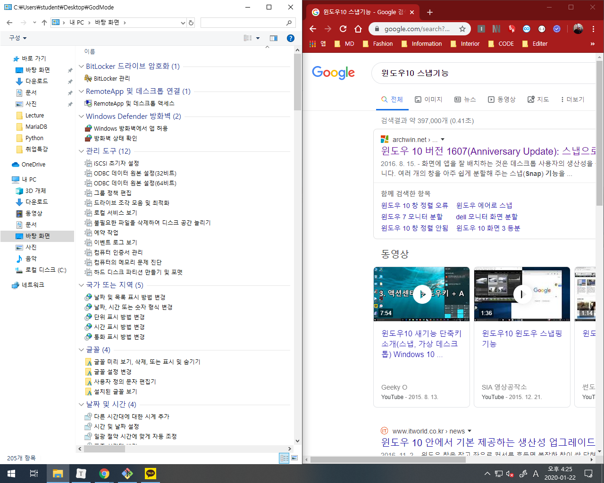
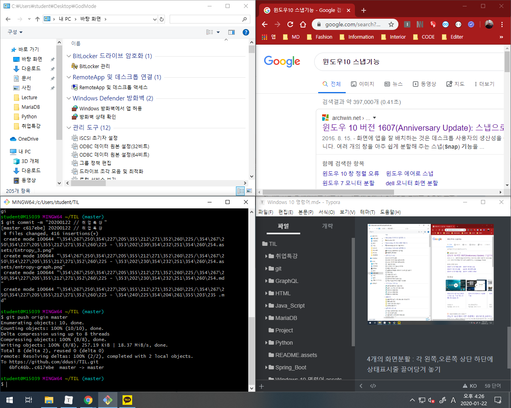

# Windows 10 명령어


## 01. 가상데스크탑

- `Window + Ctrl + D` : 가상데스크탑 생성
- `Window + Ctrl + F4` : 현재 가상데스크탑 삭제
- `Window + Ctrl + 방향키 ←, →` : 가상데스트탑 이동 선택
- `Window + Tab` :  Task bar를 연다
- `Window + 위아래 방향키` : 화면 창을 좌우로 정렬
- `Window + 방향키` : 스냅 창 제어 (정렬)


## 02. Windows 리눅스 가상머신




## 03. 윈도우 Snap 기능 

- **2개의 화면분활** : 각 왼쪽, 오른쪽 중간부분에 상태표시줄 끌어당겨 놓기




**4개의 화면분활** : 각 왼쪽,오른쪽 상단 하단에 상태표시줄 끌어당겨 놓기




## 04.  windows 명령어들

- `win + Home` : 사용중인 창을 제외한 모든 창 최소화
- **`win + D` : 모든 창을 최소화 시키고 바탕화면 보기를 실행. (한번더 복귀)**
- `win + shift + M` : 모든 창을 최소화한 것을 복원합니다.
- `win + A` : 알림센터 열기
- **`win + E` : 윈도우 탐색기 열기**
- **`win + R` : 실행창 열기**
- `win + S` : Windows 검색창 실행
- `win + =` : 윈도우 돋보기
- **`win + L` : 윈도우 잠금**
- **`win + Pause` : 컴퓨터 시스템 속성창 키기**
- **`win + X` : 윈도우 메뉴창 열기**
- **`win + I` : 제어판 열기**
- **`Ctrl + Shift + N` : 새폴더 만들기**


## 05. 공통 컴퓨터 명령어

- `Ctrl + Z` : 되돌리기
- `Ctrl + Y` : 되돌린 것 재실행


## 06. 크롬 명령어

- `Ctrl + Shit + T` : 최근에 닫은 탭 다시 열기

- `Ctrl + T` : 새탭 열기

- `Ctrl + D` : 즐겨찾기 추가

- `Ctrl + W` : 현재 탭 닫기

- `Ctrl + Teb` : 다음 탭으로 이동

- `Ctrl + Shift + Teb` : 이전 탭으로 이동

- `Ctrl + 숫자키` : 숫자에 해당하는 순서의 탭으로 이동

- `Ctrl + R` : 현재탭 새로고침

- 

  


## 07. 구글 검색 팁

- 이미지 검색하기

- 주변 검색하기

  커피숍을 찾을때, 커피 주변 검색하면 위치기반으로 커피숍을 찾아줌

- 구글 문서 빠르게 찾기

  검색 엔진에서 

  ```http
  https://drive.google.com/drive/search?q=%s
  ```

  를 입력하면 시간이 조금 지난뒤 크롬에서 검색 가능.

- 단어의 의미 찾기 

  검색시 `define:단어`로 검색

- 안드로이드 기기 찾기 기능

  `find my phone`을 검색한다. 

- 수학 그래프 그리기 기능   

  구글 코리아에선 안되고 그래프 그리기 가능

- 자동 환율 전환 

  `500달러를 원으로`

- 실시간 항공편 스케쥴

  항공편 번호만 검색하면 바로 실시간 현재 상황을 보여준다.

- 날씨 검색

- 숨겨진 구글 게임기능

  `Breakout Google`, `Google Pac-Man` 검색

  

