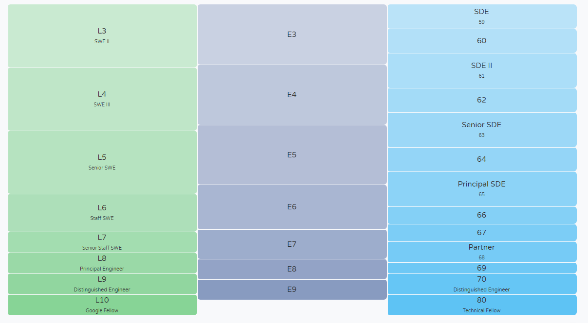

# 협업하는 방법

### (1) branch 활용 (git flow) #배달의 민족도 사용

 1. github에서 settings 

    > Collaborators에서 협업자 추가

	2. Branches 메뉴로 branch protection rules 추가 가능.

    > 아랫사람들이 함부로 master를 push하지 못하게 하기 위함.
    >
    > 결정권자가 선택할 수 있다.

	3. git-flow에서 사용하는 5가지 브랜치

    > 항상 유지되는 메인 브랜치 master, develop
    >
    > 일정기간 동안만 유지되는 보조 브랜치 feature, relese, hotfix

- master : 제품으로 출시될 수 있는 브랜치
- develop : 다음 출시 버전을 개발하는 브랜치
- feature : 기능을 개발하는 브랜치
- release : 이번 출시 버전을 준비하는 브랜치
- hotfix : 출시 버전에서 발생한 버그를 수정 하는 브랜치


좀더 자세한 설명 https://nvie.com/posts/a-successful-git-branching-model/

http://woowabros.github.io/experience/2017/10/30/baemin-mobile-git-branch-strategy.html


### (2)  fork -PR (github flow)

 1. 마음에 드는 레버지토리에서 fork 기능을 이용하여 복사해오기

    > git clone과는 다른 개념으로 레버지토리자체를 복사해와서 나의 레버지토리로 만들어 직접 push & pull을 해볼 수 있다. 재미있는건 내가 수정한 코드를 원래 주인에게 건의할 수 있다.

2. 마음 껏 테스트 한 후 원래 레버지토리 주인에게 코드 공유


# 기타 유용한 정보

### 1. html 단축키 (VS code에서 사용가능)

- `! + tap` : html 구조가 한번에 입력된다.

  ```html
  <!DOCTYPE html>
  <html lang="en">
  <head>
      <meta charset="UTF-8">
      <meta name="viewport" content="width=device-width, initial-scale=1.0">
      <meta http-equiv="X-UA-Compatible" content="ie=edge">
      <title>Document</title>
  </head>
  <body>
      
  </body>
  </html>
  ```

  

- `ul>li*2` : ul에 li가 자동완성!

  ```html
  <ul>
      <li></li>
      <li></li>
  </ul>
  ```


### 2. 구글, 페이스북, 마소 엔지니어 레벨

https://www.levels.fyi/

> 사이트 들어가면 연봉을 검색 할 수있다.... 참고로 L3만 되도 180,000$ = 약 2억




### 3. 제프 딘

> 구글 L11단계의 전설적인 엔지니어.


### 4. 부트스트랩

https://startbootstrap.com/themes/


### 5. VS code에서 터미널 키는 법

> 터미널을 vs code에서 열 수 있으니까 따로 화면 왔다갔다 안해도 됌..ㅎ

- Terminal ->  new terminel -> git bush 


### 6.명령어 동시에 쓰는법 

​	**명령어 && 명령어**

​		`git init && git add .`


### 7. font awesome

> HTML에서 지원하는 이미지 파일들


# github로 블로그 만들기

1. 자기 github 계정에서 Repository를 만든다 .

   > 이때 꼭 제목양식을 **사용자이름.github.io**을 지켜야 한다. 

2. bootstrap에서 마음에 드는 양식을 고른 후 업로드 한다.

   ```shell
   git init 
   
   git add .
   
   git commit -m "abb bootstrap"
   
   git remote add origin [URL]
   
   git push origin master
   ```

3. 사용자이름.github.io를 주소에 써서 확인한다. 

   > 만약 페이지를 찾을수 없는 404 에러가 뜬다면 처음부터 다시.. (이유를 모르겠다.)

4. HTML, CSS, Java Script을 이용하여 블로그를 이쁘게 꾸미자.

   > 이미지 바꾸기, 이름, 페이지, 등등


